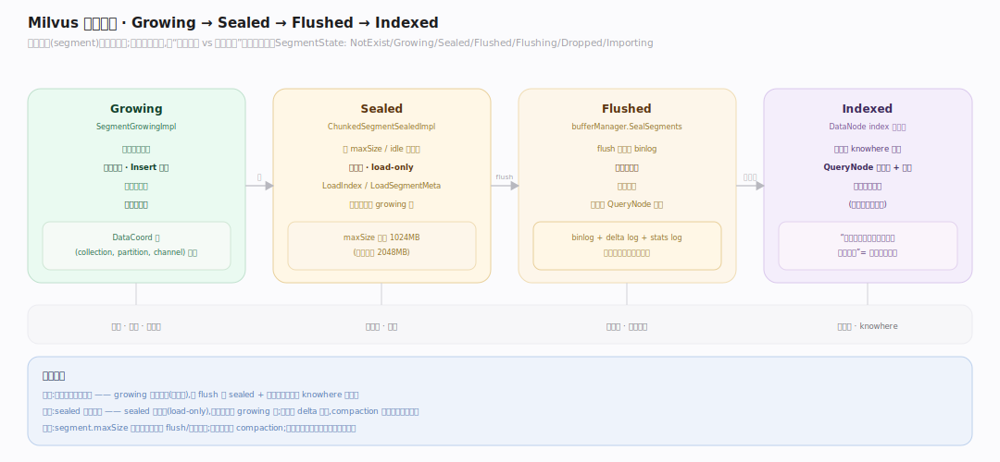
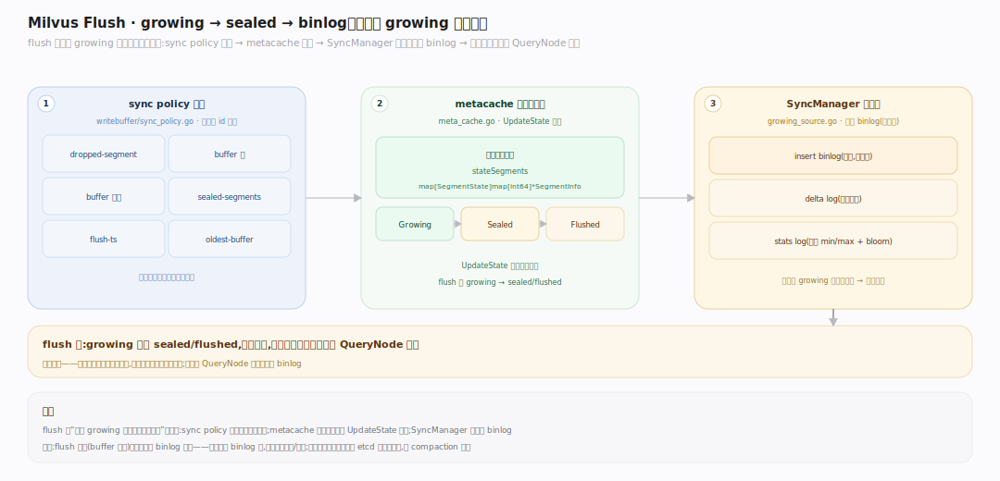
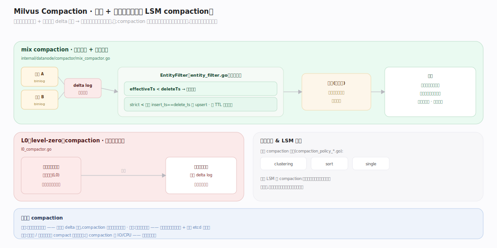
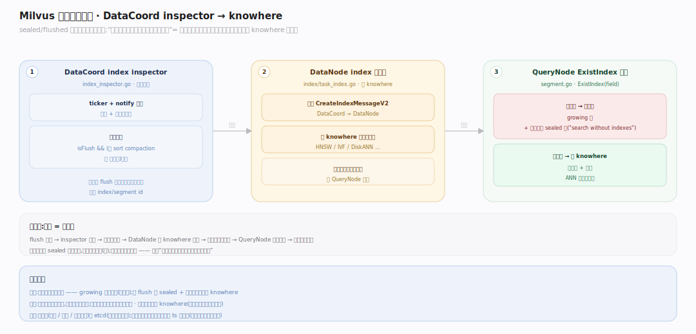

# Milvus 原理 · 支撑主线 · 段与生命周期

> **定位**：属"存储能力域"。管数据的物理组织与演进:growing(内存可变)→ sealed(封存)→ flushed(落 binlog)→ indexed(建索引);compaction 合段应用删除。被【写入路径】产出、被【向量索引与检索】读取。源码基准 **Milvus(6ca0350944)**(`internal/datacoord/`、`internal/core/src/segcore/`)。

Milvus 的数据以**段(segment)**为物理单位。段有生命周期:新写入进 **growing** 段(内存、可变、无索引、暴力搜),写满封成 **sealed** 段(不可变),flush 成 binlog 落对象存储,再异步建向量索引——之后查询才走 knowhere 快路径。删除和小段由 **compaction** 后台整理。这套生命周期是"写入吞吐 vs 查询性能"的平衡机制。

---

## 一、段状态机:growing → sealed → flushed → indexed

段状态(`commonpb.SegmentState`):NotExist / **Growing** / **Sealed** / **Flushed** / Flushing / Dropped / Importing。

- **Growing**(`SegmentGrowingImpl`,`internal/core/src/segcore/SegmentGrowing.h:25`):新写入落这;内存可变、`Insert` 追加、**无向量索引**(查询暴力搜)。DataCoord 按 (collection, partition, channel) 分配(`segment_manager.go:307`)。
- **Sealed**(封存):growing 段超 `maxSize`(默认 1024MB)或按 idle/总大小策略封;不可变。`SegmentSealed`(`SegmentSealed.h:34`)是 load-only(`LoadIndex`/`LoadSegmentMeta`),主实现 `ChunkedSegmentSealedImpl`。
- **Flushed**:sealed 段 flush 成 binlog 落对象存储;`bufferManager.SealSegments` 落盘并转 Flushed 态(`manager.go:203`)。
- **Indexed**:DataNode index 子系统异步为 flushed 段建 knowhere 向量索引;之后 QueryNode 加载段 + 索引,查询走快路径。

---

## 二、Flush:growing → sealed → binlog

flush 把内存 growing 段固化到对象存储:

- **触发策略**(`internal/flushcommon/writebuffer/sync_policy.go`):dropped-segment / buffer 满 / buffer 过期 / sealed-segments / flush-ts / oldest-buffer——各选段 id 同步。
- **段状态跟踪**:metacache 按状态索引段(`stateSegments map[SegmentState]map[int64]*SegmentInfo`,`meta_cache.go:81`),`UpdateState` 转态。
- **binlog 落盘**:SyncManager 把 growing 段的插入数据序列化成列式 binlog(按列组,`growing_source.go`)+ delta log + stats log。

flush 后 growing 段变 sealed/flushed,内存释放,数据在对象存储可被多 QueryNode 加载。

---

## 三、Compaction:合段 + 应用删除

后台整理段:

- **mix compaction**(`internal/datanode/compactor/mix_compactor.go`):合并多个小段,合并时**应用删除**——`EntityFilter`(`internal/compaction/entity_filter.go`)按 `effectiveTs < deleteTs` 丢被删行(strict `<` 保留 insert_ts==delete_ts 的 upsert)、按 TTL 丢过期行。
- **L0(level-zero)compaction**(`l0_compactor.go`):处理纯删除段——把累积的删除数据按目标段拆分、写成 delta log。
- **其它**:clustering / sort / single 等 compaction 策略(`internal/datacoord/compaction_policy_*.go`)。

**为什么 compaction**:写入产生很多小段 + 删除只写 delta 标记,查询要读多段 + 叠加删除,慢;compaction 合小段成大段、把删除物理应用掉,提查询性能、回收空间——类比 LSM 的 compaction。

---

## 四、异步索引构建

sealed/flushed 段的向量索引**异步**建:

- **触发**:DataCoord 的 index inspector 循环(`internal/datacoord/index_inspector.go:86`)按 ticker + notify,选 `isFlush && (无 sort compaction 或 已排序)` 的段。
- **构建**:分配 index/segment id、广播 `CreateIndexMessageV2`;DataNode index 子系统(`internal/datanode/index/task_index.go`)调 knowhere 建索引,产物落对象存储。
- **查询用索引 vs 暴力**:QueryNode 段 `ExistIndex(field)` 判有无索引(`segment.go:818`);growing 段和未建索引 sealed 段**暴力搜**(日志"search without indexes")、建了索引走 knowhere。

所以"导入后一段时间查询慢、之后变快"= 索引还在异步建。

---

## 拓展 · 段生命周期关键结构一览

| 结构 | 定义 | 职责 |
|---|---|---|
| SegmentState | `commonpb` enum | Growing/Sealed/Flushed/… |
| SegmentGrowingImpl | `core/src/segcore/SegmentGrowing.h:25` | 内存可变段 |
| ChunkedSegmentSealedImpl | `core/src/segcore/` | 不可变 load-only 段 |
| SegmentManager | `internal/datacoord/segment_manager.go:307` | 分配 growing 段 + seal 策略 |
| mix_compactor | `internal/datanode/compactor/mix_compactor.go` | 合段 + 应用删除 |
| index_inspector | `internal/datacoord/index_inspector.go:86` | 异步索引构建触发 |

## 调优要点（关键开关）

- **segment.maxSize**(默认 1024MB,磁盘索引 2048MB):段大小;大段查询高效但 flush/建索引久。
- **flush 策略**:buffer 阈值权衡内存与 binlog 碎片。
- **compaction 触发**:小段多/删除多时及时 compact 提查询性能;但 compaction 耗 IO/CPU。
- **索引及时性**:导入后主动建索引,避免长期暴力搜。

## 常见误区与工程要点

- **误区:数据写入就有索引。** growing 段无索引(暴力搜);要 flush 成 sealed + 异步建索引才走 knowhere。
- **误区:删除立即回收空间。** 删除写 delta 标记,compaction 应用后才物理移除。
- **误区:段越小越灵活。** 太多小段增查询开销(读多段+叠删除)+ 元数据压力;compaction 合并。
- **误区:sealed 段还能改。** sealed 不可变(load-only);新数据进新 growing 段。
- **归属提醒**:段由【写入路径】产出;段上检索在【向量索引与检索】;索引算法是 knowhere;段元数据/binlog 路径存 etcd(【元数据】);段版本按 ts(【一致性与时间】)。

## 一句话总纲

**Milvus 数据以段为物理单位、有生命周期:新写入进 growing 段(内存可变、无索引、暴力搜)→ 超 maxSize/idle 封成 sealed(不可变)→ flush 成列式 binlog 落对象存储(SyncManager)→ DataCoord index inspector 异步建 knowhere 向量索引(建好前查询暴力、建好走快路径);compaction 后台合并小段并按 effectiveTs<deleteTs 应用删除(mix)/ 拆删除 delta(L0),提查询性能回收空间——类比 LSM compaction,是写入吞吐与查询性能的平衡机制。**
