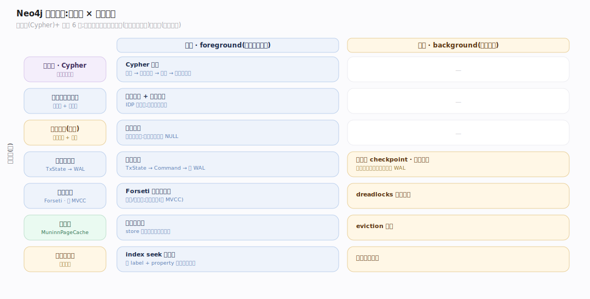
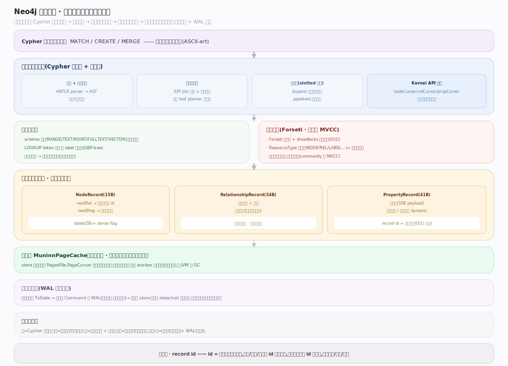
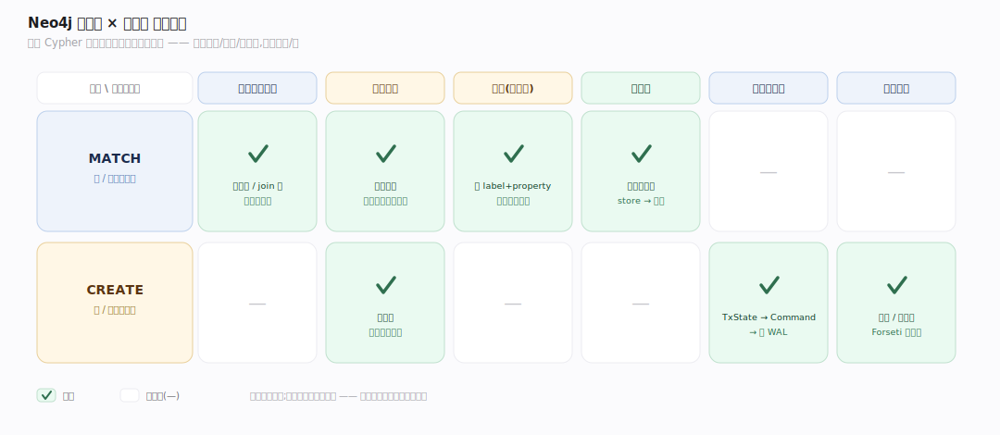
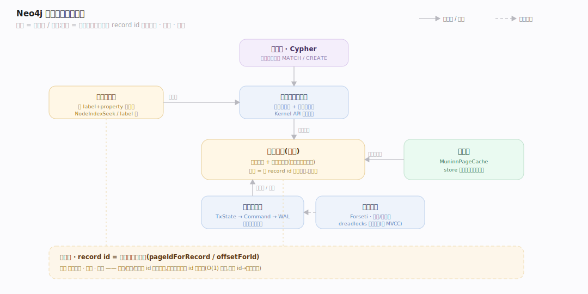

# Neo4j 原理 · 全景主线框架

> 统领全部原理文档:Neo4j 是**原生图数据库**(新家族:图数据库——接触面是 Cypher 图查询语言,核心是**免索引邻接**的记录存储,关系遍历跟指针而非查索引)。源码基准 **Neo4j 2026.06**(`~/workdir/neo4j`,git `eccd584a`;community 版)。

Neo4j 的世界观:**数据本身就是图**——节点、关系、属性都是磁盘上的定长记录,一个节点**直接指向**它的第一条关系,关系又是两条双向链表的节点。遍历 `(a)-[:KNOWS]->(b)` 是顺着指针走,**不查任何索引**——这叫"免索引邻接(index-free adjacency)",是原生图库区别于"在关系库上套图 API"的立身之本。理解"记录存储 + 免索引邻接 + Cypher"三点,就理解了 Neo4j。

> **结构提示(写文档必看)**:① 存储在 `community/record-storage-engine/`(NodeRecord 15B / RelationshipRecord 34B / PropertyRecord 41B 定长);② 事务/恢复在 `community/kernel/`;③ 锁在 `community/lock/`(Forseti,dreadlocks 死锁检测);④ 页缓存在 `community/io/`(MuninnPageCache);⑤ Cypher 在 `community/cypher/`(Java+Scala);⑥ **并发是锁基而非 MVCC**(record engine 明确未实现 MVCC);⑦ 集群/因果集群是企业版,community 源码树里没有。

---

## 一、双维模型:能力域 × 执行时机

- **能力域**:接触面(Cypher)面向用户;支撑侧——记录存储、查询规划与执行、事务与恢复、锁与并发、页缓存、索引。
- **执行时机**:前台(Cypher 查询、事务提交、指针遍历)vs 后台(检查点 checkpoint、页缓存 eviction、恢复重放、索引后台构建)。

---

## 二、总架构图(位置即语义)

用户写 Cypher → 解析/语义分析 → 成本规划器出计划 → 运行时执行(通过 Kernel API 的游标读图)→ 跟着记录里的指针遍历关系(免索引邻接)→ 记录从 store 文件经 **MuninnPageCache** 分页进内存 → 事务把变更累积成 TxState、提交时转成 Command 写 **WAL**(预写日志)→ 崩溃时从 WAL 重放恢复。锁由 **Forseti** 管(锁基并发,非 MVCC)。

---

## 三、7 条主线的分层归位

| 层 | 主线 | 一句话职责 |
|---|---|---|
| 接触面 | **Cypher 查询语言** | 声明式图模式匹配 MATCH/CREATE |
| 计算 | **查询规划与执行** | Cypher 编译器 + 成本规划器 + 运行时算子 |
| 存储 | **记录存储(核心)** | 定长记录 + 免索引邻接(节点→关系链表) |
| 索引 | **索引与遍历** | schema 索引(B-tree/range/point/text/vector)+ 游标遍历 |
| 事务 | **事务与恢复** | TxState → Command → WAL → 崩溃重放 |
| 并发 | **锁与并发** | Forseti 锁管理(dreadlocks 死锁检测,锁基非 MVCC) |
| 缓存 | **页缓存** | MuninnPageCache 把 store 文件分页进堆外内存 |

---

## 四、接触面 × 能力域 依赖矩阵

MATCH 查询依赖查询规划(选索引/join 序)+ 记录存储(游标遍历)+ 索引(按 label+property 定位起点)+ 页缓存(读记录);CREATE/写依赖事务(TxState→Command→WAL)+ 锁(节点/关系锁)+ 记录存储(写记录)。

---

## 五、能力域依赖关系图

实线=数据流/调用,虚线=状态约束。贯穿层:**记录 id(record id)** 横切存储/遍历/索引——record id = 文件偏移的寻址键(`pageIdForRecord`/`offsetForId`),节点/关系/属性靠 id 相互指向,遍历就是顺着 id 指针走。

---

## 六、三条贯穿声明(Neo4j 区别于关系库/文档库)

1. **免索引邻接是原生图库的立身之本**:节点记录直接存"第一条关系的 id"(`NodeRecord.nextRel`),关系是两条双向链表的节点(每个端点一条链)。遍历跟指针走,**代价与图局部大小成正比、与图总规模无关**——这是关系库用 JOIN 表达图关系做不到的。

2. **一切是定长记录 + 指针**:节点 15B、关系 34B、属性 41B,record id = 文件偏移(id×size)。定长让"按 id O(1) 定位"、指针让"关系直连"。变长数据(长字符串/数组)溢出到 dynamic store,记录里存指针。

3. **锁基并发 + WAL 恢复,不是 MVCC**:community record engine 明确未实现 MVCC——事务用 Forseti 锁(dreadlocks 死锁检测)串行化,变更累积成 TxState、提交转 Command 写预写日志,崩溃从最后检查点后重放 WAL 恢复。

---

**一句话定位**:Neo4j 是原生图数据库——数据即图(节点/关系/属性都是定长记录),核心是免索引邻接(节点直接指向关系链表、遍历跟指针不查索引,代价与图局部而非总规模相关);Cypher 声明式查询经成本规划器 + 游标运行时读图,事务用 Forseti 锁(锁基非 MVCC)+ WAL 恢复,记录经 MuninnPageCache 分页进内存。
