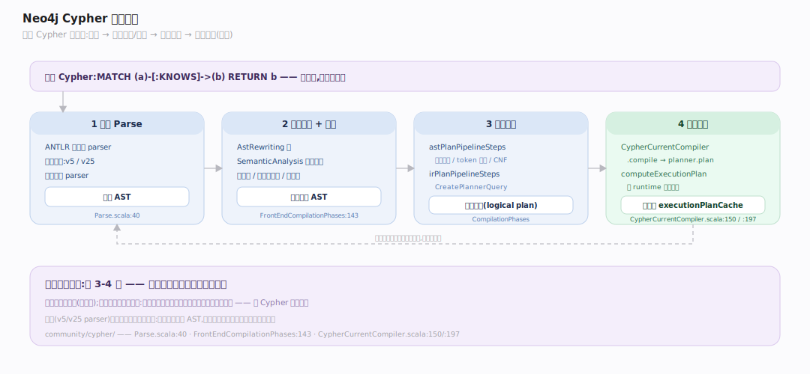
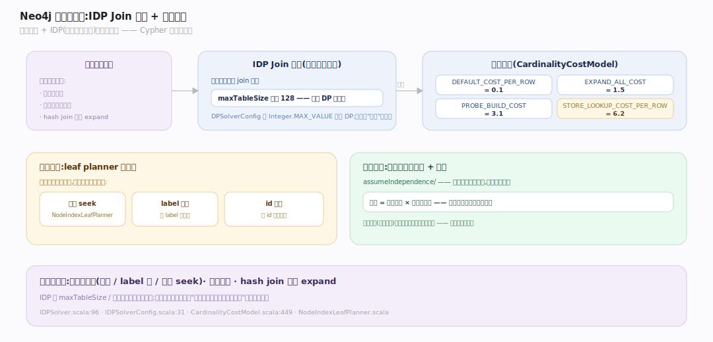
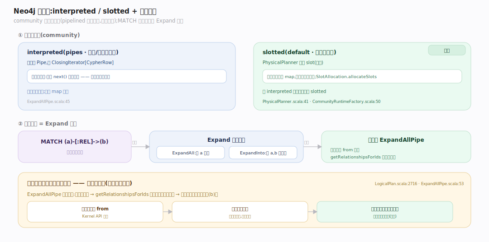

# Neo4j 原理 · 接触面主线 · Cypher 查询语言

> **定位**：属"接触面主线"(用户可见)。Neo4j 的接触面是 **Cypher**——声明式图模式匹配语言(MATCH/CREATE/MERGE)。一条 Cypher 经解析→语义分析→成本规划→运行时执行,通过 Kernel API 游标读图。调用【记录存储】遍历、【索引】定位起点、【事务】写入。源码基准 **Neo4j 2026.06**(`community/cypher/`)。

Cypher 让你用 ASCII-art 画图模式:`MATCH (a)-[:KNOWS]->(b)` 就是"找 a 通过 KNOWS 指向 b"。声明式——你说要什么,规划器决定怎么执行(选哪个索引找起点、按什么顺序展开)。这与 SQL 类似但为图而生:模式匹配天然映射到"从起点节点展开关系链"。

---

## 一、Cypher 编译管线

一条 Cypher 的旅程(`community/cypher/`):

1. **解析**(ANTLR 生成的 parser,两版共存 v5/v25):`Parse` phase(`front-end/.../phases/parserTransformers/Parse.scala:40`)按版本选 parser 产 AST。
2. **语义分析 + 改写**:`FrontEndCompilationPhases` 里 `AstRewriting` 与 `SemanticAnalysis` 交替多趟(`:143`)——检查类型、变量作用域、规范化。
3. **逻辑计划**:`CompilationPhases` 的 `astPlanPipelineSteps`(命名空间/token 解析/CNF 规范化)→ `irPlanPipelineSteps`(`CreatePlannerQuery`)产出逻辑计划。
4. **执行计划**:`CypherCurrentCompiler.compile`(`cypher/.../CypherCurrentCompiler.scala:150`)→ `planner.plan` 出逻辑计划 → `computeExecutionPlan`(`:197`)→ 按 `runtime` 选运行时,缓存进 `executionPlanCache`。

声明式的关键在第 3-4 步:**成本规划器**决定物理执行形态。

---

## 二、成本规划器:IDP Join 排序 + 索引选择

Neo4j 用**成本模型 + IDP(迭代动态规划)**选最优计划:

- **IDP Join 排序**(`compiler/planner/logical/idp/IDPSolver.scala:96`):动态规划枚举 join 顺序,`maxTableSize`(默认 128,`IDPSolverConfig.scala:31`)限制 DP 表大小控制搜索开销;`DPSolverConfig` 用 `Integer.MAX_VALUE` 做全 DP。无独立"贪心"求解器——靠表大小/迭代上限调节。
- **成本模型**(`CardinalityCostModel.scala`):`DEFAULT_COST_PER_ROW=0.1`、`EXPAND_ALL_COST=1.5`、`PROBE_BUILD_COST=3.1`、`STORE_LOOKUP_COST_PER_ROW=6.2`(`:449`)等常量加权;基数估计用假设独立性模型(`assumeIndependence/`)+ 统计。
- **索引选择**:leaf planner(`steps/index/NodeIndexLeafPlanner.scala` 等)+ label 扫描 + id 查找生成候选起点计划,按成本比较选最优。

规划器决定"从哪找起点(全扫/label 扫/索引 seek)、按什么顺序展开、用 hash join 还是 expand"——这是 Cypher 性能的大脑。

---

## 三、运行时:interpreted / slotted + 模式匹配

community 版有**两个运行时**(pipelined 是企业版,不在此树):

- **interpreted**(pipes,火山/迭代器模型):算子是 `Pipe`,产 `ClosingIterator[CypherRow]`(`ExpandAllPipe.scala:45`)。
- **slotted**(default,寄存器式行):物理规划器分配 slot(`PhysicalPlanner.scala:41` → `SlotAllocation.allocateSlots`),行用槽位而非 map,更省内存快。`getRuntime` 里连 `interpreted` 选项都映射到 slotted(`CommunityRuntimeFactory.scala:50`)。

**模式匹配 = Expand 算子**:`MATCH (a)-[:REL]->(b)` 变成 `Expand` 逻辑算子(`LogicalPlan.scala:2716`,两模式:`ExpandAll` 给 a 展开、`ExpandInto` 给 a,b 找关系);运行时 `ExpandAllPipe` 对每行读 from 节点、`getRelationshipsForIds` 遍历关系链、每条关系产一行带终点(`:53`)——这一步就是顺着记录指针走(免索引邻接,见记录存储篇)。

---

## 拓展 · Cypher 关键结构一览

| 结构 | 定义 | 职责 |
|---|---|---|
| Parse | `front-end/.../parserTransformers/Parse.scala:40` | ANTLR 解析产 AST |
| CypherCurrentCompiler | `cypher/.../CypherCurrentCompiler.scala:150` | 编译总控(规划+执行计划缓存) |
| IDPSolver | `compiler/planner/logical/idp/IDPSolver.scala:96` | Join 排序动态规划 |
| CardinalityCostModel | `compiler/.../CardinalityCostModel.scala` | 加权成本模型 |
| Expand | `cypher-logical-plans/.../LogicalPlan.scala:2716` | 关系展开算子 |
| PhysicalPlanner | `physical-planning/.../PhysicalPlanner.scala:41` | slotted 槽位分配 |

## 调优要点（关键开关）

- **runtime**:community 用 slotted(默认,快);interpreted 便于理解但慢。
- **索引起点**:给 MATCH 的过滤属性建 schema 索引,让规划器用 index seek 而非全扫。
- **PROFILE / EXPLAIN**:看执行计划的算子与 db hits,定位全扫/笛卡尔积。
- **统计新鲜度**:成本规划依赖统计;数据大变后统计过期会选错计划。
- **避免笛卡尔积**:未连接的 MATCH 模式产生笛卡尔积,注意 WHERE 连接条件。

## 常见误区与工程要点

- **误区:Cypher 像 SQL 全表扫。** 图查询从起点节点(索引/label 定位)展开关系链,遍历是指针追逐,不是扫全图。
- **误区:community 有 pipelined 运行时。** 没有,pipelined 是企业版;community 是 interpreted + slotted(默认 slotted)。
- **误区:规划器随便选顺序。** IDP 动态规划 + 成本模型选最优 join 序与索引;统计驱动。
- **误区:MATCH 模式方向无所谓。** 方向影响从哪端展开、走哪条关系链;`ExpandInto` vs `ExpandAll` 代价不同。
- **归属提醒**:展开时的关系遍历在【记录存储】(免索引邻接);找起点的索引在【索引与遍历】;读图经 Kernel API 游标;写在【事务与恢复】。

## 一句话总纲

**Cypher 是 Neo4j 的声明式图查询接触面:一条查询经 ANTLR 解析→语义分析/改写多趟→成本规划器(IDP 动态规划选 join 序 + 加权成本模型 + 索引 leaf planner 选起点)→运行时执行(community 用 slotted 寄存器式,pipelined 是企业版);MATCH (a)-[:REL]->(b) 编译成 Expand 算子(ExpandAll/ExpandInto),运行时对每行读起点节点、顺着关系链遍历(免索引邻接)产出终点行——你声明图模式,规划器决定怎么从起点展开。**
