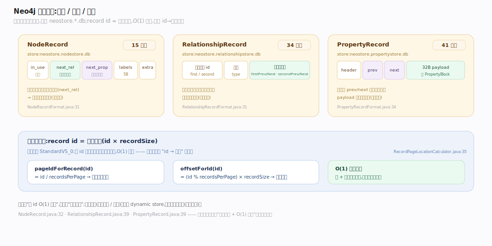
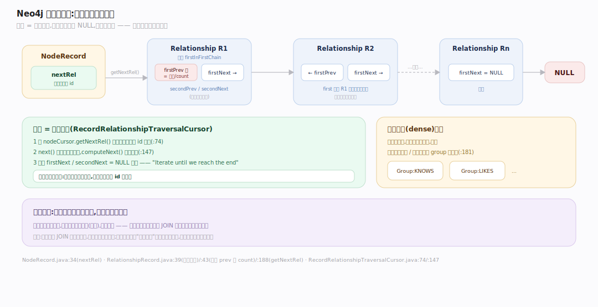
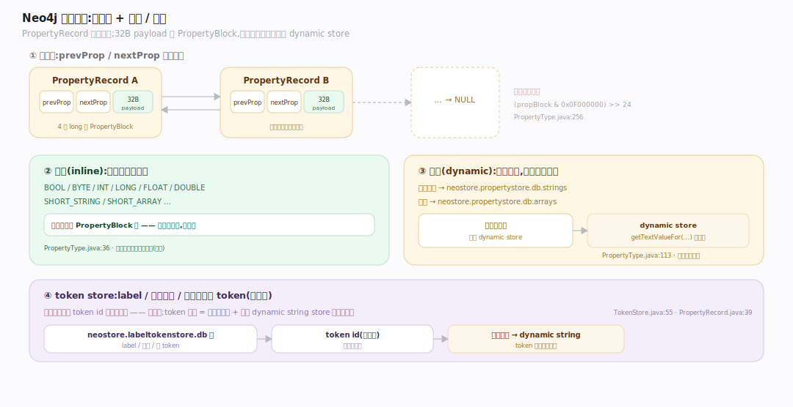

# Neo4j 原理 · 支撑主线 · 记录存储

> **定位**：属"存储能力域"——Neo4j 的核心与灵魂。管数据的物理组织:节点/关系/属性都是定长记录,以及**免索引邻接**(节点直接指向关系链表,遍历跟指针)。被【Cypher 查询执行】通过游标读取、被【事务与恢复】写入、经【页缓存】分页进内存。源码基准 **Neo4j 2026.06**(`community/record-storage-engine/`)。

原生图数据库凭什么"图遍历快"?靠**免索引邻接(index-free adjacency)**:一个节点记录直接存"第一条关系的 id",关系又是两条双向链表的节点——遍历 `(a)-[:KNOWS]->(b)` 是顺着记录里的指针走,**不查任何索引**。代价与图局部大小成正比、与图总规模无关。这是关系库用 JOIN 表达图关系根本做不到的,也是"原生图库"区别于"在关系库上套图 API"的立身之本。

---

## 一、定长记录:节点 / 关系 / 属性

一切都是定长记录,存在各自的 store 文件里:

- **NodeRecord**(`community/record-storage-engine/.../store/record/NodeRecord.java:32`)= **15 字节**:`in_use + next_rel_id(第一条关系) + next_prop_id(第一个属性) + labels(5B) + extra`(`NodeRecordFormat.java:31`)。存 `neostore.nodestore.db`。
- **RelationshipRecord** = **34 字节**(`RelationshipRecordFormat.java:31`):两端节点 id + 类型 + **四个链指针**(见第二节)。存 `neostore.relationshipstore.db`。
- **PropertyRecord** = **41 字节**:`header + next + prev + 32B payload`(`PropertyRecordFormat.java:34`)。存 `neostore.propertystore.db`。

**定长的意义**:record id 直接映射文件偏移——`pageIdForRecord(id) = id/recordsPerPage`、`offsetForId(id) = (id%recordsPerPage)*recordSize`(`RecordPageLocationCalculator.java:35`)。**按 id 是 O(1) 定位**,不需要任何"id→位置"的索引。默认格式 `StandardV5_0`。

---

## 二、免索引邻接:节点直连关系链表

这是原生图库的定义性特征:

- 节点记录直接存 `nextRel`(第一条关系的 id,`NodeRecord.java:34`)——**不经任何索引**。
- 每条关系是**两条双向链表**的节点(每个端点一条):`firstPrevRel/firstNextRel`(第一节点的链)+ `secondPrevRel/secondNextRel`(第二节点的链)(`RelationshipRecord.java:39`)。访问器 `getNextRel(nodeId)` 按从哪个端点遍历返回对应指针(`:188`)。
- 链头(`firstInFirstChain`)的 prev 槽改存**度数/count**(`:43`)——O(1) 拿到节点的关系数。
- **遍历 = 指针追逐**:`RecordRelationshipTraversalCursor` 从 `nodeCursor.getNextRel` 起(`:74`),`next` 读当前关系记录、`computeNext` 顺着链走到 `NULL`(`:147`),注释直言"Iterate relationship chain until we reach the end"。**全程零索引查找**。
- **稠密节点**(dense)例外:关系太多时切换成按类型/方向分组的 group 间接层(`:181`),避免单条超长链。

代价与图局部(该节点的关系数)成正比,与图总节点数无关——这是图遍历比关系库 JOIN 快几个数量级的根源。

---

## 三、属性存储:属性链 + 内联 / 动态

属性是 PropertyRecord 的**双向链表**(`prevProp/nextProp`),每条记录含若干变长 `PropertyBlock`,放在 32 字节(4 个 long)的 payload 里(`PropertyRecord.java:39`)。属性类型编码在块的位里(`(propBlock & 0x0F000000) >> 24`,`PropertyType.java:256`)。

- **内联(inline)**:BOOL/BYTE/INT/LONG/FLOAT/DOUBLE/SHORT_STRING/SHORT_ARRAY 等小值直接存在块里(`PropertyType.java:36`)——无额外寻址。
- **动态(dynamic)**:长字符串溢出到 `neostore.propertystore.db.strings`、数组到 `...arrays`,块里只存指向 dynamic store 的指针(`PropertyType.java:113`)。读时 `store.getTextValueFor(...)` 解引用。

**token store**:label/关系类型/属性键都是 token(小整数),存 `neostore.labeltokenstore.db` 等,token 记录 = 小定长记录 + 指向 dynamic string store 的名字指针(`TokenStore.java:55`)——所以记录里存的是 `label token id` 而非字符串,省空间。

---

## 拓展 · 记录存储关键结构一览

| 结构 | 定义 | 职责 |
|---|---|---|
| NodeRecord (15B) | `.../store/record/NodeRecord.java:32` | 节点:nextRel + nextProp + labels |
| RelationshipRecord (34B) | `.../store/record/RelationshipRecord.java:39` | 关系:两端 + 类型 + 四链指针 |
| PropertyRecord (41B) | `.../store/record/PropertyRecord.java:39` | 属性链节点(32B payload) |
| RecordPageLocationCalculator | `.../store/RecordPageLocationCalculator.java:35` | record id → 页+偏移 |
| RecordRelationshipTraversalCursor | `.../recordstorage/RecordRelationshipTraversalCursor.java:147` | 遍历关系链(免索引邻接) |
| TokenStore | `.../store/TokenStore.java:55` | label/类型/键 token + 名字 |

## 调优要点（关键开关）

- **稠密节点阈值** `dense_node_threshold`:超此关系数的节点转 group 结构;超级节点场景调整以平衡遍历与写入。
- **store 格式**:StandardV5_0(定长);记录大小固定,id 空间有上限(节点 35 位)。
- **属性设计**:高频遍历的过滤属性宜小(内联);长文本/数组走 dynamic store,读有额外寻址。
- **string/array block size**:dynamic store 块大小影响长值的存储效率。

## 常见误区与工程要点

- **误区:图遍历也要查索引。** 不。免索引邻接——节点直连关系链表,遍历跟指针,只有"找起点节点"才用索引(按 label+property)。
- **误区:关系存在某张关系表里。** 关系是独立定长记录,通过两端节点的双向链表串起来;没有"关系表"的概念。
- **误区:超级节点无所谓。** 关系极多的节点(超级节点)的链很长,dense 结构缓解但仍是遍历热点;建模时要警惕。
- **误区:record id 要维护索引。** id 直接是文件偏移(id×size),O(1) 定位,无需 id→位置索引。
- **归属提醒**:找遍历起点的索引在【索引与遍历】;记录经【页缓存】分页;记录的写入/变更在【事务与恢复】;游标读取被【Cypher 执行】驱动。

## 一句话总纲

**Neo4j 是原生图库,核心是定长记录 + 免索引邻接:节点(15B)/关系(34B)/属性(41B)都是定长记录、record id 直接映射文件偏移(O(1) 定位);节点记录直接存第一条关系 id(nextRel),关系是两条双向链表的节点(每端一条链),遍历 (a)-[:REL]->(b) 顺着记录指针走、全程不查索引(代价与图局部而非总规模相关)——这是原生图库区别于关系库套图 API 的立身之本;属性是链表(小值内联、长值溢出 dynamic store),label/类型/键都是 token。**
