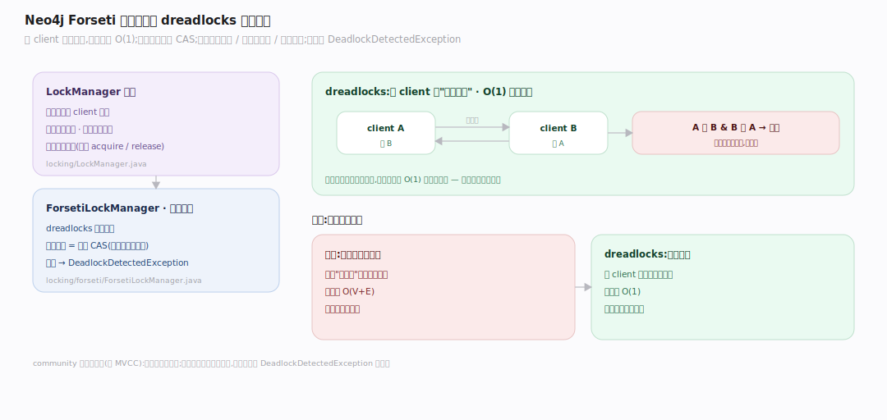
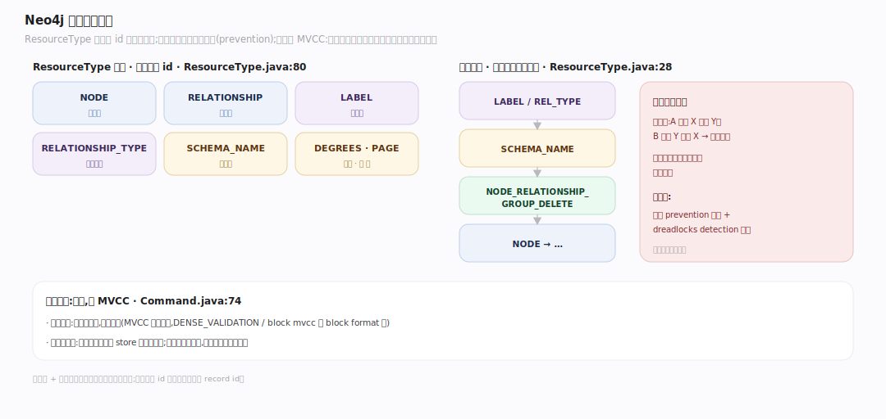

# Neo4j 原理 · 支撑主线 · 锁与并发

> **定位**：属"并发能力域"。管多事务并发的隔离与死锁处理:Forseti 锁管理器、dreadlocks 死锁检测、节点/关系粒度锁、锁序。被【事务与恢复】用于串行化写入。**community 是锁基并发,非 MVCC**。源码基准 **Neo4j 2026.06**(`community/lock/`)。

多个事务同时改图,怎么不冲突?Neo4j **不用 MVCC**,而用**锁**:事务改某节点/关系前先加锁,其他事务等锁。死锁(A 等 B、B 等 A)靠 **Forseti** 的 "dreadlocks" 算法 O(1) 检测。锁序 + 锁粒度是并发正确与性能的关键。

---

## 一、Forseti 锁管理器与 dreadlocks 死锁检测

`LockManager` 接口(`community/lock/.../locking/LockManager.java`):每事务一个 client 抓锁;共享锁可升级、排他锁可降级;锁可栈式重入(等量 acquire/release)。

默认实现 **Forseti**(`locking/forseti/ForsetiLockManager.java`)用 **"dreadlocks" 死锁检测**:每个 client 维护"正在等谁"的列表,死锁检测 O(1)(不用遍历资源分配图);最优情况抢锁 = 一次 CAS(无竞争时几乎零开销)。死锁则抛 `DeadlockDetectedException`。

**为什么 dreadlocks 快**:传统死锁检测要遍历"谁等谁"的图找环,O(V+E);dreadlocks 让每个等待者直接记录等待链,检测退化成 O(1) 的本地检查——高并发下省大量开销。

---

## 二、锁粒度与锁序

锁按 **ResourceType** 分粒度,键是实体 id(`community/lock/.../lock/ResourceType.java:80`):`NODE`、`RELATIONSHIP`、`LABEL`、`RELATIONSHIP_TYPE`、`SCHEMA_NAME`、`DEGREES`、`RELATIONSHIP_GROUP`、`PAGE` 等。

**锁序防死锁**:定义了固定的加锁顺序(`ResourceType.java:28`:LABEL/REL_TYPE → SCHEMA_NAME → NODE_RELATIONSHIP_GROUP_DELETE → NODE → …)。所有事务按同一顺序加锁,从根本上避免"A 先锁 X 再锁 Y、B 先锁 Y 再锁 X"的环——这是死锁预防(prevention)与 dreadlocks 检测(detection)的双保险。

**并发模型是锁基而非 MVCC**:`Command.java:74` 明确不取读锁、MVCC 尚未实现(`DENSE_VALIDATION`/block mvcc 仅用于 block format)。读不加读锁(读已提交语义靠 store 的当前状态),写加写锁串行化。

---

## 拓展 · 锁关键结构一览

| 结构 | 定义 | 职责 |
|---|---|---|
| LockManager | `lock/.../locking/LockManager.java` | 锁接口(升级/降级/重入) |
| ForsetiLockManager | `locking/forseti/ForsetiLockManager.java` | 默认实现 + dreadlocks 检测 |
| ResourceType | `lock/.../lock/ResourceType.java:80` | 锁粒度(NODE/REL/LABEL/…)+ 锁序 |
| DeadlockDetectedException | `lock/.../kernel/DeadlockDetectedException.java` | 死锁抛出 |

## 调优要点（关键开关）

- **减少锁竞争**:避免多事务改同一超级节点/同一热点;批量写分散实体。
- **锁序意识**:自定义批量操作按实体类型的锁序访问,减少死锁。
- **死锁重试**:应用层捕获 `DeadlockDetectedException` 重试(锁基并发的常规做法)。
- **锁超时** `db.lock.acquisition.timeout`:防长时间等锁挂死。

## 常见误区与工程要点

- **误区:Neo4j 读写不互相阻塞(像 MVCC)。** community 是锁基:写加写锁,读不加读锁但看当前已提交状态;高冲突写会互等。
- **误区:死锁靠遍历等待图检测。** Forseti 用 dreadlocks:每 client 记等待链,O(1) 检测,比遍历图快。
- **误区:锁只有节点级。** 有 NODE/RELATIONSHIP/LABEL/SCHEMA/DEGREES 等多种 ResourceType,粒度不同。
- **误区:死锁是 bug。** 高并发写下死锁是正常现象,应用应捕获异常重试;锁序设计降低其概率。
- **归属提醒**:锁服务【事务与恢复】的写串行化;锁的实体 id 对应【记录存储】的 record id;死锁重试是应用层责任。

## 一句话总纲

**Neo4j community 是锁基并发(非 MVCC):默认 Forseti 锁管理器用 dreadlocks 死锁检测(每 client 记等待链,O(1) 检测、最优抢锁一次 CAS),按 ResourceType(NODE/RELATIONSHIP/LABEL/…)分粒度加锁、并定义固定锁序防死锁环(prevention + detection 双保险);写加写锁串行化、读不加读锁看当前已提交状态,死锁抛 DeadlockDetectedException 由应用重试。**
