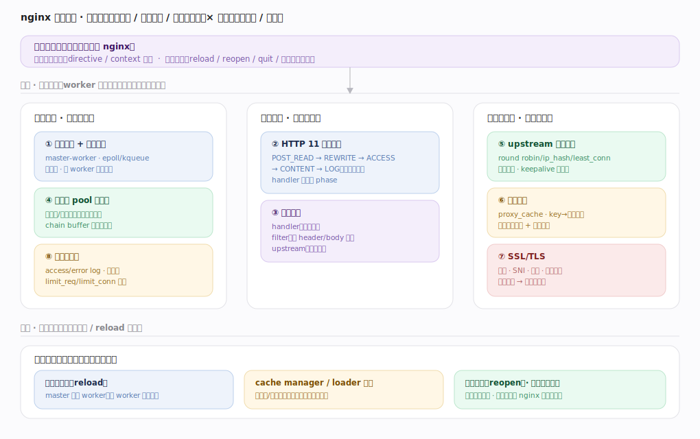
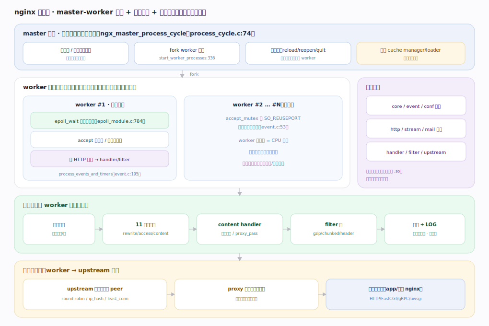
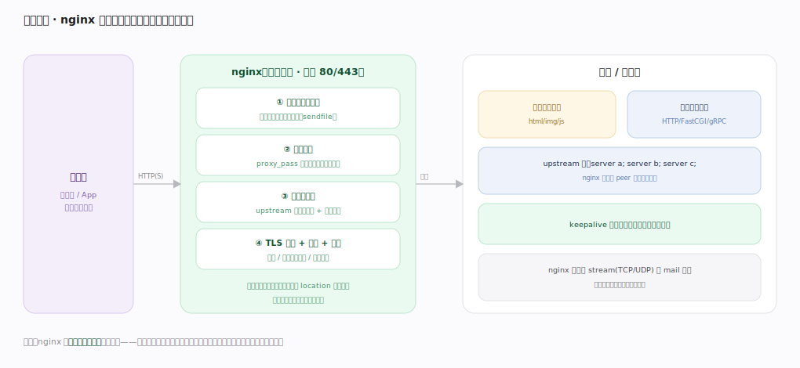
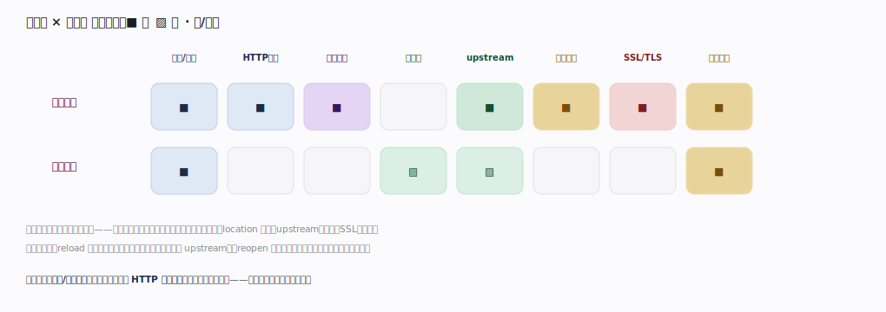

# nginx 核心原理 · 全景主线框架

> 统领全部原理文档：nginx 的 **2 条接触面主线（配置指令 / 信号控制）+ 8 条支撑能力域**，既无遗漏也无越界。核实基准 = 官方源码 `nginx/src`（`commit 9e32c636`）。nginx 属**网络服务器 / 反向代理家族**（非计算引擎）——它是**长驻守护、监听端口、事件驱动处理海量连接、配置驱动行为**的中间层。灵魂两主线：**事件驱动连接模型** 与 **HTTP 请求阶段处理**。

## 〇、与数据库/计算引擎的心智对照（读前必看）

nginx 与数据库内核假设完全不同，先立几条认知，后文不再重复：

| 维度 | 数据库（Doris/DuckDB） | nginx |
|---|---|---|
| 用户接触面 | SQL 语句族（DDL/DML/DQL/DCL） | **配置指令 + 信号**——没有"查询语言"，行为全由 `nginx.conf` 声明 |
| 核心资源 | 数据（表/行/列） | **连接与请求**——把海量并发连接高效地收、处理、转发 |
| 并发模型 | 线程池 + 查询并行 | **master-worker 多进程 + 单线程事件循环**（非阻塞 epoll） |
| 状态 | 持久化数据 + 事务 | **基本无状态**——请求处理完即释放；缓存/限流用共享内存 |
| "改配置" | ALTER + 事务 | **reload 信号**：master 起新 worker、旧 worker 优雅退出 |

一句话：**数据库以"数据 + 查询"为中心，nginx 以"连接 + 请求流水线"为中心。**

---

## 一、双维模型：能力域 × 执行时机

- **能力域（管什么）**：接触面（配置指令/信号）驱动用户意图；支撑侧按"连接底座 / 请求处理 / 后端与安全"分三类共 8 条——进程与事件模型、内存池、日志限流（底座）；HTTP 阶段处理、模块体系（请求处理）；upstream 负载均衡、代理缓存、SSL/TLS（后端与安全）。
- **执行时机（何时做）**：前台是 worker 事件循环内同步处理请求；后台很少——配置热加载（reload）、cache manager/loader 专职进程、日志切割（reopen）与二进制热升级。后台是横切的执行时机维度，非独立能力域。

---

## 二、总架构：master-worker + 事件驱动 + 模块流水线

`master` 进程不处理请求，只管控（`ngx_master_process_cycle`，`os/unix/ngx_process_cycle.c:74`）：读配置、绑定监听端口（特权操作）、fork worker（`ngx_start_worker_processes:336`）、接信号、监控重启挂掉的 worker、派生 cache manager/loader。多个 `worker` 各跑独立事件循环（`ngx_process_events_and_timers`，`event/ngx_event.c:195`），共享监听套接字，用 accept_mutex 或 SO_REUSEPORT 决定谁接新连接（`ngx_use_accept_mutex`，`ngx_event.c:53`）。一个请求在 worker 内走"连接接入 → 11 阶段 → content handler → filter 链 → 发送 + LOG"的流水线；反向代理时再经 upstream 选后端。

---

## 三、部署形态：客户端与后端之间的多角色中间层

nginx 站在客户端与后端之间，同一进程按 location 配置同时扮演：静态资源服务器（sendfile 直读磁盘）、反向代理（proxy_pass 隐藏内部拓扑）、负载均衡器（upstream 多后端分流 + 健康检查）、TLS 终止 + 缓存 + 网关（解密/缓存命中直返/限流鉴权）。关键：**前端连接与后端连接彻底解耦**——前端扛海量慢连接、后端用少量快连接（keepalive 复用），这是高并发的根基。也可作 stream(TCP/UDP) 与 mail 代理。

---

## 四、接触面 × 能力域 依赖矩阵

**配置指令几乎驱动全部能力域**——每条指令由某个模块注册，决定进程数、监听、location 路由、upstream、缓存、SSL、限流。**信号控制轻**：reload 重建配置与进程（连带重建内存池、重载 upstream），reopen 重开日志；不触碰请求处理逻辑本身。灵魂两域是**进程/事件模型**（高并发根基）与 **HTTP 阶段处理**（请求怎么被跑完）。

---

## 五、8 条支撑能力域的分层归位

| 层 | 支撑能力域 | 一句话职责 | 内核锚点 |
|---|---|---|---|
| 底座 | **进程与事件模型** | master-worker + epoll 非阻塞事件循环 | `os/unix/ngx_process_cycle.c`、`event/` |
| 底座 | **内存池与缓冲** | 按请求/连接分配、一次性释放；chain buffer | `core/ngx_palloc.c`、`core/ngx_buf.c` |
| 底座 | **日志与限流** | access/error 日志缓冲写、漏桶限流 | `http/modules/ngx_http_log_module.c`、`limit_req` |
| 请求 | **HTTP 阶段处理** | 11 phase 请求生命周期（灵魂） | `http/ngx_http_core_module.h:111` |
| 请求 | **模块体系** | handler / filter / upstream 三类模块 | `http/ngx_http.c`、`core/ngx_module.h` |
| 后端 | **upstream 负载均衡** | 多后端分流、健康检查、连接复用 | `http/ngx_http_upstream_round_robin.c` |
| 后端 | **代理缓存** | proxy_cache key→磁盘 + 共享内存索引 | `http/ngx_http_file_cache.c` |
| 后端 | **SSL/TLS** | 握手、SNI、证书、会话复用、终止加密 | `event/ngx_event_openssl.c` |

---

## 六、三条贯穿全库的声明

1. **一切行为由配置指令声明，一切指令由模块注册。** nginx 没有查询语言；`nginx.conf` 的每条 directive 都对应某模块的解析回调，决定该模块在请求流水线中的挂载点与参数。
2. **worker 单线程事件循环 + 非阻塞是高并发根基。** 一个 worker 用一个线程通过 epoll 管理上万连接，绝不为单连接阻塞——任何可能阻塞的操作（磁盘/后端/DNS）都转成事件回调。
3. **请求处理 = 11 阶段 handler + filter 输出链。** 请求经 POST_READ→…→CONTENT→LOG 十一个阶段，content 阶段产出由 header/body filter 链逐级加工后发出——这条流水线是理解一切 HTTP 模块的骨架。

---

## 常见误区与工程要点

- **以为 nginx 是多线程处理请求**：默认是多进程 + 单线程事件循环；线程池仅用于卸载阻塞的磁盘 IO（`aio threads`）。
- **把 worker 当可共享状态**：worker 间不共享请求状态，跨 worker 的缓存/限流计数走共享内存（shared zone）。
- **reload 会中断服务**：reload 是优雅的——旧 worker 处理完存量连接才退出，新连接进新 worker。
- **配置无脑抄**：指令有 context 作用域（main/events/http/server/location）与继承规则，放错块不生效或报错。

---

## 一句话总纲

**nginx 是长驻、事件驱动的网络中间层：master 进程管控并 fork 多个 worker，每个 worker 用单线程 + 非阻塞 epoll 事件循环管理上万连接；一切行为由 nginx.conf 的配置指令声明、由模块注册，请求在 worker 内经 HTTP 11 阶段（POST_READ→…→CONTENT→LOG）被 handler 处理、由 filter 输出链加工后发出，反向代理时经 upstream 负载均衡转后端并可被代理缓存加速——高并发的根基是前端海量慢连接与后端少量快连接的彻底解耦。**
