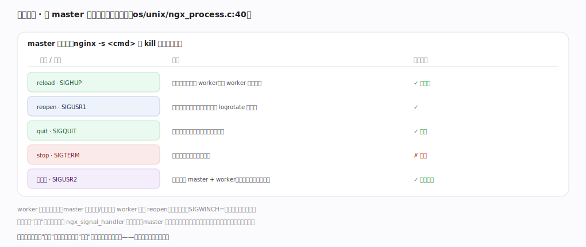
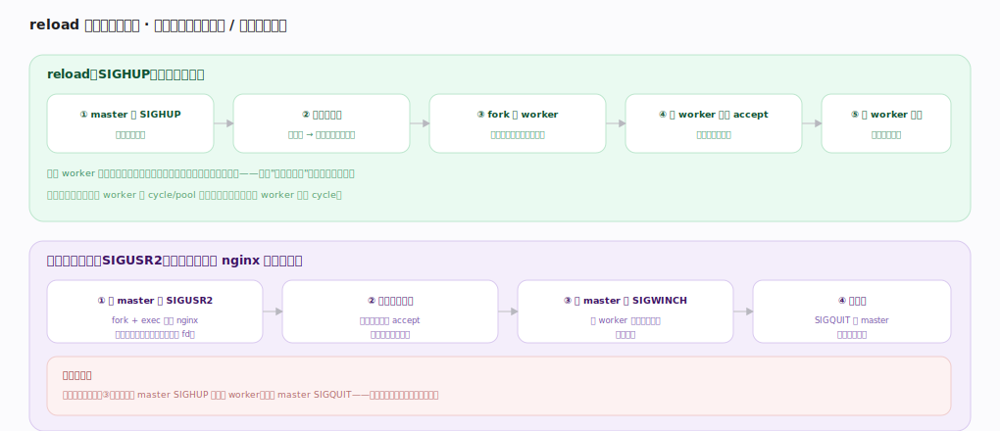

# nginx 核心原理 · 接触面主线 · 信号控制

> **定位**：接触面主线之二——通过向 master 进程发**信号**驱动运行时运维动作（reload/reopen/quit/热升级）。它与"配置指令"分工：配置声明静态行为，信号驱动动态运维；深度依赖**进程与事件模型**（master-worker 生命周期）。核实基准：官方源码 `nginx/src`。

## 一、信号表：命令 → 信号 → 动作

master 信号表（`os/unix/ngx_process.c:40`，用 `nginx -s <cmd>` 或 `kill` 发对应信号）：**reload**（SIGHUP，重读配置、起新 worker 旧 worker 优雅退出）、**reopen**（SIGUSR1，重开日志文件配合 logrotate）、**quit**（SIGQUIT，优雅停机处理完存量）、**stop**（SIGTERM，立即停机）、**热升级**（SIGUSR2，拉起新版并存后切换）。信号只是"触发"——`ngx_signal_handler` 置标志位、master 主循环轮询标志后执行（避免在信号上下文做复杂操作）。worker 由 master 经管道/信号通知执行 reopen、优雅退出（SIGWINCH=停止 accept）。

---

## 二、reload 与二进制热升级

**reload（SIGHUP）**：master 重新解析配置 → 不合法则保留旧配置放弃 → 合法则 fork 新 worker（用新配置开始 accept）→ 旧 worker 停止 accept、处理完存量请求 → 退出。新旧 worker 短暂并存、客户端无感，配置错误不影响在跑的旧配置——"配置即代码"安全演进的关键；内存池随之整体重建（旧 cycle/pool 在退出时释放）。**二进制热升级（SIGUSR2）**：旧 master fork+exec 新版 nginx 并继承监听套接字 → 新旧两套同端口 accept 并存验证 → 旧 master 收 SIGWINCH 排空存量 → 确认后 SIGQUIT 旧 master 完成切换。全程有回滚安全网:出问题可复活旧 worker、退回旧版本而不丢连接。

---

## 拓展 · 信号与效果对照

| 命令 | 信号 | 优雅 | 用途 |
|---|---|---|---|
| reload | SIGHUP | ✓ | 换配置不中断 |
| reopen | SIGUSR1 | ✓ | 日志切割后重开文件 |
| quit | SIGQUIT | ✓ | 优雅停机 |
| stop | SIGTERM | ✗ | 立即停机 |
| （热升级） | SIGUSR2 | ✓ | 换 nginx 可执行文件 |
| （停 accept） | SIGWINCH | ✓ | 旧实例排空连接 |

---

## 调优要点（关键开关）

- 改配置用 `nginx -s reload`（先 `nginx -t`），不要 stop+start（会中断）。
- 日志切割：先 mv 日志文件，再 `nginx -s reopen`，避免丢日志。
- 升级 nginx 用 SIGUSR2 热升级流程，生产环境零停机。
- 优雅停机用 quit 而非 stop，让存量请求正常完成。

---

## 常见误区与工程要点

- **用 stop 换配置**：会强制断连；换配置永远用 reload。
- **logrotate 后不 reopen**：nginx 仍写旧 inode，新文件不落日志——必须 reopen。
- **以为信号立即生效**：信号置标志位、由主循环执行；动作是异步触发的。
- **热升级不验证就 kill 旧 master**：应先并存验证新版正常，再退旧实例，保留回滚能力。

---

## 一句话总纲

**信号控制是 nginx 的运维接触面：向 master 发信号（reload=SIGHUP 换配置、reopen=SIGUSR1 切日志、quit=SIGQUIT 优雅停、SIGUSR2 二进制热升级），信号只置标志位、由 master 主循环轮询后执行；reload 与热升级都靠"新旧 worker/实例短暂并存 + 旧者排空存量再退出"实现零中断切换，配置错误或新版异常都可安全回滚而不丢连接。**
