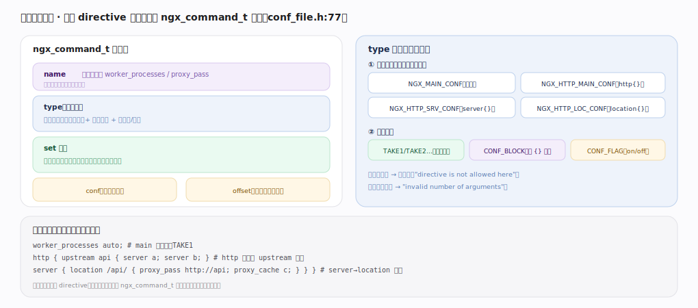
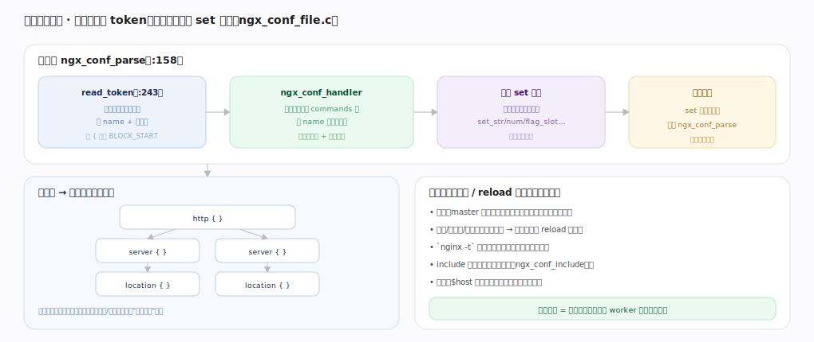
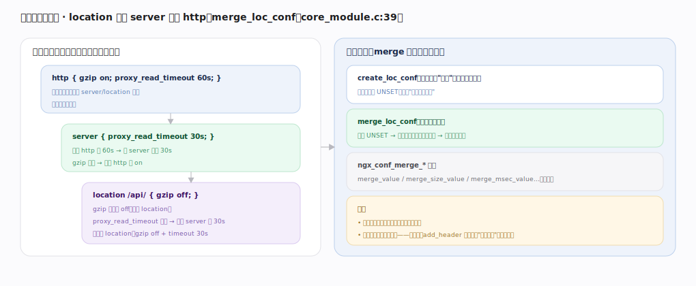

# nginx 核心原理 · 接触面主线 · 配置指令体系

> **定位**：接触面主线之一——用户通过 `nginx.conf` 的**配置指令（directive）**声明 nginx 的一切静态行为。每条指令由某模块的 `ngx_command_t` 注册，在合法上下文里由 set 回调写进配置结构。它是**模块体系**的入口，被几乎所有支撑能力域依赖；与另一条接触面"信号控制"分工——配置声明静态行为、信号驱动运维动作。核实基准：官方源码 `nginx/src`（`commit 9e32c636`，nginx 1.31.3）。

## 一、指令结构：ngx_command_t 五要素

每条指令是一个 `ngx_command_t`（`core/ngx_conf_file.h:77`，字段依次为 `name`/`type`/`set`/`conf`/`offset`/`post`，`:78-83`）：**name**（指令名，如 `worker_processes`/`proxy_pass`）、**type**（位掩码——上下文 + 参数个数 + 是否块/开关）、**set 回调**（`:80`，解析到时把参数写进配置结构）、**conf**（`:81`，存哪层配置）、**offset**（`:82`，字段偏移）。type 分两组标志：上下文（`NGX_MAIN_CONF`/`NGX_HTTP_MAIN_CONF`/`NGX_HTTP_SRV_CONF`/`NGX_HTTP_LOC_CONF`，决定在哪块合法）与参数形态（`TAKE1/2…` 定参数、`NGX_CONF_BLOCK` 带 `{}`、`NGX_CONF_FLAG` on/off）。通用 set 回调有 `ngx_conf_set_flag_slot`（`core/ngx_conf_file.c:1026`）、`ngx_conf_set_str_slot`（`:1066`）、`ngx_conf_set_num_slot`（`:1167`）等 slot 族，模块也可自定义。放错上下文报 "directive is not allowed here"（`:482`），参数不符报 "invalid number of arguments"（`:495`）。全库用同一份贯穿示例配置。

---

## 二、解析流程：递归下降派发给 set 回调

`ngx_conf_parse`（`core/ngx_conf_file.c:158`）主循环：`ngx_conf_read_token`（`:503`）逐字符切出一条指令的 name + 参数，遇 `{` 返回 `NGX_CONF_BLOCK_START`（`:644`）、遇 `}` 返回 `NGX_CONF_BLOCK_DONE`（`:690`）；解析器据返回码分派——`BLOCK_DONE` 收束当前块（`:259`）、`BLOCK_START` 或普通 token 交给 `ngx_conf_handler`（`:356`）在所有模块的 commands 里按 name 找匹配指令、校验上下文与参数个数（块指令须以 `{` 结尾，`:406`）→ 调用 set 回调把参数写进配置结构。遇块指令则 set 回调内递归再调 `ngx_conf_parse` 进入子块；`include` 由 `ngx_conf_include`（`:821`）展开其它文件再解析。

解析发生在启动/reload 时（非请求路径），语法/上下文/参数错误在此暴露；`nginx -t` 只走解析校验不启动 worker，上线前必做。产物是只读配置结构，供 worker 请求处理时查——**配置解析在启动期一次性完成，请求期零解析开销**。

---

## 深化 · 配置继承与合并

指令值沿嵌套 `http → server → location` 向内继承、可就近覆盖。机制在解析后的 merge 阶段：`ngx_http_core_create_loc_conf`（`http/ngx_http_core_module.c:3634`）每层先建字段为 `NGX_CONF_UNSET`（`core/ngx_conf_file.h:56`）的配置结构；`ngx_http_merge_servers`（`http/ngx_http.c:564`）与 `ngx_http_merge_locations`（`:626`，递归下钻子 location）驱动逐模块调各自 merge，`ngx_http_core_merge_loc_conf`（`http/ngx_http_core_module.c:3757`）自外向内合并——本层 UNSET 取父层值（继承）、已设则保留（覆盖），用 `ngx_conf_merge_size_value`（`:3569`）/`ngx_conf_merge_msec_value`（`:3573`）等宏族（带默认值）。意义是"顶层配一次、下层按需覆盖"。

注意并非所有指令都简单继承——数组类指令（如 `add_header`、`proxy_set_header`）遵循"就近整体替换"语义，子块出现同名会覆盖父层全部而非叠加。

---

## 深化 · 失败路径与边界

- **上下文错误**：指令出现在非法块（如 `proxy_pass` 放 http 顶层）时 `ngx_conf_handler`（`:356`）报 "directive is not allowed here"（`:482`）、启动/reload 失败。
- **参数个数错误**：TAKE1 却给了两个参数等，报 "invalid number of arguments"（`:495`）。
- **块未闭合**：`{` 无匹配 `}` 时 `ngx_conf_read_token` 读到 EOF 报 "unexpected end of file, expecting \"}\""。
- **reload 时配置错**：新配置解析失败，master 保留旧配置继续服务、不切换（旧 worker 不退）——故 reload 是安全的；但务必先 `nginx -t`。
- **include 通配无匹配**：`include *.conf` 匹配到 0 个文件不报错（除非用具体文件名），易漏配。

---

## 拓展 · 上下文与常见指令归属

| 上下文 | 典型指令 | 作用 | 锚点 |
|---|---|---|---|
| main（顶层） | `worker_processes`、`user`、`pid` | 进程与全局 | `core/ngx_conf_file.c:356` |
| events | `worker_connections`、`use epoll` | 事件模型 | `event/ngx_event.c` |
| http | `gzip`、`log_format`、`upstream{}` | HTTP 全局默认 | `http/ngx_http.c:564` |
| server | `listen`、`server_name`、`ssl_certificate` | 虚拟主机 | `http/ngx_http.c:626` |
| location | `proxy_pass`、`root`、`limit_req` | 按 URI 路径的处理 | `http/ngx_http_core_module.c:3757` |

---

## 调优要点（关键开关）

- `nginx -t`：改配置后先测试语法与上下文，再 reload。
- `include`：拆分大配置（`ngx_conf_include` `:821`），按 vhost/模块组织。
- 善用继承：公共项放 http/server，仅差异项放 location，减少重复与出错。
- 注意数组类指令（add_header/proxy_set_header）的"就近替换"陷阱——子块要重申父层需要的项。

---

## 常见误区与工程要点

- **指令放错块**：`proxy_pass` 只在 location 有意义，放 http 报 "not allowed here"（`:482`）；先查指令的合法上下文。
- **以为所有指令都叠加继承**：多数标量经 `merge_*` 宏继承覆盖，但 add_header 等在子块出现会整体替换父层。
- **变量在解析期求值**：`$host` 等变量是请求期求值的，配置解析期只记表达式。
- **不测试就 reload**：语法错会让 reload 失败（但旧配置仍在跑）；养成 `nginx -t` 习惯。

---

## 一句话总纲

**配置指令是 nginx 唯一的声明式接触面：每条 directive 由某模块的 `ngx_command_t`（`core/ngx_conf_file.h:77`，name + 上下文/参数位掩码 type + set 回调）注册，`ngx_conf_parse`（`ngx_conf_file.c:158`）递归下降经 `ngx_conf_read_token`（`:503`）读 token 后由 `ngx_conf_handler`（`:356`）校验上下文并派发给 set 回调写入配置结构，值沿 http→server→location 经 `ngx_http_core_merge_loc_conf`（`ngx_http_core_module.c:3757`）继承覆盖——启动/reload 期一次性解析成只读配置结构供 worker 查，`nginx -t` 是上线前的安全闸。**
