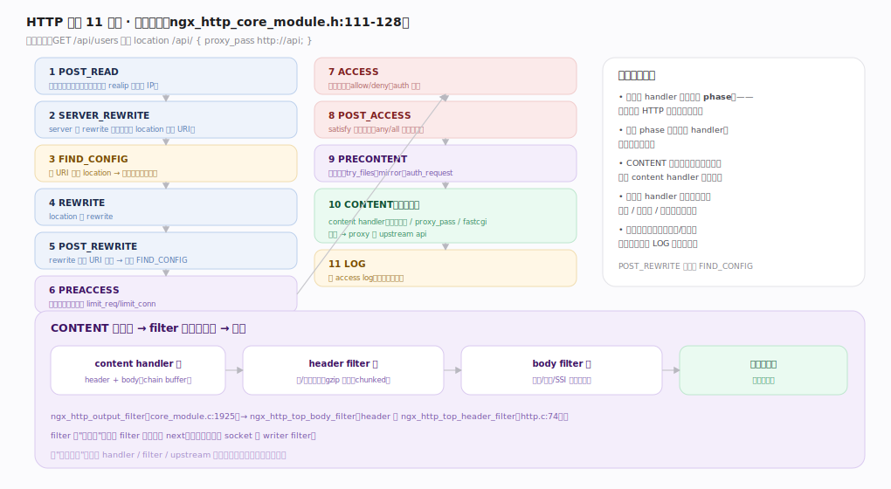
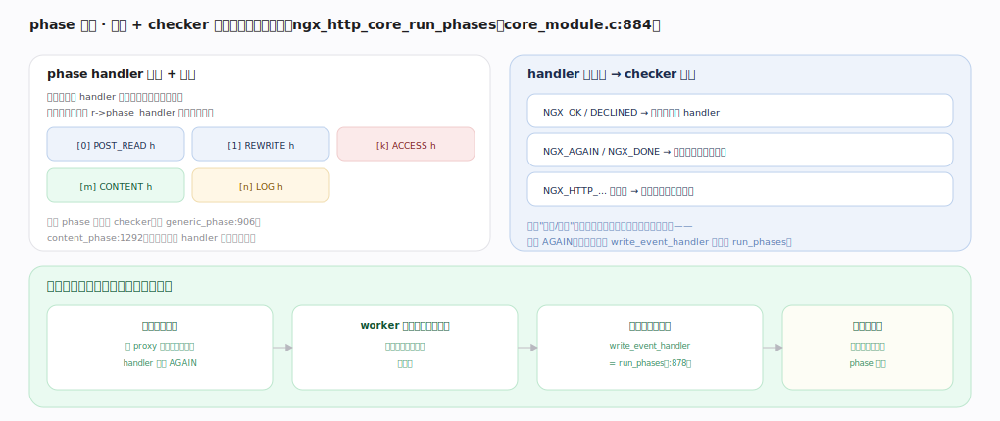

# nginx 核心原理 · 支撑能力域 · HTTP 请求阶段处理

> **定位**：请求处理、灵魂能力域之一。一个 HTTP 请求经 **11 个阶段**（POST_READ→…→CONTENT→LOG）被处理，模块把 handler 挂在某阶段——这是理解一切 HTTP 模块的骨架。依赖**进程与事件模型**（在 worker 事件循环内跑、可暂停恢复），是**模块体系**的执行舞台。核实基准：官方源码 `nginx/src`（`commit 9e32c636`，nginx 1.31.3）。

## 一、11 个阶段：请求的生命周期骨架

阶段枚举 `ngx_http_phases`（`http/ngx_http_core_module.h:110-128`，`NGX_HTTP_POST_READ_PHASE=0`、末尾 `NGX_HTTP_LOG_PHASE`）：**POST_READ**（读完头最早钩子，如 realip）→ **SERVER_REWRITE**（server 级 rewrite）→ **FIND_CONFIG**（按 URI 匹配 location 选配置，内建 checker）→ **REWRITE**（location 级）→ **POST_REWRITE**（URI 变了则跳回 FIND_CONFIG）→ **PREACCESS**（限流 limit_req/limit_conn，`limit_req_module.c:1094` 把 handler push 进本阶段）→ **ACCESS**（allow/deny、auth）→ **POST_ACCESS**（satisfy any/all 判定）→ **PRECONTENT**（try_files/mirror/auth_request）→ **CONTENT**（产内容：静态 `static_module.c:289` push 进本阶段 / proxy_pass / fastcgi）→ **LOG**（记 access log，`log_module.c:254`）。

请求解析完头后由 `ngx_http_process_request`（`http/ngx_http_request.c:2118`）调 `ngx_http_handler`（`http/ngx_http_core_module.c:841`）初始化游标：`r->phase_handler` 从 `server_rewrite_index` 或 0 起（`:864/:868`），`r->write_event_handler = ngx_http_core_run_phases`（`:878`），随即首次 `ngx_http_core_run_phases(r)`（`:879`）。CONTENT 产出后经 **header filter 链 + body filter 链**加工再写回客户端（`ngx_http_output_filter`，`http/ngx_http_core_module.c:1925`；内部先 `ngx_http_top_header_filter` `:1889`、再 `ngx_http_top_body_filter` `:1935`）。全库用同一贯穿请求 `GET /api/users` 命中 `location /api/ { proxy_pass http://api; }`。

---

## 二、phase 引擎：数组 + checker 驱动、可暂停恢复

所有阶段 handler 在 `ngx_http_init_phase_handlers` 里编译期展平成一个 `ngx_http_phase_handler_t[]` 数组，每项带 `checker` 与 `handler`；请求带游标 `r->phase_handler` 指当前位置。`ngx_http_core_run_phases`（`http/ngx_http_core_module.c:884`）主循环：`while (ph[r->phase_handler].checker)` 调 `checker`（`:1319` 处 `if (ph->checker)`），由 checker 决定如何调 handler 与推进游标。

**四类 checker 各司其职**：`ngx_http_core_generic_phase`（`:906`，POST_READ/PREACCESS/LOG 等通用阶段）、`ngx_http_core_rewrite_phase`（`:943`，改写阶段）、`ngx_http_core_find_config_phase`（`:970`，按 URI 定位 location，内部调 `ngx_http_update_location_config` `:1345`）、`ngx_http_core_access_phase`（`:1109`，处理 satisfy 语义）、`ngx_http_core_content_phase`（`:1292`，选一个 content handler 产响应）。

**handler 返回码 → checker 动作**：`NGX_OK` 通常跳到本阶段末尾的 `ph->next`（`:921` 处 `r->phase_handler = ph->next`）；`NGX_DECLINED` 推进相邻下一个 handler；**`NGX_AGAIN`/`NGX_DONE` 暂停等事件再回来**（直接 `return NGX_OK` 退出 run_phases，不推进游标）；返回 HTTP 状态码则 `ngx_http_finalize_request` 结束并走响应。正是"暂停/恢复"让阻塞点（等后端、等磁盘）不占线程——返回 AGAIN 后 worker 转处理别的连接，后端就绪事件到时经 `write_event_handler`（= run_phases）从游标续跑（`:878`）。这与"进程与事件模型"的非阻塞循环无缝衔接。

---

## 三、失败路径与边界

- **rewrite 死循环保护**：POST_REWRITE 每次跳回 FIND_CONFIG 都自增 `r->uri_changes` 计数，超过上限（默认 10）即返回 500 "rewrite or internal redirection cycle"，防止 URI 反复改写打转。
- **找不到 content handler**：CONTENT 阶段无模块产内容时，`ngx_http_core_content_phase`（`:1292`）末尾按默认返回 404/403，不会悬挂。
- **鉴权失败**：ACCESS 阶段 handler 返回 403/401，checker 直接 finalize，后续阶段不再执行；`satisfy any` 时任一 ACCESS handler 通过即放行（POST_ACCESS 判定）。
- **子请求与内部重定向**：`ngx_http_internal_redirect`/子请求会重置 `r->phase_handler` 从 server_rewrite 或指定 index 重跑（`:2563/:2696` 处 `sr->write_event_handler = ngx_http_core_run_phases`），主/子请求各自独立走阶段。
- **客户端提前断开**：写事件报错时 finalize 请求、回收连接，LOG 阶段仍会记录（若已到）。

---

## 拓展 · 各阶段可挂什么

| 阶段 | 典型模块/指令 | 作用 | 锚点 |
|---|---|---|---|
| POST_READ | realip | 取真实客户端 IP | `http/ngx_http_core_module.h:111` |
| SERVER/location REWRITE | rewrite、return | URI 改写/重定向 | `http/ngx_http_core_module.c:943` |
| FIND_CONFIG | （内建） | 匹配 location | `http/ngx_http_core_module.c:970` |
| PREACCESS | limit_req、limit_conn | 限流 | `http/modules/ngx_http_limit_req_module.c:1094` |
| ACCESS | allow/deny、auth_basic、auth_request | 鉴权 | `http/ngx_http_core_module.c:1109` |
| PRECONTENT | try_files、mirror | 内容前处理 | `http/ngx_http_core_module.h:123` |
| CONTENT | root/index（静态）、proxy_pass、fastcgi_pass | 产响应 | `http/modules/ngx_http_static_module.c:289` |
| LOG | access_log | 记录 | `http/modules/ngx_http_log_module.c:254` |

---

## 调优要点（关键开关）

- 用 `location` 精确/前缀/正则匹配控制 FIND_CONFIG 选中的配置。
- 限流放 PREACCESS（limit_req 漏桶）在鉴权前挡住洪峰。
- `try_files` 在 PRECONTENT 优雅回退（找文件→目录→兜底后端）。
- 避免在 rewrite 里写复杂正则回路（POST_REWRITE 跳回受 uri_changes 上限保护但应避免）。

---

## 常见误区与工程要点

- **以为 handler 随便挂哪都行**：模块必须挂对阶段，如鉴权挂 ACCESS、内容挂 CONTENT，错位则时机不对。
- **rewrite 无限循环**：URI 反复改会在 FIND_CONFIG↔POST_REWRITE 间打转，nginx 有 `uri_changes` 上限保护但应避免。
- **LOG 阶段做重活**：LOG 在响应后跑，别在此做阻塞操作拖慢连接回收。
- **把 CONTENT 当可多个**：CONTENT 只跑选中的一个 content handler 产响应，不是链式叠加（链式的是 filter）。

---

## 一句话总纲

**HTTP 请求处理是把一个请求跑过 11 个阶段（`ngx_http_core_module.h:110-128`）：模块把 handler 挂在对应阶段，`ngx_http_core_run_phases`（`ngx_http_core_module.c:884`）用展平的 handler 数组 + 游标 `r->phase_handler` + 各 phase 的 checker（generic/rewrite/find_config/access/content）驱动推进，handler 返回 AGAIN 即暂停让出线程、事件就绪后经 `write_event_handler`（`:878`）从游标续跑；CONTENT 产出的响应再经 header/body filter 链（`ngx_http_output_filter`，`:1925`）加工后非阻塞写回——这条阶段流水线是一切 HTTP 模块的挂载骨架。**
