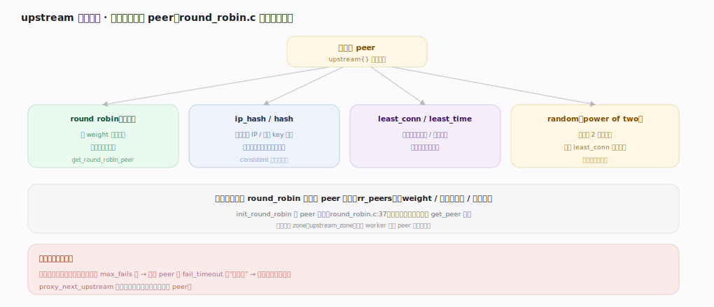
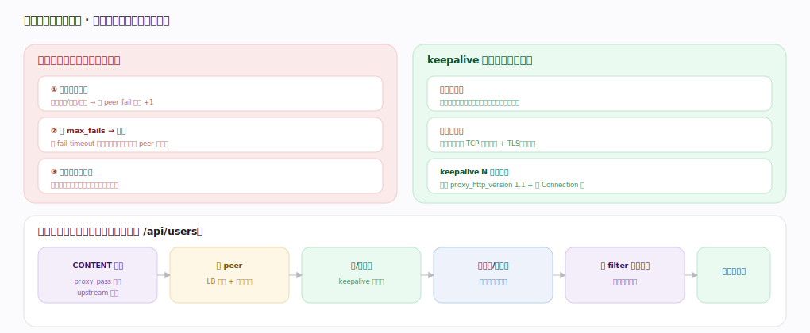

# nginx 核心原理 · 支撑能力域 · upstream 负载均衡

> **定位**：后端与安全能力域。反向代理时在多后端间选 peer、做被动健康检查、复用连接。是 **upstream 模块**（一种 content handler）的核心，被反代类 **HTTP 阶段处理**（CONTENT）驱动，peer 状态用**共享内存**跨 worker 共享。核实基准：官方源码 `nginx/src`。

## 一、负载均衡策略

`upstream{}` 声明策略选 peer：**round robin（默认）** 按 weight 加权轮询（最通用无状态，`round_robin.c` 的 `get_round_robin_peer`）；**ip_hash/hash** 按客户端 IP 或自定 key 哈希（会话保持，consistent 减少重分布）；**least_conn/least_time** 选当前连接最少/响应最快（适合请求耗时不均）；**random（power of two）** 随机选 2 个取较优（近似 least_conn 更省状态，大规模后端友好）。所有策略共享 round_robin 基座的 peer 状态（`init_round_robin` 建 peer 数组，`round_robin.c:37`），只是不同的 get_peer 选法；共享内存 zone（`upstream_zone`）让多 worker 共享 peer 状态与统计。

---

## 二、健康检查与连接复用

**被动健康检查**（开源版内建）：转发失败（超时/拒绝/错误）累计该 peer fail 计数，达 `max_fails` 在 `fail_timeout` 窗口内标记不可用、选 peer 时跳过，窗口后放一个请求半开重试恢复；`proxy_next_upstream` 控哪些错误触发重试到别的 peer。**keepalive 连接池**：请求完不关到后端的连接、放回池复用，省 TCP+TLS 握手降延迟，需配 `proxy_http_version 1.1` + 清 Connection 头。一次反向代理完整链路：CONTENT 阶段 proxy_pass 触发 upstream 模块 → 选 peer（跳过坏的）→ 取/建连接（keepalive 优先）→ 非阻塞发请求收响应 → 经 filter 回客户端（可同时写缓存）→ 连接放回池。

---

## 拓展 · upstream 相关指令

| 指令 | 作用 |
|---|---|
| `upstream name { server ...; }` | 定义后端池 |
| `server ... weight= max_fails= fail_timeout=` | peer 参数与健康检查阈值 |
| `ip_hash` / `hash` / `least_conn` / `random` | 选负载均衡策略 |
| `keepalive N` | 到后端的长连接池大小 |
| `proxy_next_upstream` | 何种错误重试到下一 peer |
| `zone name size` | 共享内存，多 worker 共享 peer 状态 |

---

## 调优要点（关键开关）

- 生产用 `zone` 让 peer 状态跨 worker 一致（否则各 worker 各判健康）。
- 配 `keepalive` + HTTP/1.1 到后端，显著降延迟与握手开销。
- `max_fails`/`fail_timeout` 按后端稳定性调，避免误熔断或迟熔断。
- 会话敏感用 ip_hash/hash（consistent），否则默认 round robin 即可。

---

## 常见误区与工程要点

- **以为开源版有主动健康检查**：开源版是被动（靠真实请求失败判定）；主动探测在商业版或第三方模块。
- **keepalive 不清 Connection 头**：不清会导致连接被关，池失效——必须配 proxy_set_header Connection ""。
- **ip_hash 后端增减致大量重分布**：用 consistent 哈希缓解。
- **不配 zone 却依赖统计一致**：多 worker 下 peer 计数各算，健康判定不准。

---

## 一句话总纲

**upstream 负载均衡在反代 CONTENT 阶段于多后端间选 peer：round robin（默认加权）/ip_hash/hash（会话保持）/least_conn/least_time/random 各是 round_robin 基座上不同的 get_peer 选法，peer 状态经共享内存 zone 跨 worker 共享；被动健康检查按 max_fails/fail_timeout 熔断坏 peer、半开重试恢复，keepalive 连接池复用到后端的长连接省握手——共同实现高可用、低延迟的后端分流。**
