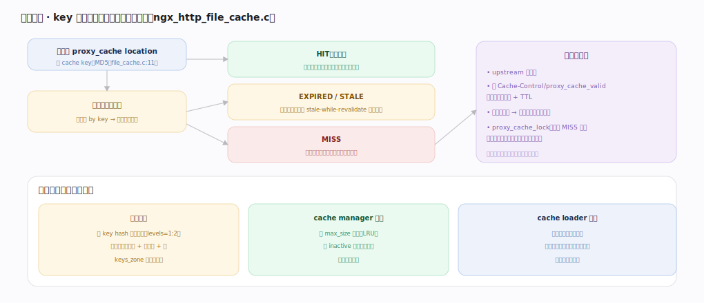

# nginx 核心原理 · 支撑能力域 · 代理缓存

> **定位**：后端与安全能力域。把后端响应按 key 缓存到磁盘、命中直返，大幅减轻后端压力。依赖 **upstream**（回源）、**共享内存**（索引）、**后台任务**（cache manager/loader 进程）。核实基准：官方源码 `nginx/src`。

## 一、缓存查找与回填流程

请求到 proxy_cache location 先算 cache key（MD5，`ngx_http_file_cache.c:11`），查共享内存索引（红黑树 by key）得缓存状态：**HIT（有效）** 直接读磁盘缓存文件返回、不碰后端；**EXPIRED/STALE** 回源校验，可配 stale-while-revalidate 先返旧的；**MISS** 回源取、边返客户端边写缓存文件。回填时依 Cache-Control/`proxy_cache_valid` 决定是否可缓存 + TTL，写临时文件后原子改名进缓存目录；`proxy_cache_lock` 让并发 MISS 只放一个回源、其余等回填（防缓存击穿）。索引在共享内存、数据在磁盘文件。

存储与后台管理：磁盘按 key hash 分级目录（`levels=1:2`），文件头存元数据+响应头+体，`keys_zone` 存内存索引；**cache manager** 进程按 `max_size` LRU 淘汰、按 `inactive` 清久未访问；**cache loader** 进程仅启动时扫描缓存目录把已有文件载入内存索引。

---

## 拓展 · 缓存相关指令

| 指令 | 作用 |
|---|---|
| `proxy_cache_path ... keys_zone= levels= max_size= inactive=` | 缓存目录、内存索引、容量、失效 |
| `proxy_cache zone` | 该 location 启用缓存 |
| `proxy_cache_key` | 自定义 key（默认含 scheme/host/uri） |
| `proxy_cache_valid code time` | 各状态码的缓存 TTL |
| `proxy_cache_lock on` | 防击穿：并发 MISS 只回源一次 |
| `proxy_cache_use_stale` | 后端异常时返旧缓存 |

---

## 调优要点（关键开关）

- `keys_zone` 要够大（每 MB 约存 8000 个 key），否则索引满 LRU 淘汰频繁。
- `proxy_cache_lock on` 防热点 key 并发回源打垮后端。
- `proxy_cache_use_stale` + `updating` 提升后端抖动时可用性。
- 缓存目录放快盘；`levels` 分级避免单目录文件过多。

---

## 常见误区与工程要点

- **以为缓存全在内存**：索引在共享内存、数据体在磁盘文件；内存只存 key→元数据。
- **key 设计不当**：默认 key 含 host/uri，动态参数多时命中率低，需按业务定 key。
- **不设 lock 致击穿**:热点内容过期瞬间大量并发回源，务必 `proxy_cache_lock`。
- **忽视 Cache-Control**:后端返回 no-cache/private 时 nginx 不缓存，排查命中率先看响应头。

---

## 一句话总纲

**代理缓存把后端响应按 MD5 cache key 缓存到磁盘：查共享内存红黑树索引判 HIT/EXPIRED/MISS，命中直读磁盘文件返回、未命中回源并边返边写缓存文件（proxy_cache_lock 防并发击穿），依 Cache-Control/proxy_cache_valid 定 TTL；索引在共享内存、数据在磁盘分级目录，cache manager 进程按 max_size/inactive 后台淘汰、cache loader 启动时载入索引——用磁盘换后端压力。**
