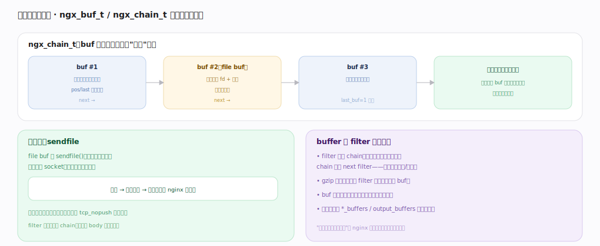

# nginx 核心原理 · 支撑能力域 · 内存池与缓冲

> **定位**：连接底座能力域。按对象生命周期开内存池、一次性释放（杜绝泄漏、免逐个 free），并用 buffer 链零拷贝传递数据。被**HTTP 阶段处理**、**模块体系**、**upstream** 广泛依赖。核实基准：官方源码 `nginx/src`。

## 一、内存池：按生命周期分配、一次性释放

一个 pool 内：**小块（≤max）** `ngx_palloc`（`palloc.c:123`）在预分配块里移动指针切一段，几乎零开销，`max = min(size, NGX_MAX_ALLOC_FROM_POOL=pagesize-1)`（`palloc.h:17`）；**大块（>max）** 直接 malloc 挂 large 链，pool 销毁时一并 free；**cleanup 回调**（`ngx_pool_cleanup_add`）注册"销毁时要做的事"（关 fd/删临时文件）。按对象生命周期开池：连接池（连接建立时）、请求池（请求开始时、结束整体销毁）。**关键收益**：请求相关的所有分配挂请求池，请求一结束 `ngx_destroy_pool`（`:47`）整池回收——忘记 free 也不漏；小块分配是指针移动无系统调用开销；`ngx_reset_pool`（`:100`）可复用池（keepalive）。

---

## 二、缓冲链与零拷贝

`ngx_chain_t` 是 buf 单链表，数据以"引用"传递：内存 buf（pos/last 指向数据）、file buf（指向 fd + 偏移不读进内存）串成链，输出时分批非阻塞写、写不完的挂起等写事件续发。**零拷贝 sendfile**：file buf 走 `sendfile()`，内核直接把文件数据发到 socket 不经用户态拷贝（磁盘→内核→网卡），是静态大文件服务的关键提速。filter 链传递的是 chain 不复制 body——多数 filter 只改指针/标志，只有 gzip 等重编码才分配新 buf。"不搬数据、只传引用"是 nginx 低内存高吞吐的又一支柱。

---

## 拓展 · 内存相关组件

| 组件 | 职责 | 锚点 |
|---|---|---|
| ngx_create_pool / palloc / pnalloc | 建池 / 对齐 / 不对齐分配 | `core/ngx_palloc.c:19/123/136` |
| ngx_destroy_pool / reset_pool | 整池释放 / 复用 | `core/ngx_palloc.c:47/100` |
| ngx_pool_cleanup_add | 销毁回调 | `core/ngx_palloc.c` |
| ngx_buf_t / ngx_chain_t | 缓冲 / 缓冲链 | `core/ngx_buf.h` |
| ngx_shmtx / slab | 共享内存分配（缓存/限流用） | `core/ngx_slab.c` |

---

## 调优要点（关键开关）

- `client_header_buffer_size` / `large_client_header_buffers`：请求头缓冲大小。
- `output_buffers`、`proxy_buffers`：响应/代理缓冲，影响内存与吞吐。
- `sendfile on` + `tcp_nopush on`：静态文件零拷贝 + 合并包。
- 大量小对象场景正是内存池的强项，勿在 handler 里手动 malloc/free 绕过池。

---

## 常见误区与工程要点

- **在请求处理里手动 malloc**：应从请求池 palloc，随请求结束自动回收；手动分配易泄漏。
- **以为 filter 会复制 body**：多数只传 chain 引用；只有重编码 filter 才分配新缓冲。
- **共享内存与池混淆**：pool 是进程内、随生命周期释放；缓存/限流跨 worker 的数据用共享内存 + slab。
- **缓冲设太小**：请求头/响应超缓冲会报错或退化落盘，按业务调大。

---

## 一句话总纲

**内存池按对象生命周期分配（小块指针 bump、大块 malloc 挂链、cleanup 回调），请求相关分配挂请求池、请求结束一次 destroy_pool 整体回收——杜绝泄漏且极快；数据用 ngx_chain_t 缓冲链以引用传递、file buf 走 sendfile 零拷贝，filter 链多只传 chain 不复制 body——"按生命周期一次性释放"与"不搬数据只传引用"共同支撑 nginx 的低内存高吞吐。**
