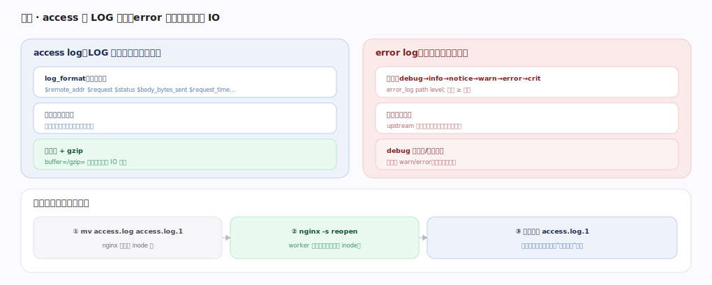
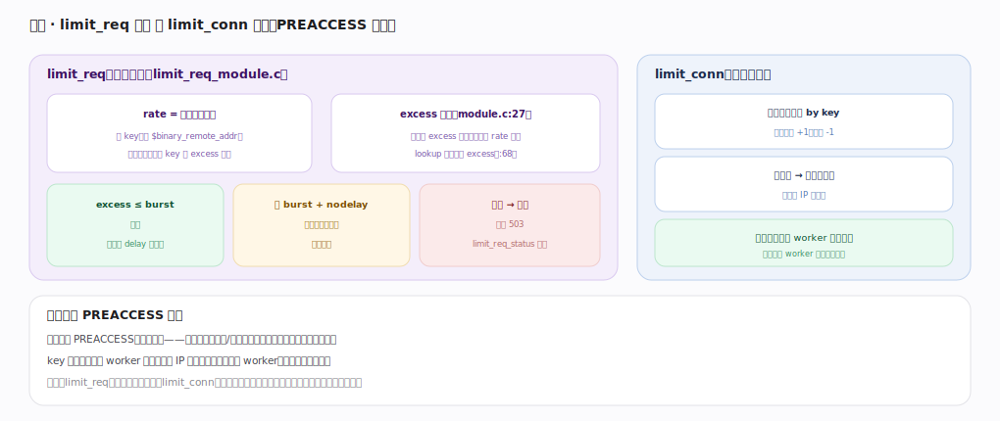

# nginx 核心原理 · 支撑能力域 · 日志与限流

> **定位**：连接底座能力域。access 日志在 LOG 阶段记录、error 日志分级随时写、缓冲写省 IO；限流（limit_req 漏桶 / limit_conn 计数）在 PREACCESS 阶段挡洪峰。依赖**HTTP 阶段处理**（挂载时机）与**共享内存**（跨 worker 计数）、**信号控制**（reopen 切日志）。核实基准：官方源码 `nginx/src`（`commit 9e32c636`，nginx 1.31.3）。

## 一、日志：access 在 LOG 阶段、error 分级

**access log**（LOG 阶段，响应发完后）：`log_format` 是变量模板（`$remote_addr $request $status $body_bytes_sent $request_time`…），`ngx_http_log_handler`（`http/modules/ngx_http_log_module.c:254`）在 LOG 阶段被调，请求期求值各变量填模板成一行。**缓冲写**：`access_log ... buffer=` 时数据先攒进内存缓冲 `ngx_http_log_buf_t`（`http/modules/ngx_http_log_module.c:263`），只有当本行长度超过缓冲剩余空间（`len > buffer->last - buffer->pos`，`http/modules/ngx_http_log_module.c:328`）才 `ngx_http_log_write`（`http/modules/ngx_http_log_module.c:98`）刷盘、指针拨回（`http/modules/ngx_http_log_module.c:333`），大幅降 IO 频率；`gzip=` 再叠压缩写。**error log**（分级，随时可写）：级别 debug→info→notice→warn→error→crit，`error_log path level` 只记 ≥ 该级，是诊断第一现场（upstream 错误、超时、配置告警）；debug 需编译/配置开启，生产用 warn/error、排障临时提级。

**日志切割配合信号**：mv 日志文件（nginx 仍持旧 inode 写）→ `nginx -s reopen`（master 收 SIGUSR1 通知各 worker 重开日志文件）→ 压缩归档，不丢日志不停服（见"信号控制"篇）。

---

## 二、限流：漏桶与并发计数

**limit_req 漏桶**（`http/modules/ngx_http_limit_req_module.c`）：入口 `ngx_http_limit_req_handler`（`http/modules/ngx_http_limit_req_module.c:195`）在 PREACCESS 阶段（`http/modules/ngx_http_limit_req_module.c:1094` 处 push 进 `NGX_HTTP_PREACCESS_PHASE`）被调，按 key（如 `$binary_remote_addr`）在共享内存记 `excess` 水位（`http/modules/ngx_http_limit_req_module.c:27`）。核心算法在 `ngx_http_limit_req_lookup`（`http/modules/ngx_http_limit_req_module.c:405`）：算距上次请求的毫秒差 `ms = now - lr->last`（`http/modules/ngx_http_limit_req_module.c:445`），漏桶更新 `excess = lr->excess - ctx->rate * ms / 1000 + 1000`（`http/modules/ngx_http_limit_req_module.c:456`）——即水位随时间按 rate 匀速漏掉、每来一个请求加 1000（放大 1000 倍避浮点）。判定：`excess ≤ burst` 放行（可 delay 平滑）、超 burst 则 `return NGX_BUSY`（`http/modules/ngx_http_limit_req_module.c:462`）→ handler 按 `NGX_HTTP_LIMIT_REQ_REJECTED`（`http/modules/ngx_http_limit_req_module.c:15`）返 503（默认，`limit_req_status` 可改）。

**limit_conn 并发计数**（`http/modules/ngx_http_limit_conn_module.c`）：`ngx_http_limit_conn_handler`（`http/modules/ngx_http_limit_conn_module.c:180`）同样在 PREACCESS（`http/modules/ngx_http_limit_conn_module.c:750` 处 push），共享内存计数 by key，连接开始 `lc->conn++`（`http/modules/ngx_http_limit_conn_module.c:286`）、请求结束（cleanup 回调）-1，超 `limit_conn N` 上限拒绝新连接。

二者都在 **PREACCESS 阶段**——在花代价做鉴权/回源前就把洪峰挡住、保护后端与自身；key 用共享内存跨 worker 统计（一个 IP 的请求可能落不同 worker，必须共享才准）。漏桶平滑速率、计数限并发，常配合用。

---

## 三、失败路径与边界

- **共享内存 zone 耗尽**：`limit_req`/`limit_conn` 的 key 太多撑爆 zone 时，`ngx_http_limit_req_lookup` 会 LRU 淘汰最旧节点（`ngx_queue_remove` + 插头，`:441-443`）腾位；极端下老 key 被挤掉、限流精度降但不崩。
- **拒绝的返回码**：limit_req 超限走 `NGX_HTTP_LIMIT_REQ_REJECTED`（`:15`）返 503；`limit_req ... nodelay` 允许突发立即放行但计入水位，`delay=` 则排队平滑。
- **dry_run 模式**：`limit_req_dry_run on` 时命中 `NGX_HTTP_LIMIT_REQ_REJECTED_DRY_RUN`（`:17`）只记日志不真拒，用于上线前观测阈值。
- **单 worker 计数无意义**：不配 `*_zone`（共享内存）时限流退化为进程内、多 worker 下完全不准——必须用 zone。
- **日志写盘失败**：磁盘满时 `ngx_http_log_write`（`:98`）写失败记 error（每分钟限频告警），不阻塞请求处理。

---

## 拓展 · 日志与限流指令

| 指令 | 作用 | 锚点 |
|---|---|---|
| `log_format` / `access_log path fmt buffer= gzip=` | 日志格式与缓冲/压缩写 | `http/modules/ngx_http_log_module.c:254` |
| `error_log path level` | 错误日志与级别 | `core/ngx_log.c` |
| `limit_req_zone key zone= rate=` + `limit_req zone= burst= nodelay` | 请求速率漏桶 | `http/modules/ngx_http_limit_req_module.c:195/405` |
| `limit_conn_zone key zone=` + `limit_conn zone= N` | 并发连接数限制 | `http/modules/ngx_http_limit_conn_module.c:180/286` |
| `limit_req_status` / `limit_conn_status` | 超限返回码 | `http/modules/ngx_http_limit_req_module.c:15` |

---

## 调优要点（关键开关）

- access log 开 `buffer=`（如 32k）+ `gzip`，高流量下大幅降磁盘 IO。
- 限流 key 用 `$binary_remote_addr`（比字符串省内存）。
- `burst` + `nodelay` 允许合理突发又不排队延迟。
- 排障临时把 error_log 提到 info/debug，完事调回 warn。
- 上线新限流阈值先用 `limit_req_dry_run on` 观测再启用。

---

## 常见误区与工程要点

- **限流不用共享内存**：单 worker 计数无意义；必须 `*_zone`（共享内存）跨 worker 统计。
- **access log 不缓冲**：每请求同步写盘拖慢高并发；开 buffer（`:328` 的攒批逻辑）。
- **limit_req 无 burst**：严格匀速会拒掉正常突发；配合理 burst。
- **logrotate 后不 reopen**：nginx 仍写旧 inode，新文件空——必须 reopen。
- **误把 excess 当整数请求数**：源码里放大了 1000 倍（`:456`），比较时对应 rate×1000。

---

## 一句话总纲

**日志与限流：access log 由 `ngx_http_log_handler`（`log_module.c:254`）在 LOG 阶段按 log_format 变量模板缓冲写盘（超缓冲才 `ngx_http_log_write` `:98` 刷）、error log 分级记录诊断现场、日志切割靠 mv + reopen 不丢不停服；限流在 PREACCESS 阶段抢先挡洪峰——limit_req 漏桶 `ngx_http_limit_req_lookup`（`:405`）按 `excess = lr->excess - rate*ms/1000 + 1000`（`:456`）算水位、超 burst 返 503，limit_conn（`conn++` `:286`）共享内存计数限并发，二者的 key 都用共享内存跨 worker 统计才准确。**
