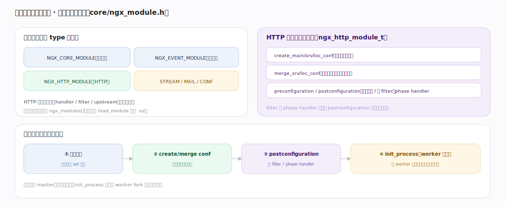

# nginx 核心原理 · 支撑能力域 · 模块体系

> **定位**：请求处理能力域。nginx"一切功能皆模块"——三类 HTTP 模块（handler 产内容 / filter 加工响应 / upstream 转后端）挂进请求流水线。它是**配置指令**的载体（每指令由模块注册）、**HTTP 阶段处理**的填充物。核实基准：官方源码 `nginx/src`。

## 一、三类 HTTP 模块

**handler**（内容生成器）挂在某 phase（多为 CONTENT），直接产响应（static 读文件、autoindex、return）；一个请求的 CONTENT 只选一个 handler。**filter**（响应加工链）不产内容、改 header/body，串成责任链逐级调 next（gzip、chunked、ssi）；可多个叠加。**upstream**（后端代理）是特殊 content handler，把请求转后端并回传（proxy/fastcgi/uwsgi/grpc），配 `upstream{}` 做负载均衡。**filter 链 LIFO 构建**：每个 filter 在 postconfiguration 时把全局链头存进自己 next、再把自己设为新头（`gzip_filter_module.c:214`）——后注册先执行，链尾是真正写 socket 的 writer filter。

---

## 二、模块类型与生命周期

模块按 type 分大类（`core/ngx_module.h`）：`NGX_CORE_MODULE`/`NGX_EVENT_MODULE`/`NGX_HTTP_MODULE`/`STREAM`/`MAIL`/`CONF`，编译期静态链接进 `ngx_modules[]` 或动态 `load_module` 加载 `.so`。HTTP 模块的配置钩子（`ngx_http_module_t`）：`create_main/srv/loc_conf`（各层建配置结构）、`merge_srv/loc_conf`（继承合并）、`preconfiguration/postconfiguration`（注册变量 / 挂 filter 和 phase handler）。启动初始化顺序：解析配置 → create/merge conf → postconfiguration（挂 filter/handler）→ init_process（每 worker fork 后各初始化连接池等）。

---

## 拓展 · 模块与流水线挂载点

| 类型 | 挂载点 | 例子 |
|---|---|---|
| handler | phase handler 数组 | static、proxy、fastcgi |
| header filter | ngx_http_top_header_filter 链 | headers、gzip、not_modified |
| body filter | ngx_http_top_body_filter 链 | gzip、chunked、ssi、sub |
| upstream | content handler + 负载均衡 | proxy_pass、grpc_pass |
| 变量 | preconfiguration 注册 | $http_x、$upstream_addr |

---

## 调优要点（关键开关）

- 编译时用 `--with-*` / `--without-*` 裁剪模块，减小体积。
- 动态模块 `load_module` 便于按需加载第三方模块。
- filter 顺序由内置注册决定，一般无需干预；自定义模块注意注册时机。
- 用 `nginx -V` 看编译进了哪些模块。

---

## 常见误区与工程要点

- **以为 filter 能改内容顺序随意**：filter 是固定 LIFO 链，顺序由注册决定，不能任意插队。
- **handler 与 filter 混淆**：handler 产内容（CONTENT 阶段选一个），filter 只加工已产出的内容。
- **第三方模块乱加**：模块直接嵌进 worker 进程，劣质模块会拖垮/搞崩整个 nginx。
- **忘了 upstream 也是 content handler**：proxy_pass 本质是 CONTENT 阶段的一个 handler。

---

## 一句话总纲

**nginx 一切功能皆模块：handler 挂在 phase 上产内容（CONTENT 只选一个）、filter 以 LIFO 责任链逐级加工 header/body 后调 next（链尾 writer filter 写 socket）、upstream 作为特殊 content handler 转后端；模块按 core/event/http/stream/mail 分类，经 create/merge conf 与 pre/postconfiguration 钩子把配置结构、变量、filter 与 phase handler 注册进引擎——这套模块体系是配置指令的载体与 HTTP 阶段流水线的填充物。**
