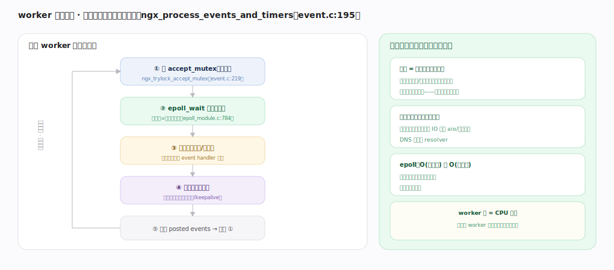
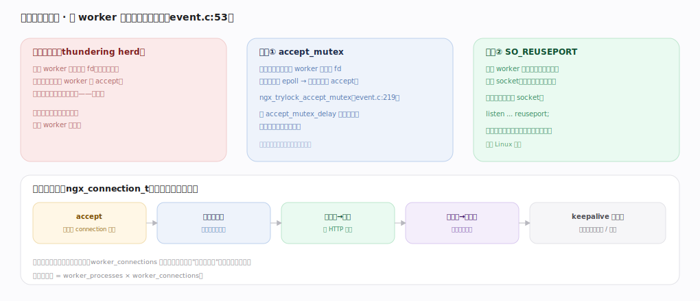

# nginx 核心原理 · 支撑能力域 · 进程与事件模型

> **定位**：连接底座、灵魂能力域之一。master-worker 多进程 + worker 单线程非阻塞事件循环（epoll），是 nginx 高并发的根基。被**所有**能力域依赖（一切都在 worker 事件循环内跑），由**信号控制**驱动进程生命周期。核实基准：官方源码 `nginx/src`。

## 一、worker 事件循环：单线程非阻塞跑满一颗核

每个 worker 跑无限循环 `ngx_process_events_and_timers`（`event/ngx_event.c:195`）：① 抢 accept_mutex（可选，`ngx_trylock_accept_mutex` `:219`）→ ② `epoll_wait` 等就绪事件（超时=最近定时器，`epoll_module.c:784`）→ ③ 处理就绪读/写事件（调各连接的 event handler 回调）→ ④ 处理到期定时器（红黑树管超时/keepalive）→ ⑤ 处理 posted events → 回到 ①。**一个线程扛上万连接**的原因：连接是状态机不占线程（就绪才被唤醒、处理一小步就返回）、一切可能阻塞的都异步化（网络非阻塞、磁盘 aio/线程池、DNS 异步 resolver）、epoll 只返回真正有事件的连接（O(就绪数) 而非 O(总连接)）。worker 数 ≈ CPU 核数，每核跑满无线程切换抖动。

---

## 二、惊群与连接分配

多 worker 共享监听套接字,新连接若唤醒所有 worker 去 accept 就是**惊群**（只一个成功、其余空忙、分配不均）。两种解法:**accept_mutex**(同一时刻只持锁 worker 把监听 fd 加进自己 epoll,配 accept_mutex_delay 轮流持锁);**SO_REUSEPORT**(每 worker 各绑同端口 socket,内核均匀分发,无锁无惊群、延迟更低,现代 Linux 首选)。连接的一生是事件驱动状态机(`ngx_connection_t`):accept 取连接结构 → 注册读事件 → 读就绪跑 HTTP 阶段 → 写就绪发响应 → keepalive 复用或关闭。连接数上限 = worker_processes × worker_connections。

---

## 拓展 · 进程与事件组件

| 组件 | 职责 | 锚点 |
|---|---|---|
| ngx_master_process_cycle | master 管控循环 | `os/unix/ngx_process_cycle.c:74` |
| ngx_worker_process_cycle | worker 主体 | `os/unix/ngx_process_cycle.c` |
| ngx_process_events_and_timers | 事件循环核心 | `event/ngx_event.c:195` |
| ngx_event_actions | epoll/kqueue 抽象层 | `event/ngx_event.c:44` |
| ngx_epoll_process_events | epoll 具体实现 | `event/modules/ngx_epoll_module.c:784` |
| accept_mutex | 惊群互斥 | `event/ngx_event.c:53` |

---

## 调优要点（关键开关）

- `worker_processes auto`：通常设为 CPU 核数，跑满多核。
- `worker_connections`：单 worker 连接上限；总容量 = worker 数 × 它。
- `use epoll`（Linux 默认）/ `multi_accept`：一次事件循环接多个连接。
- `listen ... reuseport`：现代 Linux 用它替代 accept_mutex，降尾延迟。

---

## 常见误区与工程要点

- **调大 worker_processes 到远超核数**：进程切换开销反增；一般 = 核数。
- **worker_connections 当作最大并发请求数**：它含到后端的连接、代理时一个请求占两个连接。
- **以为多线程**：默认单线程事件循环；`aio threads` 仅卸载阻塞磁盘 IO。
- **阻塞操作写进 handler**：任何同步阻塞（如同步 DNS、大文件同步读）会卡住整个 worker 上所有连接。

---

## 一句话总纲

**进程与事件模型是 nginx 高并发的根基：master 管控并 fork ≈CPU 核数个 worker，每个 worker 用单线程跑 ngx_process_events_and_timers 无限循环——epoll_wait 拿就绪事件、回调各连接的 event handler、处理定时器——连接是不占线程的状态机、一切阻塞操作都异步化，故一个线程可管上万连接；多 worker 抢连接用 accept_mutex 或 SO_REUSEPORT 避免惊群并均衡分配。**
