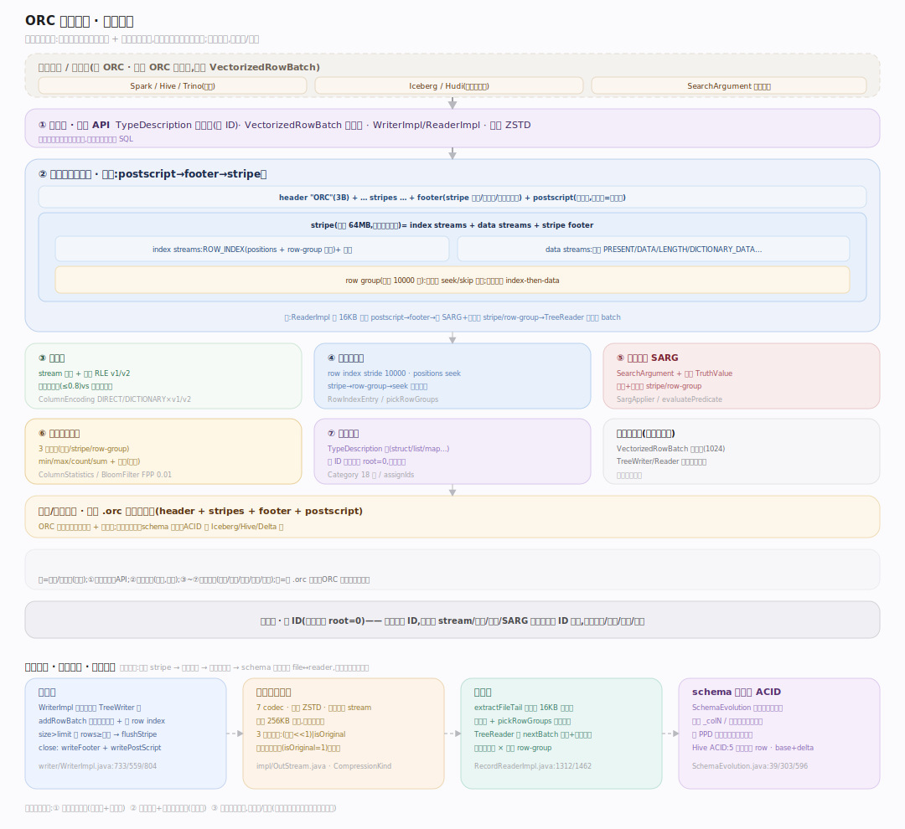
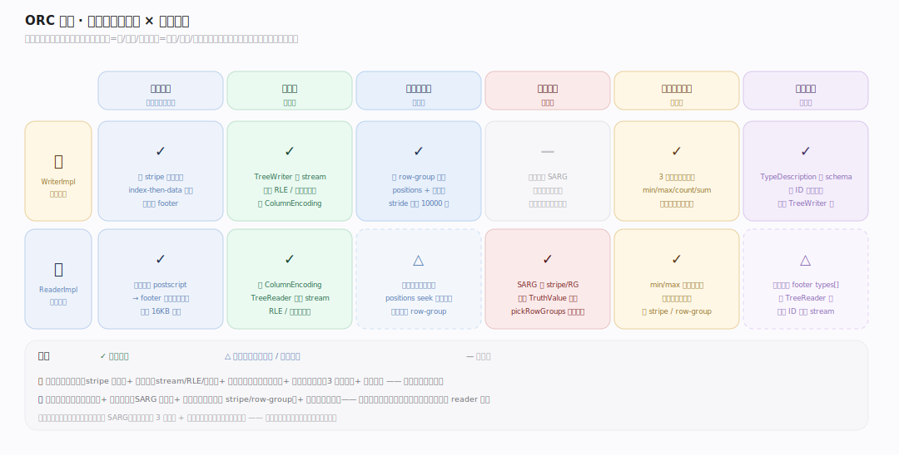
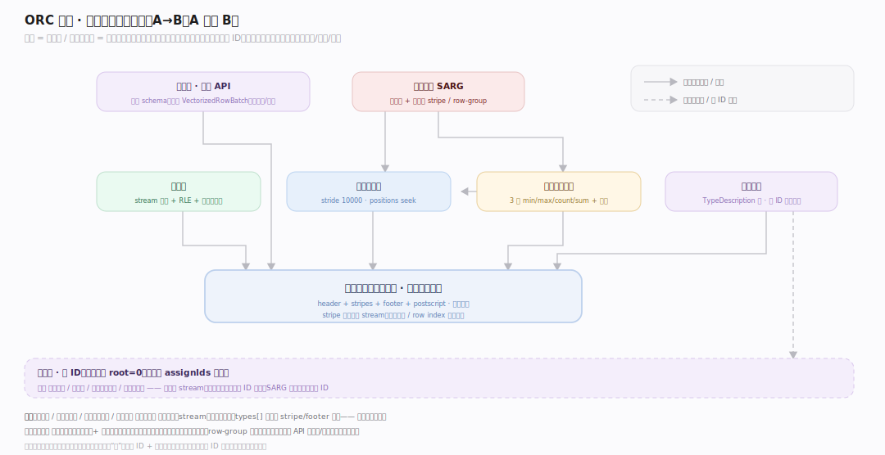

# ORC 原理 · 全景主线框架

> 统领全部原理文档:Apache ORC(Optimized Row Columnar)是**列式文件格式**(新家族:列存文件格式——不是引擎、不是表格式,而是**单个文件的磁盘字节布局规范** + 读写库,让一个文件把行数据按列存、带索引和统计能跳读)。源码基准 **ORC(git 5f34b04a4)**(`~/workdir/orc`,Java `java/core/` + C++ `c++/`)。

ORC 的世界观:**文件 = 按列组织的字节流 + 多级统计索引**。一张表的数据切成多个 ORC 文件,每文件内数据按**列**存(非按行)——同列值连续,压缩率高、只读需要的列;文件分 stripe(行组),stripe 内每列是独立 stream,配 row-group 级统计 + 布隆过滤器,让查询按谓词跳过整 stripe/row-group。它自己不管表、不管事务(那是 Iceberg/Hive 的事);ORC 只管"一个文件怎么高效列存 + 能跳读"。理解"文件布局 + 列编码 + 统计跳读"三点,就懂了 ORC。

> **结构提示(写文档必看)**:① 文件布局倒读——尾部 postscript(不压缩,末字节=其长度)指 footer,footer 列 stripe;② stripe = index streams + data streams + stripe footer,默认 64MB;③ 每列多个 stream(PRESENT/DATA/LENGTH/DICTIONARY_DATA…),整数 RLE v1/v2、字符串字典编码;④ row index stride 默认 10000 行,row-group 级统计支持细粒度 seek/skip;⑤ 谓词下推 SearchArgument 用统计+布隆跳 stripe/row-group;⑥ 类型树 TypeDescription,列 ID 前序编号;⑦ 压缩 ZSTD 默认。

---

## 一、双维模型:能力域 × 执行时机

- **能力域**:接触面(读写 API + VectorizedRowBatch)面向计算引擎;支撑侧——文件布局、列编码、行组与索引、谓词下推、列统计与布隆、类型系统。
- **执行时机**:全前台(写:TreeWriter 逐列攒 stream、flush stripe;读:倒读 footer、按谓词剪 stripe/row-group、TreeReader 解码填 batch)。无后台守护——ORC 是纯文件格式库,进程内同步读写。

---

## 二、总架构图

**写**:计算引擎给 VectorizedRowBatch → WriterImpl 的 TreeWriter 树(每列一个)把值编码进各 stream + 攒 row-group 统计 → 满 64MB/行数上限 flush stripe(先 index streams 后 data streams + stripe footer)→ 收尾写 footer(列 stripe 信息+类型+文件级统计)+ postscript。**读**:ReaderImpl 从文件尾倒读 postscript → footer → 用 SearchArgument + 列统计/布隆剪掉不匹配的 stripe 和 row-group → RecordReaderImpl 的 TreeReader 树解码存活 row-group 的列 stream 填 VectorizedRowBatch 交引擎。ORC 是链接进 Spark/Hive/Trino 的库,不是独立进程。

---

## 三、6 条主线的分层归位

| 层 | 主线 | 一句话职责 |
|---|---|---|
| 接触面 | **读写 API + 向量批** | 引擎给/取 VectorizedRowBatch,TreeWriter/Reader |
| 布局 | **文件布局(核心)** | header+stripes+footer+postscript,倒读定位 |
| 编码 | **列编码** | stream 分工 + 整数 RLE + 字符串字典 |
| 索引 | **行组与索引** | row index stride 10000,细粒度 seek/skip |
| 剪枝 | **谓词下推 SARG** | 统计 + 布隆跳 stripe/row-group |
| 统计 | **列统计与布隆** | 3 级 min/max/count/sum + 布隆等值过滤 |

---

## 四、接触面 × 能力域 依赖矩阵

写依赖文件布局(stripe 结构)+ 列编码(stream/RLE/字典)+ 行组与索引(建 row-group 统计)+ 列统计(3 级统计)+ 类型系统;读依赖文件布局(倒读)+ 谓词下推(SARG 剪枝)+ 列统计与布隆(跳 stripe/row-group)+ 列编码(解码)。

---

## 五、能力域依赖关系图

实线=数据流/调用,虚线=约束。贯穿层:**列 ID(前序编号)** 横切类型/编码/统计——类型树前序编号赋列 ID(root=0),每列的 stream、统计、索引都按列 ID 定位,SARG 谓词也映射到列 ID。

---

## 六、三条贯穿声明(ORC 区别于行存/表格式)

1. **按列存,不按行**:同列值连续存(不同 stream),带来高压缩(同类型值相邻)+ 只读所需列(列裁剪)。这是列存格式的立身之本,与 CSV/Avro 等行存根本不同。

2. **多级统计支撑跳读**:文件级 + stripe 级 + row-group 级(每 10000 行)三级 min/max/count/sum + 可选布隆过滤器。查询谓词经 SearchArgument 用这些统计跳过整 stripe / row-group——不读不匹配的数据。这是列存"扫得快"的关键。

3. **纯文件格式库,不管表/事务**:ORC 只定义一个文件的字节布局 + 提供读写库,不管多文件组成的表、schema 演进、ACID(那是 Iceberg/Hive/Delta 的事)。它是被表格式和引擎调用的底层砖块。

---

**一句话定位**:ORC 是列式文件格式——单文件按列存字节布局(倒读 postscript→footer→stripe;stripe=index+data streams+footer,每列多 stream,整数 RLE + 字符串字典编码),配三级统计(文件/stripe/row-group,min/max/count/sum)+ 布隆过滤器 + row index stride 10000 支撑谓词下推 SearchArgument 跳 stripe/row-group;类型树前序编号赋列 ID 贯穿编码/统计;纯文件格式库(读写 VectorizedRowBatch),不管表/事务,是 Iceberg/Hive/Spark 调用的底层列存砖块。
