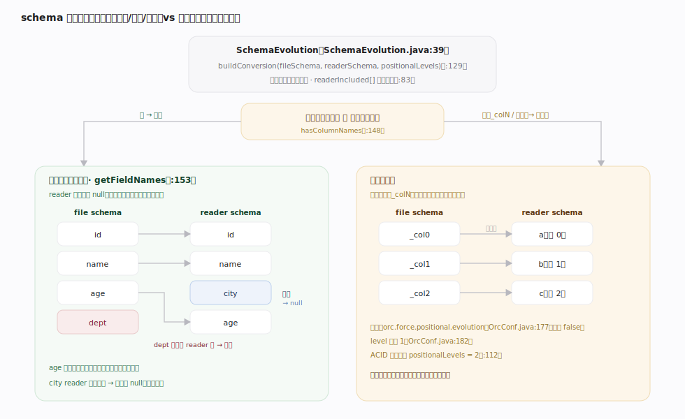
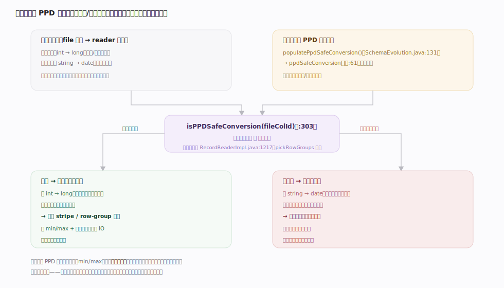
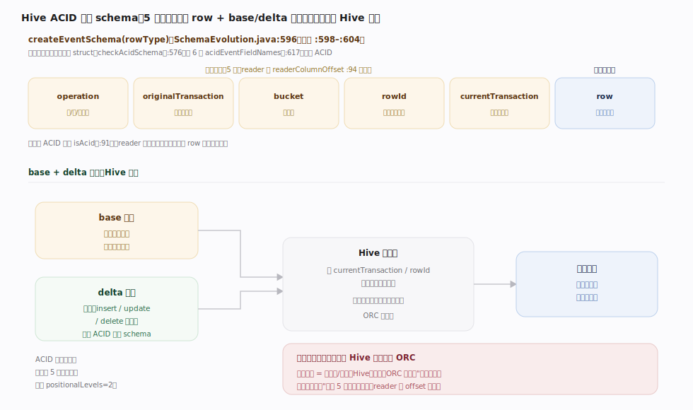

# ORC 原理 · 支撑主线 · schema 演进与 ACID/delta

> **定位**：属"兼容能力域"。管读时 schema 与文件 schema 不一致的调和:按名/按位置映射、类型转换与 PPD 安全、以及 Hive ACID 的 delta/base 事件 schema(择要)。是【读路径】列裁剪与【谓词下推】下推安全性的前提。ORC 本身不管表/事务,ACID 事件 schema 是给 Hive 事务表约定的一层封装。源码基准 **ORC(5f34b04a4)**(`java/core/`)。

文件一旦写下,schema 就固化在 footer 里;但表会演进(加列、改类型、重排),查询用的是**新 schema**。ORC 的 `SchemaEvolution` 负责把"文件 schema"映射到"reader schema":默认**按列名**匹配(加的列读 null、删的列忽略),必要时**按位置**;类型可安全提升(int→long)时转换,不安全的转换会**取消该列的谓词下推**以防误判。ACID 则是 Hive 在 ORC 之上约定的一层 delta/base 事件封装。理解名/位置映射 + PPD 安全 + ACID 事件 schema,就懂了 ORC 怎么跨版本读、怎么承载事务表。

---

## 一、schema 映射:按名 vs 按位置

`SchemaEvolution`(`SchemaEvolution.java:39`)把 file schema 映射到 reader schema:

- **默认按名**:struct 字段按 `getFieldNames()` 名字匹配(`:153` 遍历 file 字段名);reader 有而文件无的列 → 读 **null**(新增列);文件有而 reader 无的列 → **忽略**(未选);顺序变了也能对上。
- **按位置回退**:当文件字段是无意义名(`_col0/_col1`,`hasColumnNames`(`:148`)判定)或显式开 `orc.force.positional.evolution`(`OrcConf.java:177`,默认 false;level 默认 1,`OrcConf.java:182`)时,退回**按序号**映射。ACID 文件强制 positionalLevels=2(`:112`)。
- `buildConversion(fileSchema, readerSchema, positionalLevels)`(`:129`)递归建每列的转换关系,`readerIncluded[]`(`:83`)标读取列。

**为什么默认按名**:名字比位置稳——加列/删列/重排都不破坏映射;只有丢了列名的老文件才退位置。

---

## 二、类型转换与 PPD 安全

演进允许**列类型变化**,但要区分是否影响谓词下推正确性:

- **安全提升**:如 int→long、部分数值/字符串放宽,值等价,可直接转换。
- **PPD 安全判定**:`populatePpdSafeConversion()`(`:131`)为每列算 `ppdSafeConversion[]`(`:61`);`isPPDSafeConversion(fileColId)`(`:303`)返回该列的转换是否**保序/保等值**。
- 读端在 `pickRowGroups` 前检查:仅当 `evolution.isPPDSafeConversion(columnIx)`(`RecordReaderImpl.java:1217`)才对该列下推谓词——**不安全转换的列不下推**,退回引擎精确过滤,避免用错类型的统计误剪掉命中行。

**为什么要判 PPD 安全**:统计(min/max)是按文件旧类型算的;若转换不保序(如 string→date 边界变化),拿旧统计剪新谓词会漏行——宁可不下推、也不能读错。

---

## 三、ACID/delta:事件 schema(择要)

ORC 本身不管事务,但 **Hive ACID** 在 ORC 之上约定一层**事件 schema**:

- `createEventSchema(rowType)`(`SchemaEvolution.java:596`)把用户行 `row` 包进定长前缀 struct:`operation`(增删改类型)、`originalTransaction`、`bucket`、`rowId`、`currentTransaction`、`row`(原始行,`:598`–`:604`)。
- `checkAcidSchema()`(`:576`)按这 6 个 `acidEventFieldNames`(`:617`)判文件是否 ACID;是则 `isAcid`(`:91`)、reader 列偏移跳过前缀(`readerColumnOffset`,`:94`)。
- **base + delta**:全量 base 文件 + 增量 delta 文件(记 insert/update/delete 事件),读时按 `currentTransaction`/`rowId` 合并出某快照——这套合并逻辑在 Hive 层,ORC 只提供事件行的列存承载。

**为什么 ORC 只管承载**:事务边界、快照合并是表格式/引擎(Hive/Iceberg)的职责;ORC 只保证"事件行也是高效列存文件",职责边界清晰。

---

## 拓展 · schema 演进关键结构一览

| 结构 / 方法 | 位置 | 职责 |
|---|---|---|
| SchemaEvolution | `SchemaEvolution.java:39` | file→reader schema 映射 |
| 按名匹配 | `SchemaEvolution.java:153` | 遍历 file 字段名对齐 |
| hasColumnNames | `SchemaEvolution.java:148` | _colN 无名则退位置 |
| FORCE_POSITIONAL_EVOLUTION | `OrcConf.java:177` | 强制按位置(默认 false) |
| isPPDSafeConversion | `SchemaEvolution.java:303` | 转换是否可安全下推 |
| PPD 安全检查点 | `RecordReaderImpl.java:1217` | 仅安全列下推谓词 |
| createEventSchema | `SchemaEvolution.java:596` | ACID 事件 6 字段封装 |
| checkAcidSchema | `SchemaEvolution.java:576` | 判定 ACID 文件 |

## 调优要点（关键开关）

- **优先按名演进**:保留有意义列名(非 `_col0`),避免退位置映射带来的错位风险。
- **orc.force.positional.evolution**(默认 false):仅无列名老数据才开;有名数据开了反而错位。
- **类型演进走安全提升**:int→long 等安全;不安全转换会丢该列谓词下推、变慢,需评估。
- **ACID 表**:delta 合并成本高,定期 compaction 合并 base+delta 减少读放大。

## 常见误区与工程要点

- **误区:schema 演进按位置。** 默认按**列名**(加列读 null、删列忽略、重排能对上);只有丢了列名(_colN)或强制开关才退位置。
- **误区:任意类型转换都能下推谓词。** 只有 PPD 安全(保序/保等值)的转换才下推;不安全列退回引擎精确过滤,防误剪。
- **误区:ORC 自己实现 ACID。** ORC 只提供事件行的列存承载 + 事件 schema 约定;事务边界与 base/delta 合并在 Hive 层。
- **误区:ACID 文件和普通文件同构。** ACID 文件多 5 个定长前缀列(operation/…/currentTransaction)包住 row,reader 按 offset 跳过。
- **归属提醒**:映射结果供【读路径】列裁剪;PPD 安全决定【谓词下推】是否下推;类型树本体在【类型系统】;文件 schema 存在【文件布局】footer。

## 一句话总纲

**ORC schema 演进用 SchemaEvolution 把文件 schema 映射到 reader schema:默认按列名匹配(struct 遍历 getFieldNames,reader 多的列读 null、文件多的列忽略、重排也能对上),仅当字段是无名 _colN(hasColumnNames 判定)或强制 orc.force.positional.evolution(默认 false)才退按位置;类型可安全提升(int→long)时转换,但只有 isPPDSafeConversion 为真(保序/保等值)的列才在 pickRowGroups 前下推谓词、不安全转换退回引擎精确过滤以防用旧类型统计误剪;ACID 是 Hive 在 ORC 之上的约定——createEventSchema 用 operation/originalTransaction/bucket/rowId/currentTransaction 五定长前缀包住 row,base+delta 文件由 Hive 层按 currentTransaction/rowId 合并出快照,ORC 只负责把事件行也存成高效列存,不管事务边界。**
