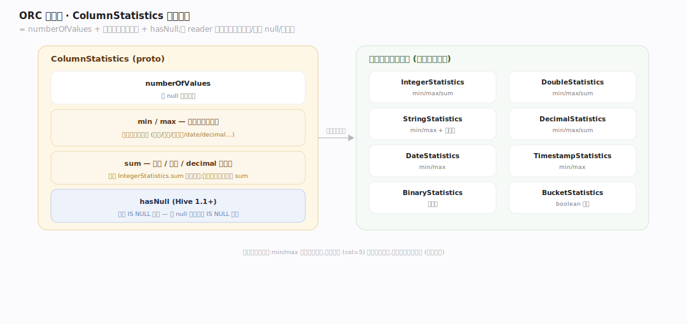
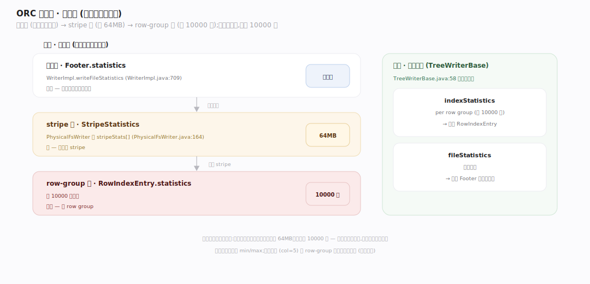
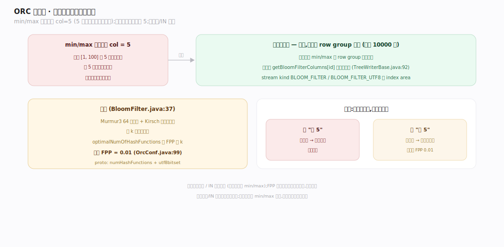

# ORC 原理 · 支撑主线 · 列统计与布隆过滤器

> **定位**：属"统计能力域"。管跳读的判据:三级列统计(文件/stripe/row-group,min/max/count/sum)+ 可选布隆过滤器(等值查询)。是【谓词下推】的燃料。挂在【文件布局】各级 + 【行组与索引】。源码基准 **ORC(5f34b04a4)**(`java/core/`)。

跳读要有判据——统计。ORC 在**三个粒度**(文件级、stripe 级、row-group 级)存每列的 min/max/count(整数/浮点/decimal 再加 sum)。范围统计(min/max)能跳"肯定无匹配"的块,但等值查询(`col=5`)光靠范围不够——补**布隆过滤器**判"块内有没有这个值"。理解三级统计 + 布隆,就懂了跳读的判据来源。

---

## 一、ColumnStatistics:每列的摘要

**ColumnStatistics** = `numberOfValues` + 一个类型化子消息 + `hasNull`:

- **min/max**:多数原始类型有(整数/浮点/字符串/date/decimal…)——范围剪枝的核心。
- **sum**:整数(`IntegerStatistics.sum`,溢出则丢)、浮点、decimal 额外有;字符串存 min/max 值 + 总长度作 sum。
- **hasNull**(Hive 1.1+):支撑 `IS NULL` 剪枝——无 null 的块跳过 IS NULL 查询。
- 各类型专门子消息:IntegerStatistics/DoubleStatistics/StringStatistics/DecimalStatistics/DateStatistics/TimestampStatistics/BinaryStatistics/BucketStatistics。

统计让 reader 不看数据就知"这块的值在什么范围、有无 null、多少行"——跳读判据。

---

## 二、三级统计:文件 / stripe / row-group

统计存在**三个粒度**,逐级细:

- **文件级**:`Footer.statistics`(`WriterImpl.writeFileStatistics`,`WriterImpl.java:709`)——读不读整个文件。
- **stripe 级**:`StripeStatistics`(`PhysicalFsWriter` 的 `stripeStats[]`,`:164`)——跳整个 stripe(64MB)。
- **row-group 级**:`RowIndexEntry.statistics`(每 10000 行)——跳 row group。

写侧 `TreeWriterBase` 每列同时建 `indexStatistics`(per row group)+ `fileStatistics`(`TreeWriterBase.java:58`)——边写边攒。

**为什么三级**:粗粒度(文件)先排除整文件、中(stripe)排除 64MB、细(row-group)排除 10000 行——由粗到细逐层剪,每层代价小收益大。

---

## 三、布隆过滤器:等值查询补位

min/max 处理不了等值(`col=5`,5 在范围内但可能不存在)——**布隆过滤器**补位:

- 可选、每列、**每 row group 一个**布隆条目(默认 10000 行);只对通过 min/max 的 row group 再查布隆。
- 实现:**Murmur3 64 位**哈希 + Kirsch 双哈希技巧跑 k 个函数(`BloomFilter.java:37`);`optimalNumOfHashFunctions` 按 FPP 定 k。默认 **FPP=0.01**(`BLOOM_FILTER_FPP`,`OrcConf.java:99`)。
- proto:`numHashFunctions` + `utf8bitset`(ORC-101 后 UTF-8 变体)。stream kind `BLOOM_FILTER`/`BLOOM_FILTER_UTF8` 在 index area。
- 写侧按 `getBloomFilterColumns[id]` 决定哪列建布隆(`TreeWriterBase.java:92`)。

**为什么布隆**:布隆"说无一定无、说有可能有"(假阳性,FPP 0.01)——等值查询时,布隆说"这块无 5"就确定跳过,补 min/max 范围判断之不足。只对等值/IN 有用(范围查询用 min/max)。

---

## 拓展 · 统计与布隆关键结构一览

| 结构 | 定义 | 职责 |
|---|---|---|
| ColumnStatistics | (proto) | numberOfValues + min/max/sum + hasNull |
| 文件级统计 | `WriterImpl.java:709` | 跳整文件 |
| StripeStatistics | `PhysicalFsWriter.java:164` | 跳 stripe |
| RowIndexEntry.statistics | (proto) | 跳 row group |
| BloomFilter | `util/BloomFilter.java:37` | Murmur3 + 双哈希,等值过滤 |
| BLOOM_FILTER_FPP | `OrcConf.java:99` | 假阳性率(默认 0.01) |

## 调优要点（关键开关）

- **orc.bloom.filter.columns**:给等值/IN 高频过滤列建布隆;范围过滤列不必(min/max 够)。
- **orc.bloom.filter.fpp**(默认 0.01):调小假阳性少但布隆大;调大反之。
- **数据排序**:按过滤列排序让各级 min/max 紧凑(不重叠),范围剪枝才有效。
- **列统计粒度**:三级自动建,无需配;排序数据让 row-group 统计更有区分度。

## 常见误区与工程要点

- **误区:统计只在文件级。** 三级——文件/stripe/row-group,由粗到细逐层剪枝。
- **误区:min/max 能处理等值查询。** `col=5` 时 5 在 [min,max] 内跳不掉;需布隆判"块内有没有 5"。
- **误区:布隆"说有"就一定有。** 布隆假阳性(FPP 0.01):说无一定无(可跳)、说有可能有(需读进精确判)。
- **误区:所有列都该建布隆。** 只对等值/IN 过滤列有益;范围过滤列布隆无用还占空间。
- **归属提醒**:统计存在【文件布局】各级 + 【行组与索引】的 row index;用统计剪枝在【谓词下推】;统计随【列编码】写入时攒;布隆 stream 在 index area(【文件布局】)。

## 一句话总纲

**ORC 跳读判据是三级列统计 + 布隆:ColumnStatistics(numberOfValues + min/max + 整数/浮点/decimal 的 sum + hasNull)存在文件级(Footer)/stripe 级(StripeStatistics)/row-group 级(RowIndexEntry,每 10000 行)三粒度,由粗到细逐层剪范围查询;等值查询(col=5)min/max 跳不掉,靠每 row group 的布隆过滤器(Murmur3+双哈希,默认 FPP 0.01)判"块内有没有该值"——说无一定无可跳、说有可能有需读;写侧 TreeWriterBase 边写边攒 index+file 统计,只给等值过滤列建布隆。**
