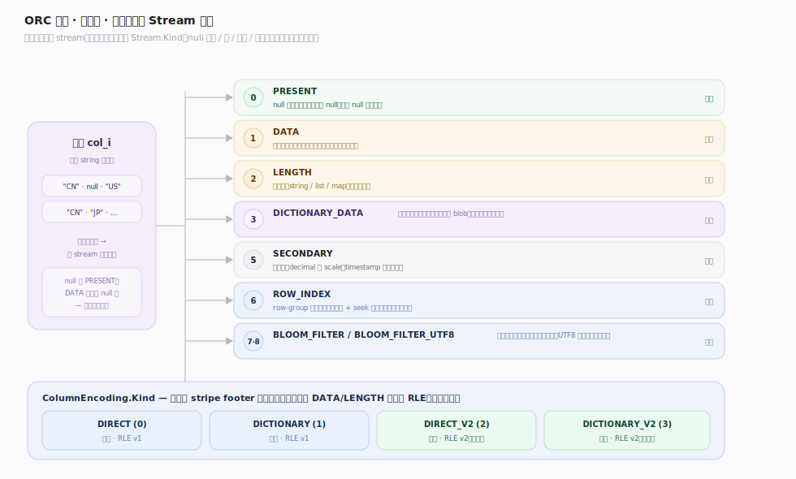
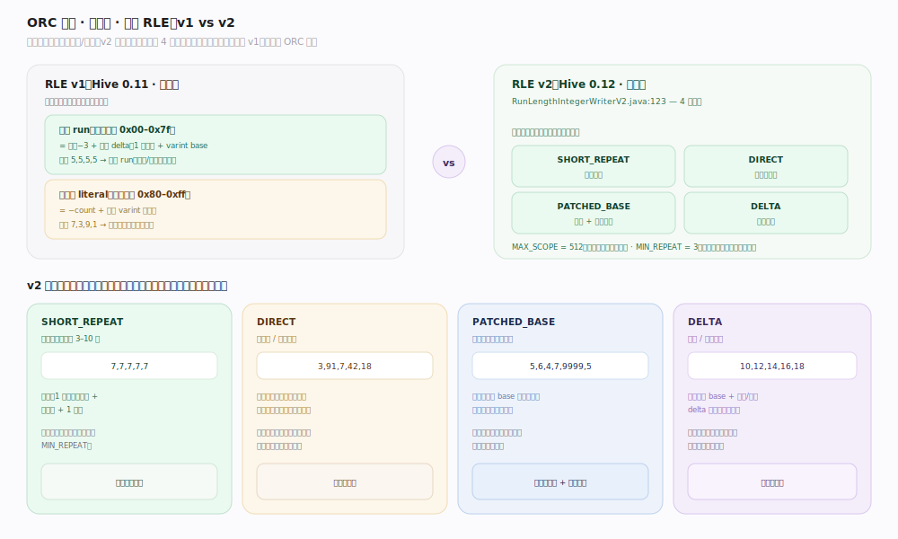
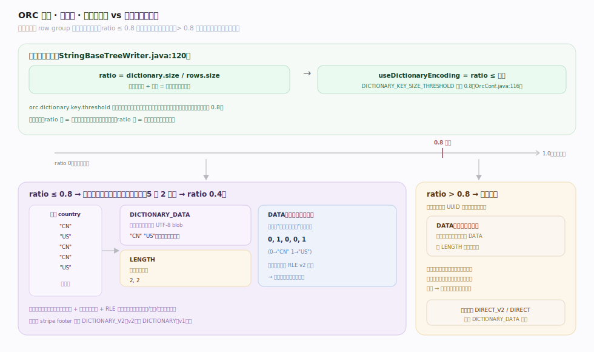

# ORC 原理 · 支撑主线 · 列编码

> **定位**：属"编码能力域"。管每列值如何编码进字节 stream:stream 分工(PRESENT/DATA/LENGTH/DICTIONARY…)、整数 RLE v1/v2、字符串字典编码。是列存"省空间"的核心机制。被【文件布局】的 stripe 承载、【类型系统】定列类型。源码基准 **ORC(5f34b04a4)**(`java/core/`)。

ORC 按列存的红利要靠编码兑现:同列值相邻,用 RLE(游程)压重复、用字典压重复字符串、用位图标 null。每列不是一个 stream 而是**多个 stream 分工**(有无 null、值、长度、字典)。整数用 RLE v1/v2、字符串按重复度自动选字典或直存。理解 stream 分工 + RLE + 字典,就懂了 ORC 怎么把列压小。

---

## 一、stream 分工:一列拆多个 stream

一列的数据拆成多个 **Stream.Kind**(按需):

- `PRESENT`(0):位图,标每行该列是否非 null(全非 null 时省略)。
- `DATA`(1):主数据 stream（值本身，或字典引用）。
- `LENGTH`(2):变长值(字符串/list/map)的每项长度。
- `DICTIONARY_DATA`(3):字符串字典的唯一值 blob。
- `SECONDARY`(5):辅助(如 decimal 的 scale、timestamp 的纳秒)。
- `ROW_INDEX`(6):row-group 索引。`BLOOM_FILTER`(7)/`BLOOM_FILTER_UTF8`(8):布隆。

**ColumnEncoding.Kind**:`DIRECT`(0,RLE v1)、`DICTIONARY`(1,RLE v1)、`DIRECT_V2`(2,RLE v2)、`DICTIONARY_V2`(3,RLE v2)——每列在 stripe footer 记自己的编码。

**为什么拆 stream**:null 位图、值、长度分开存,各自压缩最优;读时按需取(如只查非空判断只读 PRESENT)。

---

## 二、整数 RLE:v1 vs v2

整数用**游程编码(RLE)**压重复/规律:

- **RLE v1**(Hive 0.11):游程(初始字节 0x00–0x7f=长度−3 + 定长 delta + varint base)与字面量(0x80–0xff=−count + varints)两种。简单。
- **RLE v2**(Hive 0.12,`RunLengthIntegerWriterV2.java:123`):4 子编码 `SHORT_REPEAT`(短重复)、`DIRECT`(直存)、`PATCHED_BASE`(基值+补丁,压异常值)、`DELTA`(等差)。`MAX_SCOPE=512`、`MIN_REPEAT=3`。按数据分布自动选最省的子编码。

RLE v2 更聪明——针对不同数据形态(重复/递增/离群)选专门编码,压缩率更高,是现代 ORC 默认。

---

## 三、字符串字典编码

字符串按重复度自动选**字典 vs 直存**:

- **字典编码**:字典按字典序排序,`DICTIONARY_DATA` 存唯一 UTF-8 blob、`LENGTH` 存每项长度、`DATA` 存整数引用(指字典第几项)。重复多时极省(重复串只存一次 + 小整数引用)。
- **自动选择**:写第一个 row group 后按比率测——`useDictionaryEncoding = ratio <= dictionaryKeySizeThreshold`,`ratio = dictionary.size()/rows.size()`(`StringBaseTreeWriter.java:120`),阈值默认 **0.8**(`DICTIONARY_KEY_SIZE_THRESHOLD`)。唯一值占比高(>0.8,重复少)则退回直存(字典无益)。

**为什么自动**:低基数列(如国家/状态)字典大赢;高基数列(如 UUID)字典反而多一层引用开销,直存更好——ORC 按实际数据选。

---

## 拓展 · 列编码关键结构一览

| 结构 | 定义 | 职责 |
|---|---|---|
| Stream.Kind | (proto) | PRESENT/DATA/LENGTH/DICTIONARY_DATA/SECONDARY… |
| ColumnEncoding.Kind | (proto) | DIRECT/DICTIONARY × v1/v2 |
| RunLengthIntegerWriterV2 | `impl/RunLengthIntegerWriterV2.java:123` | RLE v2 四子编码 |
| StringBaseTreeWriter | `impl/writer/StringBaseTreeWriter.java:120` | 字典 vs 直存自动选 |
| DICTIONARY_KEY_SIZE_THRESHOLD | `OrcConf.java:116` | 字典切换阈值(默认 0.8) |

## 调优要点（关键开关）

- **RLE 版本**:默认 v2(更优);极老兼容才用 v1。
- **orc.dictionary.key.threshold**(默认 0.8):高基数列可调低/关字典避免无益开销;低基数列保默认。
- **列排序**:写入前按低基数列排序,让同值相邻、RLE/字典压得更狠。
- **压缩叠加**:stream 编码后再走块压缩(ZSTD 等),编码 + 压缩双重减小。

## 常见误区与工程要点

- **误区:一列一个 stream。** 一列拆多个 stream(PRESENT/DATA/LENGTH/DICTIONARY…),各自压缩,按需读。
- **误区:字符串总用字典。** 按重复度自动:唯一值占比 >0.8(重复少)退回直存,字典只在低基数列用。
- **误区:RLE v1 v2 差不多。** v2 有 4 子编码(短重复/直存/基值补丁/等差)按分布自动选,压缩率明显优于 v1。
- **误区:null 也占 DATA 空间。** null 由 PRESENT 位图标记,DATA 只存非 null 值——稀疏列省很多。
- **归属提醒**:stream 存在【文件布局】的 stripe;编码后块压缩在【文件布局】postscript 声明;列类型定编码选择在【类型系统】;row-group 级 seek 用编码位置在【行组与索引】。

## 一句话总纲

**ORC 列编码把每列拆成多个 stream 分工压缩:PRESENT 位图标 null、DATA 存值/字典引用、LENGTH 存变长长度、DICTIONARY_DATA 存字符串字典;整数用 RLE(v1 游程+字面量;v2 四子编码 SHORT_REPEAT/DIRECT/PATCHED_BASE/DELTA 按分布自动选),字符串按唯一值占比自动选字典(≤0.8 用字典存唯一 blob+整数引用,>0.8 退直存);每列在 stripe footer 记 ColumnEncoding(DIRECT/DICTIONARY×v1/v2)——同列值相邻 + 分 stream + RLE/字典是列存省空间的核心。**
