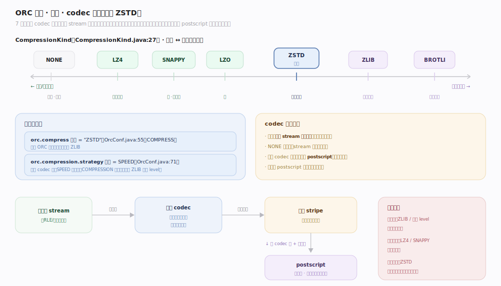
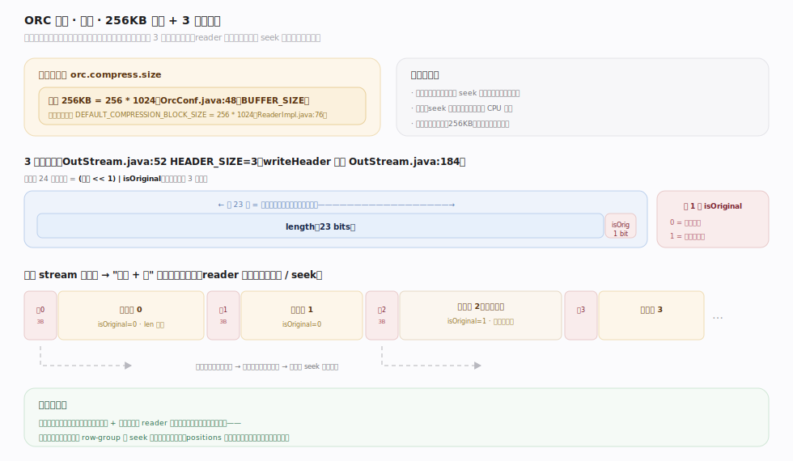
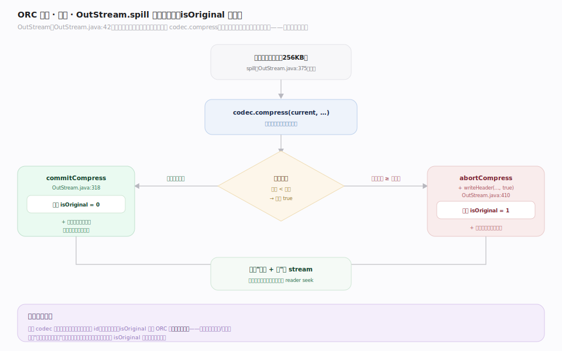

# ORC 原理 · 支撑主线 · 压缩与流分块

> **定位**：属"压缩能力域"。管每个 stream 的字节如何被压缩:codec 选型(ZSTD 默认)、压缩块分块(默认 256KB)、3 字节块头(长度 + isOriginal 位)、压不动就存原文的回退。是【列编码】之后、落盘之前的最后一道字节变换。被【文件布局】的 postscript 声明压缩方式,给【读路径】倒推解压。源码基准 **ORC(5f34b04a4)**(`java/core/`)。

列编码把每列压成 stream 之后,还要再走一层**通用块压缩**——把编码后的字节按固定大小切块、逐块压缩。ORC 的压缩不是"整文件压一遍",而是**流内分块压缩**:每个 stream 独立、每块独立,块头自带长度让 reader 能随机 seek 到某块解压。压不动的块直接存原文(isOriginal 位标记)。理解 codec 选型 + 256KB 分块 + 3 字节块头 + isOriginal 回退,就懂了 ORC 怎么在"可随机读"的前提下压字节。

---

## 一、压缩编解码器:ZSTD 默认

ORC 支持 7 种 codec(`CompressionKind.java:27`):`NONE、ZLIB、SNAPPY、LZO、LZ4、ZSTD、BROTLI`。

- **默认 ZSTD**(`OrcConf.java:55`,`COMPRESS` 默认值 `"ZSTD"`):压缩率与速度俱佳,现代 ORC 首选(早期默认是 ZLIB)。
- **压缩策略**`orc.compression.strategy`(`OrcConf.java:71`)默认 `SPEED`——同一 codec 下偏速度;`COMPRESSION` 偏压缩率(如 ZLIB 提高 level)。
- codec 作用于**每个 stream 的字节流**,不是整文件一次;`NONE` 时不压、stream 字节直落。

**为什么可插拔**:不同场景权衡不同——冷数据用高压缩率 codec、热查询用快解压 codec;ORC 把 codec 记进 postscript,读时按声明选对应解码器。

---

## 二、压缩块:256KB 分块 + 3 字节块头

压缩不是流式一整段,而是**按缓冲区大小分块**:

- **压缩块大小**`orc.compress.size`(`OrcConf.java:48`)默认 **256KB**(`256 * 1024`);读侧同名常量 `DEFAULT_COMPRESSION_BLOCK_SIZE = 256 * 1024`(`ReaderImpl.java:76`)。
- 每块前有 **3 字节头**(`OutStream.java:52`,`HEADER_SIZE = 3`),小端存 `(长度 << 1) | isOriginal`(`OutStream.java:184`):
  - 低 1 位 = **isOriginal**(该块是否未压缩存原文);
  - 高 23 位 = **块字节长度**(压后或原文长度)。
- 每个 stream 的字节被切成"块头 + 压缩块"序列;reader 读块头即知本块长度,可**跳到下一块或 seek 到指定块**再解压。

**为什么分块**:整流压缩必须从头解到目标位置;分块 + 块头长度让 reader 能定位到某压缩块起点、只解那块——这是【行组与索引】的 seek 能落到字节的前提。

---

## 三、压缩流水与 isOriginal 回退

`OutStream`(`OutStream.java:42`,"handles both compression and encryption")的 `spill()`(`OutStream.java:375`)是压一块的核心:

- 攒够一个缓冲区就 `codec.compress(current, ...)`:
  - **压得动**(返回 true):`commitCompress()`(`OutStream.java:318`)写块头 isOriginal=0 + 压缩字节;
  - **压不动**(返回 false,压后 ≥ 原文):`abortCompress()` + `writeHeader(current, 0, len, true)`(`OutStream.java:410`)——**存原文、isOriginal=1**。
- 这个回退保证"压缩绝不让块变大":对已压/随机数据,ORC 退回存原文,读时看 isOriginal 位决定是否解压。

**为什么要回退**:通用 codec 对高熵数据(已压缩图片、随机 id)会越压越大;isOriginal 位让 ORC 在块粒度上择优——每块独立判断压/不压,不会因个别块拖累。

---

## 拓展 · 压缩关键结构一览

| 结构 / 常量 | 定义 | 职责 |
|---|---|---|
| CompressionKind | `CompressionKind.java:27` | NONE/ZLIB/SNAPPY/LZO/LZ4/ZSTD/BROTLI |
| COMPRESS 默认 | `OrcConf.java:55` | 默认 codec = ZSTD |
| BUFFER_SIZE | `OrcConf.java:48` | 压缩块大小,默认 256KB |
| HEADER_SIZE | `OutStream.java:52` | 块头 3 字节 |
| writeHeader | `OutStream.java:184` | (长度<<1)\|isOriginal,小端 |
| spill / commitCompress / abortCompress | `OutStream.java:375/318` | 压一块 + isOriginal 回退 |
| DEFAULT_COMPRESSION_BLOCK_SIZE | `ReaderImpl.java:76` | 读侧块大小常量 |

## 调优要点（关键开关）

- **orc.compress**(默认 ZSTD):冷归档可 ZLIB/更高 level 求压缩率;极致低延迟解压可 LZ4/SNAPPY。
- **orc.compress.size**(默认 256KB):调大压缩率略升但 seek 粒度粗、解压放大读;调小 seek 更精但块头开销与 CPU 升。
- **orc.compression.strategy**(默认 SPEED):归档场景切 COMPRESSION 换更高压缩率。
- **与编码叠加**:先【列编码】(RLE/字典)再块压缩,双重收益;已高度编码的 stream 压缩增益递减。

## 常见误区与工程要点

- **误区:ORC 整文件压一遍。** 是每 stream 独立、按 256KB 分块逐块压;块头带长度支持随机 seek。
- **误区:块头是定长长度。** 块头 3 字节里低 1 位是 isOriginal 标志,高 23 位才是长度。
- **误区:开了压缩每块都变小。** 压不动的块存原文(isOriginal=1),保证不膨胀——高熵数据可能整片存原文。
- **误区:postscript 也按此压缩。** postscript 不压缩(要自举读它);压缩方式与块大小恰恰记在 postscript 里,供 reader 解压其余段。
- **归属提醒**:压缩发生在【列编码】之后;压缩方式声明在【文件布局】postscript;块 seek 位置由【行组与索引】的 positions 给出;读时逐块解压在【读路径】。

## 一句话总纲

**ORC 压缩是流内分块压缩:7 种 codec(默认 ZSTD,可 ZLIB/SNAPPY/LZ4…),作用于每个 stream 的字节流而非整文件;按 orc.compress.size(默认 256KB)切块,每块前 3 字节头小端存 (长度<<1)|isOriginal,低位标该块是否未压存原文、高 23 位存长度;OutStream.spill 攒满一块就 codec.compress,压得动写 isOriginal=0 的压缩块、压不动 abortCompress 存原文 isOriginal=1 保证绝不膨胀;块头长度让 reader 能 seek 到指定压缩块只解那块,是行组级细粒度跳读能落到字节的前提;压缩方式与块大小记在不压缩的 postscript 里供自举解压。**
