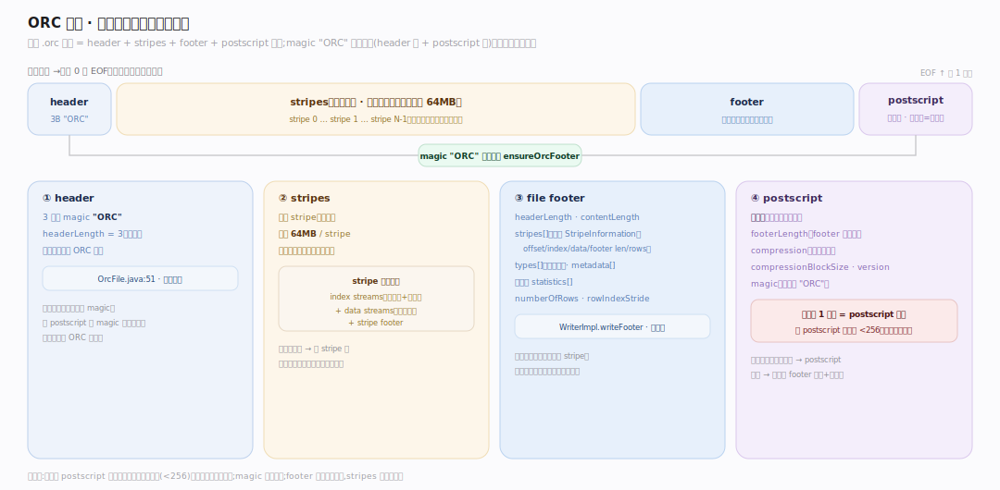
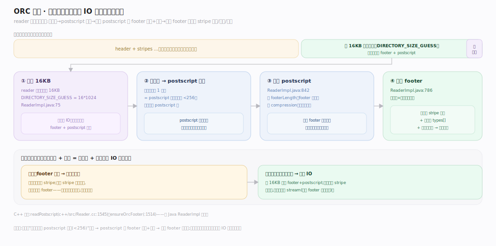
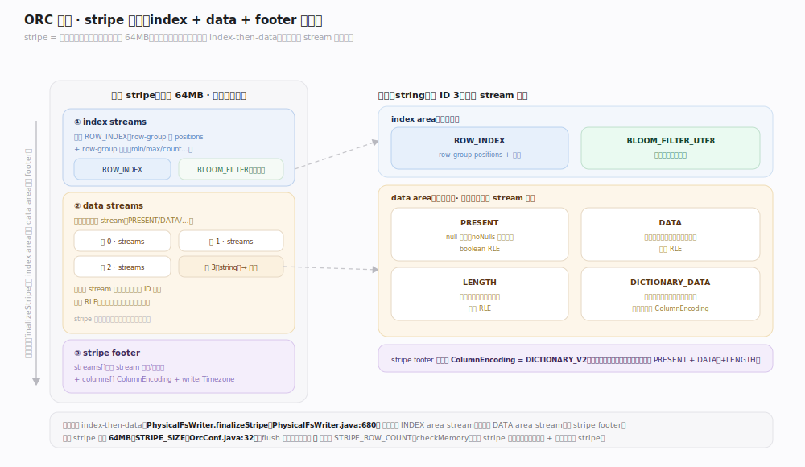

# ORC 原理 · 支撑主线 · 文件布局

> **定位**：属"布局能力域"——ORC 的核心。管单个 ORC 文件的磁盘字节布局:header + stripes + footer + postscript,倒读定位。是一切读写的物理基础。被【读写 API】写/读、【列编码】填 stream、【行组与索引】挂统计。源码基准 **ORC(5f34b04a4)**(`java/core/`)。

ORC 的立身之本:**文件是一段精心布局的字节流**。开头 3 字节 magic "ORC",中间是 stripe(行组,每个自包含),结尾是 footer + postscript。读取**从尾部倒读**——末字节给 postscript 长度,postscript 给 footer 长度和压缩方式,footer 列出所有 stripe。这种"尾部索引 + 倒读"让 reader 一次小 IO 就拿到全文件地图。理解 4 段布局 + 倒读,就懂了 ORC 的物理骨架。

---

## 一、四段布局:header + stripes + footer + postscript

文件 = 3 段:

- **header**:3 字节 magic `"ORC"`(`OrcFile.java:51`,`headerLength=3` 恒定),标识文件类型。
- **stripes**:文件主体,多个 stripe(行组),每个自包含一批行的列数据。
- **file footer**:`headerLength`、`contentLength`、`stripes[]`(每个 StripeInformation:offset/indexLength/dataLength/footerLength/numberOfRows)、`types[]`(类型树)、`metadata[]`、`numberOfRows`、文件级 `statistics[]`、`rowIndexStride`(`WriterImpl.writeFooter`)。
- **postscript**:**不压缩**(其它都可压),末段——含 `footerLength`、`compression`、`compressionBlockSize`、`version`、`magic`。**文件最后 1 字节 = postscript 长度**(必 <256)。

magic 出现两次:开头 header + postscript 里(`ensureOrcFooter` 校验),双重确认是 ORC 文件。

---

## 二、倒读:从文件尾拿全图

ORC **从尾部倒读**(footer 在尾,不像顺序格式):

- reader 先读文件尾 **16KB**(`DIRECTORY_SIZE_GUESS=16*1024`,`ReaderImpl.java:75`)——赌一次读到 footer + postscript。
- 末字节给 postscript 长度 → 解析 postscript(`ReaderImpl.java:842`)→ 得 footer 长度 + 压缩方式。
- 按 footer 长度解压 footer(`ReaderImpl.java:786`)→ 得所有 stripe 位置 + 类型 + 文件级统计。
- C++ 镜像:`readPostscript`(`c++/src/Reader.cc:1545`)、`ensureOrcFooter`(`:1514`)。

**为什么倒读**:footer/postscript 在尾,写时才知全部 stripe;放尾部让写单遍(边写 stripe 边攒 stripe 信息,最后一次写 footer)。读时一次 16KB 尾读常够拿全图,极省 IO。

---

## 三、stripe 结构:index + data + footer

**stripe** = 一批行的自包含列数据(不跨行边界),三部分:

- **index streams**:各列的 row index(row-group 级位置 + 统计),在前。
- **data streams**:各列的实际数据 stream(PRESENT/DATA/…),在后。
- **stripe footer**:`streams[]`(各 stream 位置)+ `columns[]`(各列 ColumnEncoding)+ writerTimezone。

物理写序 **index-then-data**:`PhysicalFsWriter.finalizeStripe` 先写所有 INDEX area stream,再写所有 DATA area stream,再 stripe footer(`PhysicalFsWriter.java:680`)。默认 stripe 大小 **64MB**(`STRIPE_SIZE`,`OrcConf.java:32`);触发 flush:内存超限 **或** 行数超 `STRIPE_ROW_COUNT`(`WriterImpl.checkMemory`)。

**为什么 stripe 自包含**:每 stripe 独立可读(含自己的索引+统计),支持并行读(不同 stripe 分给不同 task)+ 跳读(按统计跳整 stripe)。

---

## 拓展 · 文件布局关键结构一览

| 结构 | 定义 | 职责 |
|---|---|---|
| magic "ORC" | `OrcFile.java:51` | 文件标识(header + postscript) |
| PostScript | (proto) | 不压缩尾段,末字节=其长度 |
| Footer | `WriterImpl.writeFooter` | stripes[]/types[]/文件级统计 |
| StripeInformation | (proto) | offset/index/data/footer len/rows |
| PhysicalFsWriter.finalizeStripe | `PhysicalFsWriter.java:680` | index-then-data 物理写序 |
| ReaderImpl 倒读 | `ReaderImpl.java:75,842` | 16KB 尾读 → postscript → footer |

## 调优要点（关键开关）

- **orc.stripe.size**(默认 64MB):大 stripe 压缩/扫描高效但内存占用大、并行粒度粗;小 stripe 反之。
- **HDFS block 对齐**:stripe 大小对齐 HDFS block(256MB)避免 stripe 跨 block。
- **orc.stripe.row.count**:行数上限,配合大小上限触发 flush。
- **一次尾读**:16KB 猜测通常够;超大 footer(列极多)可能二次读。

## 常见误区与工程要点

- **误区:ORC 顺序读(像 CSV)。** 不。从尾部倒读——先读 postscript(末字节给长度)再 footer 拿全图,一次小 IO。
- **误区:postscript 也压缩。** postscript 不压缩(否则无法自举读它);其它段按 postscript 声明的压缩方式压。
- **误区:stripe 是按列切。** stripe 是按**行**切(一批行),stripe **内**才按列存(每列独立 stream)。
- **误区:一行可能跨 stripe。** 不。stripe 只含完整行,不跨边界——保证 stripe 自包含可独立读。
- **归属提醒**:stripe 内每列的 stream 编码在【列编码】;row-group 索引在【行组与索引】;各级统计在【列统计与布隆】;类型树在【类型系统】。

## 一句话总纲

**ORC 文件是 header(3 字节 magic "ORC")+ stripes(多个自包含行组,默认 64MB,不跨行边界)+ footer(列 stripe 信息/类型树/文件级统计)+ postscript(不压缩,末字节=其长度,给 footer 长度+压缩方式)四段;读取从尾部倒读(先读末 16KB 赌拿到 postscript+footer,解析得全文件地图),写入单遍(边写 stripe 边攒信息、最后写 footer);每 stripe = index streams + data streams + stripe footer,物理 index-then-data 序——尾部索引 + 倒读让一次小 IO 拿全图、stripe 自包含支持并行读与跳读。**
