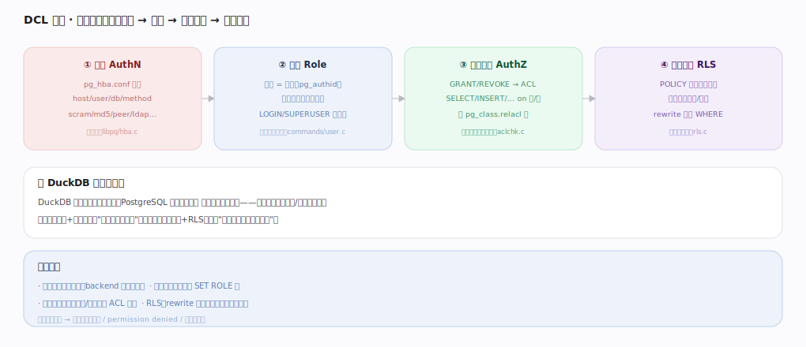
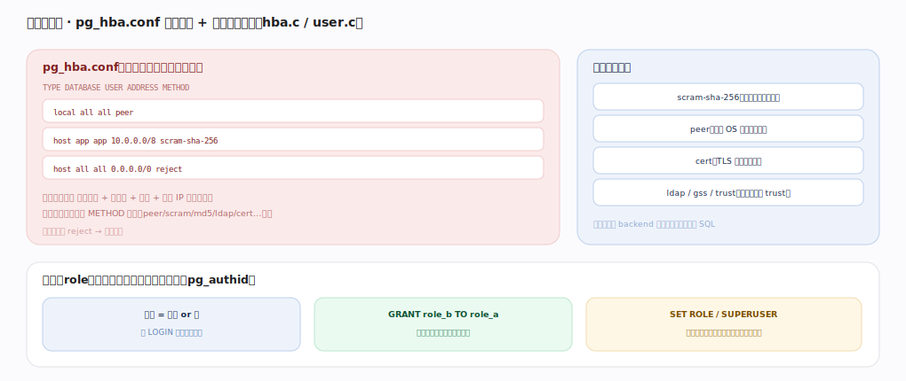
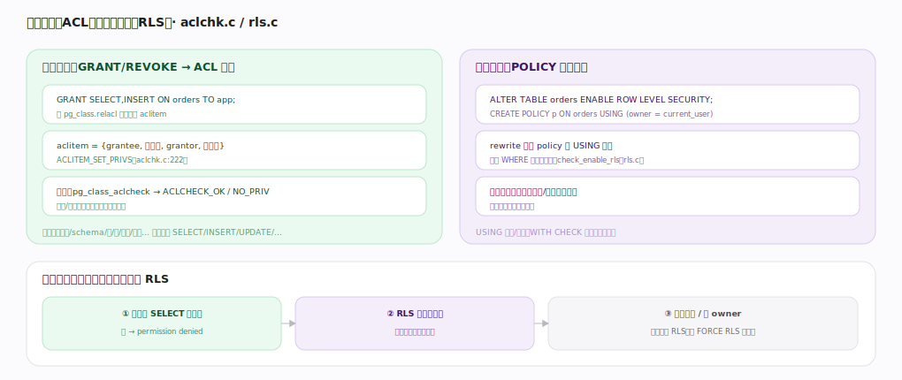

# PostgreSQL 核心原理 · DCL 数据控制（认证 / 角色 / 权限 / RLS）

> **定位**：控制访问接口主线，PostgreSQL 的强项——**四道关卡**：连接认证（pg_hba）→ 角色（roles）→ 对象权限（GRANT/ACL）→ 行级安全（RLS）。落在**系统目录**（pg_authid/relacl）与查询**优化/执行/rewrite** 各期。与 DuckDB「无多用户 GRANT」形成鲜明对比。核实基准：官方源码 `postgres/src`。

## 一、总览：四道关卡

① **认证 AuthN**（`libpq/hba.c`）：pg_hba.conf 匹配连接类型/库/用户/来源，选认证方法（scram/md5/peer/ldap…）——"你是谁"；② **角色 Role**（`commands/user.c`）：用户=角色（pg_authid），可继承成员关系、有 LOGIN/SUPERUSER 属性——"你属于谁"；③ **对象权限 AuthZ**（`catalog/aclchk.c`）：GRANT/REVOKE→ACL，SELECT/INSERT/… on 表/列，存 pg_class.relacl——"能对该对象做什么"；④ **行级安全 RLS**（`utils/misc/rls.c`）：POLICY 谓词注入查询、按行过滤——"能看哪些行"。前两层回答"你是谁、属于谁"，后两层回答"能对什么、看哪些行"。任一关卡不过即拒绝。这是数据库多租户/合规的基石。

---

## 二、认证与角色

**pg_hba.conf** 自上而下第一条匹配生效：按 连接类型 + 目标库 + 用户 + 来源 IP 逐行匹配，命中即用其 METHOD 认证（scram-sha-256 推荐、peer 本机 OS 用户、cert 客户端证书、ldap/gss；勿在生产用 trust），匹配不到或 reject 则拒绝连接；认证发生在 backend 启动早期、早于任何 SQL。**角色**（pg_authid）把用户与组统一为一个概念：有 LOGIN 属性才能登录，`GRANT role_b TO role_a` 建成员关系（权限经组继承），`SET ROLE` 切换当前角色，超级用户绕过权限检查。

---

## 深化 · 对象权限（ACL）与行级安全（RLS）

**对象权限**：`GRANT SELECT,INSERT ON orders TO app` 在 `pg_class.relacl` 加一条 aclitem（`{grantee, 权限位, grantor, 可转授}`，`aclchk.c:222`），检查经 `pg_class_aclcheck` 返回 OK/NO_PRIV，编译/执行期对涉及对象逐个校验；粒度到数据库/schema/表/列/序列/函数。**RLS**：`ENABLE ROW LEVEL SECURITY` + `CREATE POLICY p ON orders USING (owner=current_user)`，rewrite 期把 policy 谓词作为 WHERE 注入查询树（`check_enable_rls`，`rls.c`），每个用户只看到/改到自己的行——多租户共表隔离利器（USING 控读、WITH CHECK 控写）。两者叠加：先过表级权限（无则 permission denied）→ 再过 RLS 谓词过滤行；超级用户/表 owner 默认绕过 RLS（可 FORCE RLS 强制）。

---

## 拓展 · 权限体系速览

| 层 | 载体 | 命令 | 锚点 |
|---|---|---|---|
| 认证 | pg_hba.conf | （编辑文件 + reload） | `libpq/hba.c` |
| 角色 | pg_authid | CREATE ROLE / GRANT role | `commands/user.c` |
| 对象权限 | relacl（aclitem） | GRANT/REVOKE ON 对象 | `catalog/aclchk.c` |
| 默认权限 | pg_default_acl | ALTER DEFAULT PRIVILEGES | `catalog/aclchk.c` |
| 行级安全 | pg_policy | CREATE POLICY | `utils/misc/rls.c` |

---

## 调优要点（关键开关）

- 认证用 scram-sha-256；限定 pg_hba 来源网段，最小暴露面。
- 用角色继承管权限（授权给组、把用户加进组），而非逐用户 GRANT。
- 多租户共表用 RLS + 应用设 `current_user`/会话变量隔离。
- 改 pg_hba.conf 后 `pg_ctl reload`（reload 生效，无需重启）。

---

## 常见误区与工程要点

- **在生产用 trust 认证**：等于无认证；用 scram + 限定网段。
- **只 GRANT 表不管 RLS**：多租户共表要用 RLS，否则有表权限就能看全表。
- **忘了超级用户绕过 RLS**：需 FORCE ROW LEVEL SECURITY 才对 owner 生效。
- **默认权限漏配**：新建对象的权限用 ALTER DEFAULT PRIVILEGES 统一，别逐个补。

---

## 一句话总纲

**DCL 是 PostgreSQL 的四道关卡：pg_hba.conf 逐行匹配做连接认证（scram/peer/cert…）、角色(pg_authid)统一用户与组并经成员关系继承权限、GRANT/REVOKE 把对象权限写进 relacl 的 ACL 由 aclcheck 在编译/执行期校验、RLS 策略在 rewrite 期把谓词注入查询按行过滤；先过对象权限再过 RLS、超级用户/owner 默认绕过 RLS——完整的认证+角色+权限+行级安全体系是它区别于嵌入式库的多租户合规基石。**
