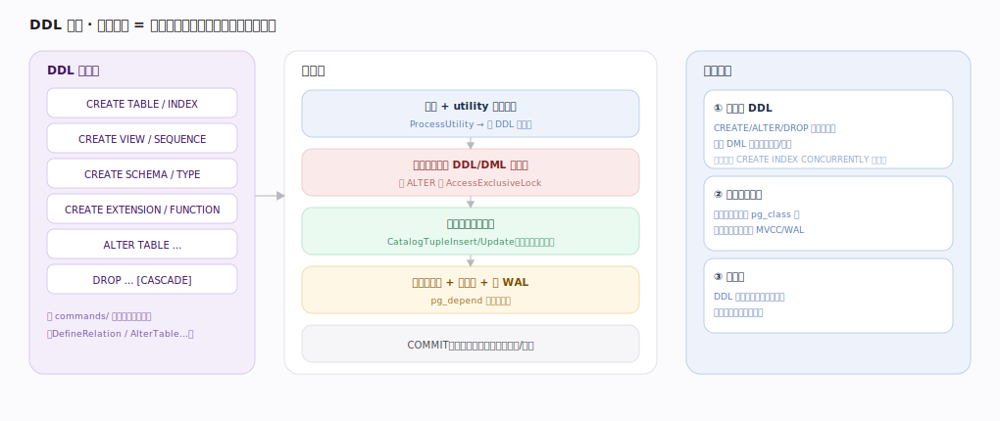
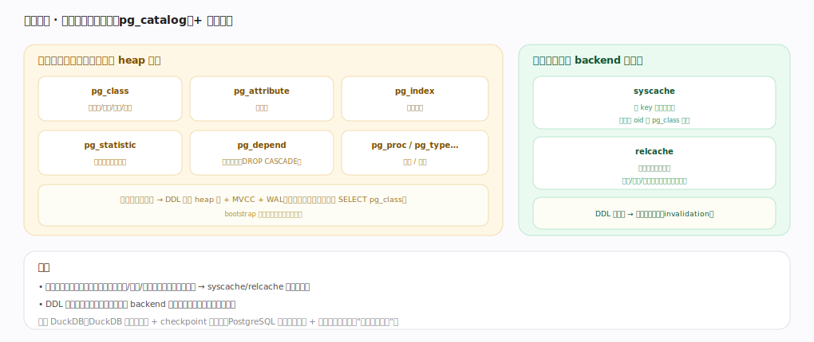

# PostgreSQL 核心原理 · DDL 数据定义（CREATE / ALTER / DROP）

> **定位**：定义对象接触面主线，骨架 = `utility 命令分派 → 取锁 → 改系统目录表行 → 建物理文件/记依赖/写 WAL`。以**系统目录**（元数据即表）为主轴，事务性依赖**事务与 MVCC**、并发保护依赖**并发控制与锁**。核实基准：官方源码 `postgres/src`。

## 一、总览：定义对象 = 改系统目录表的行

DDL 语句经 `ProcessUtility` 分派到 `commands/` 各处理器（DefineRelation/AlterTable…）。处理链：① 解析 + utility 分派 → ② 取锁防并发冲突（如 ALTER 取 `AccessExclusiveLock`）→ ③ 改系统目录表的行（`CatalogTupleInsert/Update`，就是普通表写）→ ④ 建物理文件 + 记依赖（`pg_depend`）+ 写 WAL → COMMIT 时目录变更随事务原子生效。三个特点：**事务性 DDL**（CREATE/ALTER/DROP 可与 DML 一起原子提交/回滚，少数如 `CREATE INDEX CONCURRENTLY` 例外）、**目录即普通表**（改元数据就是往 pg_class 写行、复用 MVCC/WAL）、**锁保护**（DDL 取重锁可能阻塞读写，生产变更需评估锁影响）。

---

## 二、系统目录：元数据本身就是表

核心系统目录都是普通 heap 表：`pg_class`（所有表/索引/视图/序列）、`pg_attribute`（列）、`pg_index`（索引）、`pg_statistic`（优化器用的列统计）、`pg_depend`（对象依赖，支撑 DROP CASCADE）、`pg_proc`/`pg_type`（函数/类型）。妙处：目录是表 → DDL 复用 heap 写 + MVCC + WAL，查元数据就是查表（可 `SELECT pg_class`）。因每次查询编译都频繁读目录，用每 backend 私有的 **syscache**（按 key 缓存目录行）与 **relcache**（缓存表完整描述）加速；DDL 提交后经共享失效消息让所有 backend 缓存失效以看到新定义。

---

## 拓展 · 常见 DDL 与目录落点

| DDL | 主要目录变更 | 备注 |
|---|---|---|
| CREATE TABLE | pg_class + pg_attribute + 建文件 | 事务性 |
| CREATE INDEX | pg_class + pg_index + 建索引文件 | CONCURRENTLY 非事务、不阻塞写 |
| ALTER TABLE ADD COLUMN | pg_attribute（多数不重写数据） | 加默认值可能重写 |
| DROP … CASCADE | 删目录行 + 按 pg_depend 递归 | RESTRICT 有依赖则拒绝 |
| CREATE EXTENSION | 注册一组对象 | 可插拔能力 |

---

## 调优要点（关键开关）

- 生产加索引用 `CREATE INDEX CONCURRENTLY`：不取重锁、不阻塞写（代价是更慢、非事务）。
- 评估 ALTER 的锁级别：部分 ALTER 取 AccessExclusiveLock 会短暂阻塞全表读写。
- 迁移脚本包在事务里（DDL 事务性），失败自动回滚。
- 大表加列避免带 volatile 默认值（可能触发全表重写）。

---

## 常见误区与工程要点

- **以为 DDL 不阻塞**：多数 DDL 取重锁；高并发上线需选低锁方案或错峰。
- **忽视 pg_depend**：裸 DROP 被依赖对象会报错，需 CASCADE 或先删依赖。
- **认为目录很神秘**：目录就是表，可直接查询排查（pg_class/pg_attribute…）。
- **CREATE INDEX 阻塞写**：普通 CREATE INDEX 会阻塞写，生产用 CONCURRENTLY。

---

## 一句话总纲

**DDL 把 CREATE/ALTER/DROP 统一为对系统目录表（pg_class/pg_attribute/pg_index…，本身就是 heap 表）的行增删改：经 ProcessUtility 分派到 commands/ 处理器，取锁防并发后改目录行、建物理文件、记 pg_depend 依赖、写 WAL，随事务原子提交/回滚；目录复用 MVCC/WAL，查询编译经 syscache/relcache 缓存加速、DDL 提交后广播缓存失效——生产变更的关键是评估 DDL 取的锁级别。**
