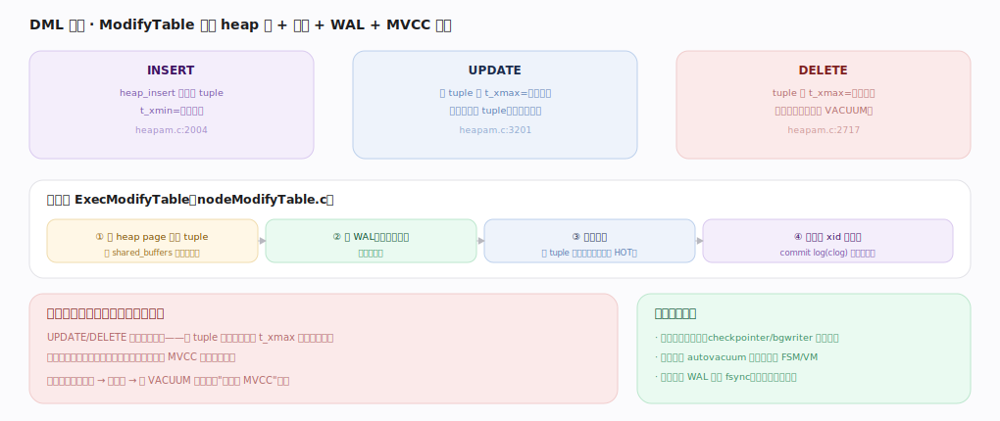

# PostgreSQL 核心原理 · DML 数据写入（INSERT / UPDATE / DELETE）

> **定位**：改数据接口主线，骨架 = `ExecModifyTable → heap 写 + 索引维护 + WAL + MVCC 版本`。以**存储引擎**（heap tuple）与**事务与 MVCC**（xmin/xmax 多版本）为双轴，持久化靠 **WAL 与恢复**，死元组回收依赖后台 **VACUUM**。核实基准：官方源码 `postgres/src`。

## 一、总览：ModifyTable 驱动，写造版本

三类写共享 `ExecModifyTable`（`nodeModifyTable.c`）：**INSERT** `heap_insert` 追加新 tuple、`t_xmin`=当前事务（`heapam.c:2004`）；**UPDATE** 旧 tuple 打 `t_xmax`=当前事务 + 插入新版本（不就地改，`:3201`）；**DELETE** tuple 打 `t_xmax`、不物理删除留给 VACUUM（`:2717`）。统一路径：① 在 shared_buffers 缓冲页上改 tuple → ② 写 WAL（先于刷盘）→ ③ 更新索引（新 tuple 需新索引项，除非 HOT）→ ④ 提交时 commit log(clog) 记事务状态定可见性。**关键：写不就地覆盖而是造版本**——旧数据留着供旧快照读，代价是死元组堆积、表膨胀，靠 VACUUM 回收。

---

## 深化 · 版本链与 HOT 优化

普通 UPDATE：旧版本 v1 打 `t_xmax` 失效、新版本 v2 另存（ctid 从 v1 指 v2），**每个索引都要加指向 v2 的新项**（即使只改非索引列，也为所有索引维护——写放大），旧索引项等 VACUUM 清。**HOT（Heap-Only Tuple）UPDATE**：当更新的列都不在任何索引里（`heapam.c:3976` 检查），新版本只在同一 heap page 内形成 HOT chain、**索引不动仍指向 v1**（经 v1 顺链找 v2），省去索引维护、减少写放大与索引膨胀；页内 HOT pruning 可就地回收死版本。工程含义：读写不互阻塞（MVCC 红利）、UPDATE 本质"删+插"、`fillfactor` 留页内空间提高 HOT 命中、VACUUM 不可少。

---

## 拓展 · 写相关组件

| 组件 | 职责 | 锚点 |
|---|---|---|
| ExecModifyTable / ExecInsert/Update/Delete | 写算子 | `executor/nodeModifyTable.c` |
| heap_insert / heap_update / heap_delete | 堆表写 + MVCC 标记 | `access/heap/heapam.c:2004/3201/2717` |
| ExecInsertIndexTuples | 维护索引项 | `executor/execIndexing.c` |
| clog（commit log） | 记事务提交/回滚状态 | `access/transam/clog.c` |
| WAL | 先写日志 | `access/transam/xloginsert.c` |

---

## 调优要点（关键开关）

- `fillfactor`（建表/索引时）：留页内空闲提高 HOT 命中，写多的表可调低于 100。
- 更新尽量只碰非索引列，触发 HOT 减少索引写放大。
- 批量写用 `COPY` 而非逐行 INSERT；大事务减少提交开销。
- autovacuum 参数（`autovacuum_vacuum_scale_factor` 等）按更新频率调，防膨胀。

---

## 常见误区与工程要点

- **以为 UPDATE 就地改**：实际是造新版本 + 旧版本失效；频繁更新累积死元组。
- **忽视索引写放大**：非 HOT 的 UPDATE 要更新所有索引，索引越多写越慢。
- **关掉 autovacuum**：死元组不回收 → 表/索引膨胀、XID 回卷风险。
- **把 DELETE 当立即释放空间**：只打删除标记，空间靠 VACUUM 回收。

---

## 一句话总纲

**DML 三类写都经 ExecModifyTable：INSERT 追加新 tuple、UPDATE 旧版本打 t_xmax 并另存新版本、DELETE 打 t_xmax 不物理删——写不就地覆盖而是造 MVCC 版本，改动在缓冲页上做、先写 WAL、维护索引（HOT 更新在改的列无索引时可省索引维护）、提交经 clog 定可见性；旧版本供旧快照读、死元组由 VACUUM 后台回收，fillfactor 与"只更新非索引列"能提高 HOT 命中减少膨胀。**
