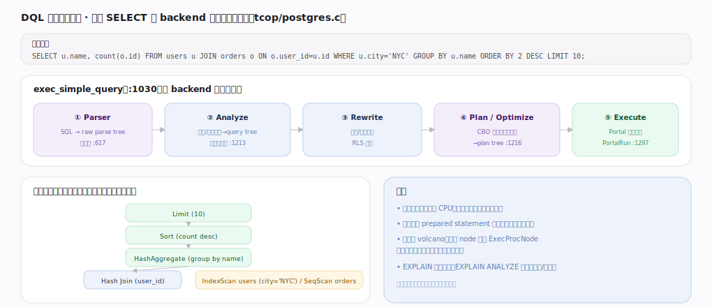
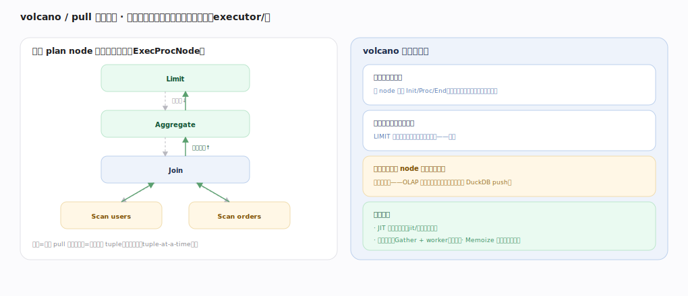
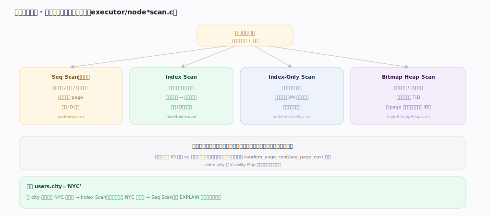
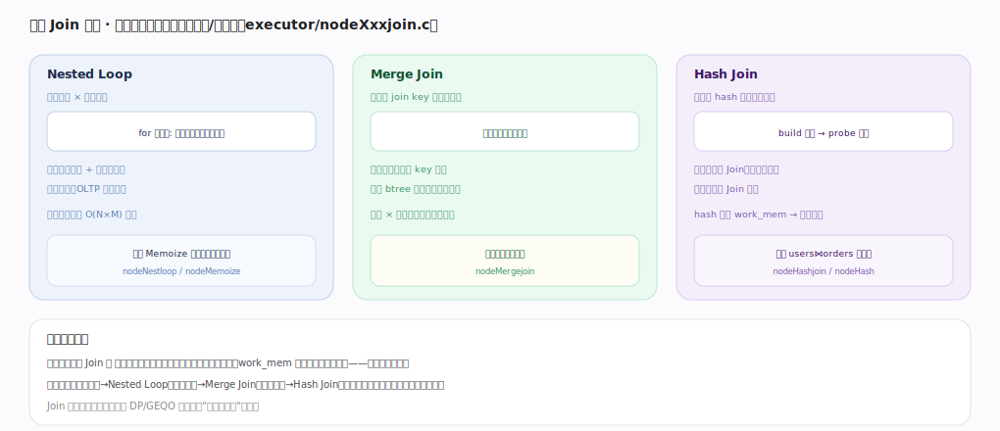

# PostgreSQL 核心原理 · DQL 数据查询（SELECT）

> **定位**：读数据接口主线，骨架 = backend 内 `Parser → Analyze → Rewrite → Plan → Execute`（`tcop/postgres.c` `exec_simple_query:1030`）。强依赖**查询优化器**（选计划）、**执行引擎**（volcano 执行）、**索引方法**与**存储引擎**（读取），跨事务时依赖**事务与 MVCC**（快照可见性）。核实基准：官方源码 `postgres/src`（commit 572c3b2）。

## 一、生命周期总览：五段流水线

一条 SELECT 在单个 backend 内顺序走五段：**Parser**（`pg_parse_query`，`tcop/postgres.c:617`，SQL→raw parse tree，纯语法、不查目录）→ **Analyze**（`parse_analyze_fixedparams`，`parser/analyze.c:128`，经 `transformStmt:335` 做名称/类型绑定、查系统目录→query tree）→ **Rewrite**（`QueryRewrite`，`rewrite/rewriteHandler.c:4789`，其中 `fireRIRrules:2042` 展开视图、`RewriteQuery:4044` 处理规则、并注入 RLS 谓词）→ **Plan/Optimize**（`pg_plan_queries`，`postgres.c:988`，CBO 选最省代价计划→plan tree）→ **Execute**（Portal 逐行拉取）。

在 `exec_simple_query` 里可精确看到调用序：analyze+rewrite 在 `tcop/postgres.c:1213`、plan 在 `tcop/postgres.c:1216`、`PortalStart` 在 `tcop/postgres.c:1258`、`PortalRun` 在 `tcop/postgres.c:1297`。前四段是编译（纯 CPU、无 IO，可被 prepared statement 缓存复用），第五段才真正读数据。全库用同一贯穿示例 `SELECT u.name, count(o.id) FROM users u JOIN orders o ON o.user_id=u.id WHERE u.city='NYC' GROUP BY u.name ORDER BY 2 DESC LIMIT 10;`。

---

## 二、volcano / pull 执行模型

执行三段由 Portal 驱动（`tcop/pquery.c`）：`PortalStart`（`tcop/pquery.c:430`）建执行态、`PortalRun`（`tcop/pquery.c:681`）→`PortalRunSelect`（`tcop/pquery.c:860`）反复取行、结束时收尾。执行器内部是**火山模型**：每个 plan node 建成一个运行态 `PlanState`（`ExecInitNode`，`executor/execProcnode.c:142`），顶层反复调 `ExecProcNodeFirst`（`executor/execProcnode.c:448`）向下 pull "要一行"、数据自底向上逐行返回（tuple-at-a-time），取尽或够 LIMIT 后 `ExecEndNode`（`executor/execProcnode.c:543`）收尾。

性质：统一迭代器接口（Init/Proc/End 可组合任意算子树，实现简洁）、按需拉取天然流水线（LIMIT 拿够就停、上游不必算完）。代价是每行每 node 一次函数调用——逐行开销大，OLAP 大扫描不如列存向量化（对照 DuckDB 的 push）。三条缓解手段：JIT 编译表达式（`jit/`，把 ExprState 编译成机器码）、并行查询（`Gather` + worker，见"执行引擎"）、Memoize 缓存重复子查询探测结果。

---

## 深化 · 扫描方法选择

优化器按选择率与代价挑读表方式（各 node 在 `executor/node*scan.c`）：**Seq Scan**（选择率高/表小/无索引，顺序读所有 page，代价模型 `cost_seqscan`，`optimizer/path/costsize.c:271`）、**Index Scan**（选择率低，走索引 `index_getnext_tid`（`access/index/indexam.c:599`）定位 TID 再回堆表取行，含随机 IO，代价 `cost_index`，`costsize.c:546`）、**Index-Only Scan**（查询列全在索引里、经 Visibility Map `visibilitymap_get_status`（`access/heap/visibilitymap.c:319`）确认整页全可见则免回表，最快）、**Bitmap Heap Scan**（中等选择率/多索引组合，先建 TID 位图再按 page 有序回表，把随机 IO 摊成顺序 IO）。

关键是**选择率**：命中占比越低越倾向索引、越高越倾向全表顺序读，由 `random_page_cost`/`seq_page_cost` 与 `pg_statistic` 统计权衡；SSD 上调低 `random_page_cost` 会让索引更受青睐。

---

## 深化 · 三种 Join 算法

优化器为每种 Join 算代价选最小者：**Nested Loop**（外表每行探内表，适合外表小 + 内表有索引；可配 Memoize 缓存内表探测结果）、**Merge Join**（两表按 key 排序后双指针归并，适合已有序或结果需有序）、**Hash Join**（小表 build 哈希表、大表 probe，等值大 Join 主力，超 `work_mem` 则分批落盘）。经验对应（外小内有索引→NL、有序→Merge、大表等值→Hash）只是常见结果，实际以代价为准；Join 顺序由 DP/GEQO 决定（见"查询优化器"）。

---

## 深化 · 失败路径与边界

- **计划编译期错误 vs 执行期错误**：绑定失败（列不存在、类型不匹配）在 Analyze 阶段就报错、不进执行；而唯一约束冲突、除零、`work_mem` 不足落盘等在 Execute 阶段才暴露——`EXPLAIN`（不带 ANALYZE）只跑到计划、不触发执行期错误。
- **估计失真选坏计划**：`cost_*` 全依赖 `pg_statistic`；统计陈旧或多列相关（如 city 与 zip 强相关）导致基数估偏，可能把该走 Hash Join 的选成 Nested Loop、慢几个数量级。多列相关用 `CREATE STATISTICS` 扩展统计缓解。
- **work_mem 与并发相乘爆内存**：每个 Sort/Hash/Agg 节点各占最多 `work_mem`，一条复杂计划可能有多个此类节点，再乘以并发连接数——设太大会 OOM。
- **游标与快照**：RR/Serializable 下打开的游标沿用事务快照，长时间持有游标等价于长事务，会压住死元组回收。

---

## 拓展 · 常见 plan node

| 类别 | node | 说明 |
|---|---|---|
| 扫描 | SeqScan / IndexScan / IndexOnlyScan / BitmapHeapScan | 读表 |
| 连接 | NestLoop / MergeJoin / HashJoin | 连接两表 |
| 聚合 | Agg（Hash/Group）/ WindowAgg | 分组/窗口 |
| 排序/限量 | Sort / IncrementalSort / Limit | 排序、取前 N |
| 并行 | Gather / GatherMerge | 汇聚并行 worker 结果 |
| 其他 | Material / Memoize / Append / ModifyTable | 物化/缓存/合并/写 |

---

## 调优要点（关键开关）

- `EXPLAIN (ANALYZE, BUFFERS)`：看真实计划、行数估计误差与缓冲命中——调优第一手段。
- `work_mem`：排序/Hash 的内存上限；不够则落盘，影响 Join/Sort/Agg 选择，注意乘并发。
- `random_page_cost`/`seq_page_cost`：SSD 上调低 random_page_cost 使索引更受青睐。
- `max_parallel_workers_per_gather`：开并行查询分摊大扫描。
- 保持统计新鲜（`ANALYZE`/autovacuum），多列相关用 `CREATE STATISTICS`。

---

## 常见误区与工程要点

- **以为有索引就一定走索引**：选择率高时全表顺序读更省；优化器按代价选。
- **忽视统计陈旧**：estimate 依赖 pg_statistic，数据大改后不 ANALYZE 会选坏计划。
- **work_mem 设太大又高并发**：每个 Sort/Hash 节点各占 work_mem，并发下可能爆内存。
- **把 volcano 当向量化**：逐行执行，纯分析大扫描性能不如列存引擎。
- **EXPLAIN 能暴露一切错误**：不带 ANALYZE 只到计划，执行期错误看不到。

---

## 一句话总纲

**DQL 在 backend 内经 `pg_parse_query`→`parse_analyze`→`QueryRewrite`→`pg_plan_queries`(CBO)→Portal 执行五段流水线：前四段编译成 plan tree（可缓存），执行由 Portal 驱动 volcano/pull 火山模型（`ExecInitNode`/`ExecProcNode`/`ExecEndNode`）逐行拉取；读表按选择率在 Seq/Index/IndexOnly/BitmapHeap 间用 `cost_seqscan`/`cost_index` 选、连接按代价在 NestLoop/Merge/Hash 间选、Join 顺序由 DP+GEQO 定，逐行开销靠 JIT、并行查询与 Memoize 缓解——一切选择以优化器基于 pg_statistic 的代价估计为准，统计失真是坏计划头号原因。**
