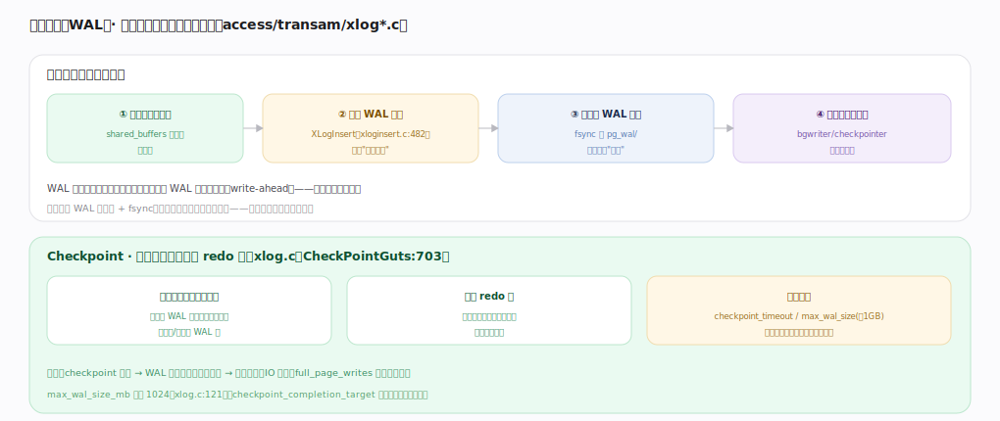
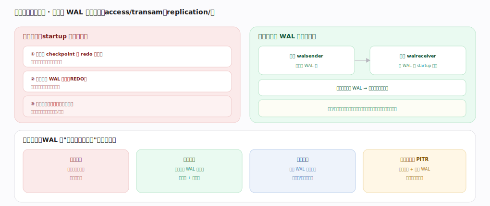

# PostgreSQL 核心原理 · 支撑能力域 · WAL 与恢复复制

> **定位**：保障能力域。先写日志（WAL）保证持久性与崩溃恢复，同一份 WAL 又驱动流复制与 PITR。被所有写路径（**DML/DDL**）依赖，由后台 **checkpointer/walwriter/walsender/startup** 进程执行。核实基准：官方源码 `postgres/src`（commit 572c3b2）。

## 一、先写日志（WAL）

一次修改的持久化路径：① 改缓冲池里的页（标脏、未落盘）→ ② 组装并插入 WAL 记录（`XLogRegisterData`（`access/transam/xloginsert.c:372`）登记数据、`XLogInsert:482` → `XLogRecordAssemble:621` 组装成 xlog record 描述"改了什么"，写进 WAL buffers 并返回其 LSN，同时写入该页 `pd_lsn`）→ ③ 提交时把到本事务 commit 记录为止的 WAL **fsync** 落盘（此刻才算持久，`GetInsertRecPtr:6983` 是当前插入位置）→ ④ 脏数据页稍后由 bgwriter/checkpointer 异步批量刷。

**WAL 规则（write-ahead）**：任何数据页刷盘前，描述该页修改的 WAL 必须已先落盘——`FlushBuffer` 刷脏页前会确保其 `pd_lsn` 对应的 WAL 已 fsync。这保证崩溃后总能靠 WAL 把"改了但没刷的页"重放出来；且把大量随机的数据页写摊平成 WAL 的**顺序追加写**（提交只需顺序 fsync，很快）。

**Checkpoint**（`CreateCheckPoint`，`access/transam/xlog.c:7400` → `CheckPointGuts:8049`）：把所有脏页刷到数据文件、记下 **redo 点**（此前的 WAL 不再需要用于崩溃恢复、可回收/归档），从而缩短下次恢复时间、界定 WAL 保留量。触发时机：时间（`checkpoint_timeout`）或 WAL 量（`max_wal_size`，默认 `max_wal_size_mb=1024`=1GB，`xlog.c:121`）到阈值；为避免 checkpoint 时刷盘尖峰打满 IO，`checkpoint_completion_target` 把刷盘摊到整个周期。

---

## 二、崩溃恢复与复制

**崩溃恢复**：重启时 startup 进程跑 `StartupXLOG`（`access/transam/xlog.c:5845`），从最近 checkpoint 的 redo 点开始，`PerformWalRecovery`（`access/transam/xlogrecovery.c:1612`）循环 `ReadRecord:3108` 逐条读 WAL、按 rmgr 回调重放（redo）到崩溃时刻——**已提交事务的改动补齐、未提交的丢弃**，回到一致状态。因 WAL 先落盘，凡提交的都能重放出来，这就是 D（持久性）的实现。WAL 是幂等可重放的物理/逻辑混合日志。

**复制**：同一份 WAL 直接喂给备库。**物理流复制**——主库 `walsender`（`replication/walsender.c`，`StartReplication:850`→`WalSndLoop:3036`→`XLogSendPhysical:3350`）把 WAL 流式发给备库的 `walreceiver`（`replication/walreceiver.c` `WalReceiverMain:154`），备库持续回放、可只读查询（hot standby），主库故障可提升（failover）。同步/异步由 `synchronous_commit` 控（同步则等备库确认落盘才返回 commit，零丢失但增延迟）。**PITR（时间点恢复）**：基础备份 + 归档 WAL（archive_command）可回放到任意时点。**逻辑复制**：解码 WAL 成行级变更、按发布/订阅选择性复制到异构目标。一份 WAL，兼顾持久性、高可用与数据分发。

---

## 深化 · 失败路径与边界

- **fsync 失败的严重性**：WAL fsync 失败意味着"以为持久的其实没落盘"，PG 会 panic 重启保守处理；底层存储必须诚实实现 fsync（某些云盘/RAID 卡缓存曾因谎报 fsync 导致丢数据）。
- **WAL 堆积撑爆磁盘**：归档失败（archive_command 报错）、复制槽（replication slot）对应的备库掉线不消费、或长事务钉住 WAL，都会让 `pg_wal/` 无限增长、写满磁盘导致停摆——复制槽尤其危险，僵尸槽要及时 `pg_drop_replication_slot`。
- **checkpoint 尖峰**：`max_wal_size` 太小会频繁 checkpoint、刷盘尖峰打满 IO 拖慢前台；太大则恢复时间长、WAL 占盘多——用 `checkpoint_completion_target` 摊平、按负载权衡两者。
- **备库回放延迟**：备库单进程回放跟不上主库高写入时产生复制延迟（replication lag），只读查询看到旧数据；`hot_standby_feedback` 又会让备库的长查询反压主库阻止死元组回收。
- **异步复制丢数据窗口**：`synchronous_commit=off` 或异步备库下，主库崩溃会丢失尚未传到备库的已提交事务——RPO 非零，需按业务容忍度选同步级别。

---

## 拓展 · WAL 与复制组件

| 组件 | 职责 | 锚点 |
|---|---|---|
| XLogInsert | 插入 WAL 记录、返回 LSN | `access/transam/xloginsert.c:482` |
| CreateCheckPoint / CheckPointGuts | 刷脏页、记 redo 点 | `access/transam/xlog.c:7400/8049` |
| StartupXLOG / PerformWalRecovery | 崩溃恢复回放 WAL | `xlog.c:5845` / `xlogrecovery.c:1612` |
| walsender / XLogSendPhysical | 主库发 WAL 流 | `replication/walsender.c:850/3350` |
| walreceiver | 备库收 WAL 流 | `replication/walreceiver.c:154` |
| max_wal_size（默认 1GB） | checkpoint WAL 阈值 | `access/transam/xlog.c:121` |

---

## 调优要点（关键开关）

- `max_wal_size`/`checkpoint_timeout`/`checkpoint_completion_target`：平衡 checkpoint 频率与刷盘尖峰、恢复时间与占盘。
- `synchronous_commit`：吞吐 vs 持久性权衡；关键数据用同步复制换零丢失。
- `wal_compression`/`wal_level`：控 WAL 体积与复制/归档能力（replica/logical）。
- 监控复制延迟与 `pg_wal/` 大小、归档成功率；及时清理僵尸复制槽。
- 底层存储必须正确实现 fsync，否则持久性保证失效。

---

## 常见误区与工程要点

- **提交就等于数据页落盘**：提交只保证 WAL 落盘，数据页由 checkpoint 稍后刷。
- **checkpoint 越频繁越安全**：过频引发刷盘尖峰拖慢前台；用 completion_target 摊平。
- **WAL 可以随意删**：归档/复制/长事务未消费的 WAL 不能删，删了破坏恢复与复制。
- **异步复制零丢失**：异步下主库崩溃会丢未传备库的已提交事务，RPO 非零。
- **复制槽有益无害**：备库掉线时僵尸槽会让 WAL 无限堆积撑爆磁盘。

---

## 一句话总纲

**WAL 是持久性与高可用的共同支柱：任何改动先在缓冲页上做、再把描述改动的 WAL 记录（`XLogInsert`，写入页 pd_lsn）顺序写并在提交时 fsync 落盘（write-ahead：数据页刷盘前其 WAL 必先落盘），脏数据页由 checkpointer/bgwriter 异步刷、`CreateCheckPoint`→`CheckPointGuts` 定期刷全脏页并记 redo 点（受 max_wal_size=1GB 等触发）；崩溃时 startup 进程 `StartupXLOG`→`PerformWalRecovery` 从 redo 点回放 WAL 恢复一致状态，同一份 WAL 经 walsender→walreceiver 驱动物理流复制/hot standby/PITR/逻辑复制——把随机写摊成顺序写换来快提交，但归档失败或僵尸复制槽会让 WAL 堆满磁盘、异步复制存在 RPO 丢数据窗口。**
