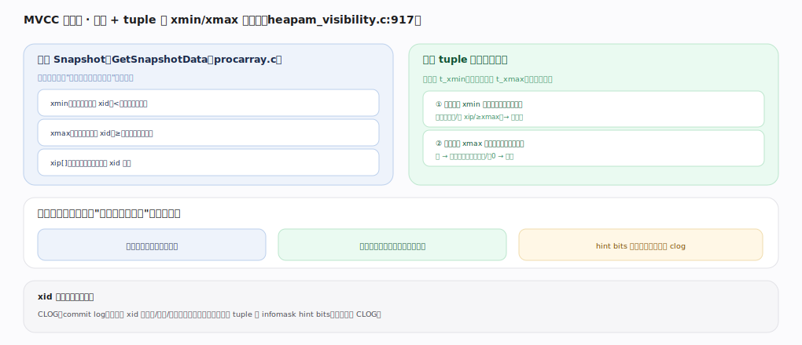
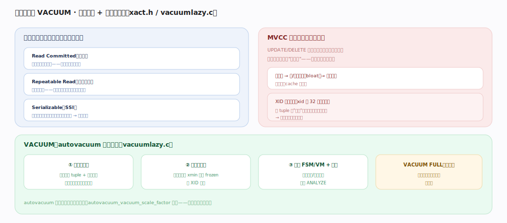

# PostgreSQL 核心原理 · 支撑能力域 · 事务与 MVCC

> **定位**：保障、灵魂能力域之一。tuple 多版本 + 快照可见性 + VACUUM 回收，是读写不互阻塞与正确性的根基。被 **DML**（写造版本）、**DQL**（快照读）依赖，死元组回收依赖后台 **VACUUM**。核实基准：官方源码 `postgres/src`（commit 572c3b2）。

## 一、可见性：快照 + xmin/xmax

查询开始时取**快照**（`GetSnapshotData`，`storage/ipc/procarray.c:2114`）：它遍历 ProcArray 把当前所有活跃事务拍照，填出 `SnapshotData`（`utils/snapshot.h:138`）三要素——`xmin`（所有 XID < xmin 的都已定论、无需再查，`:153`）、`xmax`（所有 XID ≥ xmax 的都还没开始、一律不可见，`:154`）、`xip[]`（拍照瞬间仍在进行中的 XID 列表，`:164`）。

一行 tuple 是否可见，由其头部 `HeapTupleHeaderData`（`access/htup_details.h:153`）的 `t_xmin`（谁插入）与 `t_xmax`（谁删除/更新）对照快照判定，核心逻辑在 `HeapTupleSatisfiesMVCC`（`access/heap/heapam_visibility.c:939`）：① 插入事务 `t_xmin` 是否已提交且对本快照可见？若未提交、在 `xip[]` 中、或 ≥ `xmax` → 该行尚不可见；② 删除事务 `t_xmax` 是否已提交且对本快照可见？若是 → 已被删除、不可见，若为 0 或删除者未提交 → 仍可见。效果：读不阻塞写、写不阻塞读，同一行的多个版本并存，供不同快照各取所需。

XID 的提交状态并不存在 tuple 里，而在 **CLOG**（`TransactionIdGetStatus`，`access/transam/clog.c:743`）——每个 XID 两 bit（进行中/已提交/已中止/子事务）。为省去每次可见性判定都查 CLOG，首次判定后把结论以 **hint bits** 写回 tuple 的 `infomask`（`SetHintBits`，`heapam_visibility.c:199`，如 `HEAP_XMIN_COMMITTED=0x0100`，`htup_details.h:204`）；后续同一行再判可见性直接读 infomask，避免反复访问 CLOG。判活跃用 `TransactionIdIsInProgress`（`procarray.c:1393`）。`HeapTupleSatisfiesVisibility`（`heapam_visibility.c:1732`）按快照类型分派到 MVCC/Dirty/SelfUpdated 等具体判定器。

---

## 二、隔离级别与 VACUUM

三种隔离级别本质是**快照粒度**不同：**Read Committed**（默认，每条语句执行前取一次新快照，故能看到期间别的事务已提交的新数据）、**Repeatable Read**（事务开始时取一次快照并沿用到结束，防不可重复读/幻读）、**Serializable**（在 RR 快照之上叠加 **SSI 可串行化快照隔离**，`storage/lmgr/predicate.c` 跟踪读写依赖，`CheckForSerializableConflictOut:3952` 与 `OnConflict_CheckForSerializationFailure:4465` 检测危险的读写依赖环，命中即回滚一方并报序列化失败）。

MVCC 的代价是**死元组堆积**：UPDATE/DELETE 不就地改，而是给旧版本打 `t_xmax`、留在原页；当没有任何活跃快照还需要它（即比全局 `xmin` 更老），它就成为死元组。不回收则表/索引膨胀、扫描要跳过大量死行；且 XID 是 32 位循环计数，若极老的 tuple 不"冻结"，XID 回卷后会被误判为"未来事务"而突然不可见——PostgreSQL 会在临近阈值时强制停写自保。

**VACUUM**（`access/heap/vacuumlazy.c`）三件事：① 回收死元组与死索引项使空间可复用（`heap_vacuum_rel:624` → `lazy_scan_heap:1279` → `lazy_scan_prune:2021` 剪枝、`lazy_vacuum:2369` 清索引与堆）；② **冻结**足够老的事务防 XID 回卷；③ 更新 FSM/VM 并顺带 ANALYZE。页内轻量剪枝还有 `heap_page_prune_opt`（`access/heap/pruneheap.c:272`）在普通读时顺手清理 HOT 链上的死版本。`VACUUM FULL` 会重写整表真正缩小文件，但取 `AccessExclusiveLock` 锁全表，生产慎用。回收阈值由后台 `do_autovacuum`（`postmaster/autovacuum.c:1928`）按更新量自动触发——关掉 autovacuum 是生产大忌。

---

## 深化 · 关键组件与源码锚点

| 组件 | 职责 | 源码锚点 |
|---|---|---|
| GetSnapshotData | 遍历 ProcArray 取快照（xmin/xmax/xip） | `storage/ipc/procarray.c:2114` |
| HeapTupleSatisfiesMVCC | 按快照判一行可见性 | `access/heap/heapam_visibility.c:939` |
| SetHintBits | 判定结论写回 infomask（缓存 CLOG） | `access/heap/heapam_visibility.c:199` |
| TransactionIdGetStatus | 查 CLOG 事务提交状态 | `access/transam/clog.c:743` |
| TransactionIdIsInProgress | 判 XID 是否仍活跃 | `storage/ipc/procarray.c:1393` |
| lazy_scan_prune | VACUUM 页内剪枝 | `access/heap/vacuumlazy.c:2021` |
| heap_page_prune_opt | 读路径上的机会式剪枝 | `access/heap/pruneheap.c:272` |
| CheckForSerializableConflictOut | SSI 读写依赖检测 | `storage/lmgr/predicate.c:3952` |

---

## 深化 · 失败路径与边界

- **XID 回卷停写**：若某表的 `relfrozenxid` 年龄逼近 `autovacuum_freeze_max_age`，autovacuum 触发**强制反回卷 VACUUM**（即使已禁用 autovacuum）；再逼近 `xidStopLimit` 则数据库进入**只读拒写**保护态，必须单用户模式 VACUUM 才能恢复——这是 MVCC 唯一会让整库停摆的边界。
- **长事务压住回收**：`ComputeXidHorizons`（`procarray.c:1674`）算出的全局可回收水位取决于最老快照；一个空闲但未提交的事务会把水位钉死，导致其后所有死元组无法回收、膨胀失控。
- **hint bits 首次访问放大写**：hint bits 由第一个访问该 tuple 的查询回写（`SetHintBits`），故一次大 SELECT 可能引发大量页变脏、连带 WAL（若开 `wal_log_hints`/校验和）——批量导入后首次全表扫描"莫名"变慢即源于此。
- **SSI 序列化失败**：Serializable 下检测到依赖环会主动 `ERROR: could not serialize access`，应用需捕获并重试；跟踪读写依赖本身也有内存与 CPU 开销。

---

## 调优要点（关键开关）

- 保持 autovacuum 开启并按更新频率调（`autovacuum_vacuum_scale_factor`、`autovacuum_vacuum_cost_limit` 等）。
- 长事务/未关闭的空闲事务会压住"最老快照"阻止死元组回收——务必避免。
- 监控膨胀与年龄（`age(relfrozenxid)`），临近回卷阈值前主动 `VACUUM (FREEZE)`。
- 高更新表配低 `fillfactor` 提高 HOT 更新比例，减少版本与索引膨胀。
- Serializable 场景应用侧务必实现"序列化失败自动重试"。

---

## 常见误区与工程要点

- **UPDATE 就地改**：实为造新版本、旧版本打 t_xmax 留原地；死元组靠 VACUUM 回收。
- **长事务无害**：它让 VACUUM 无法回收其后产生的死元组，膨胀失控。
- **VACUUM 只是清垃圾**：它还冻结防 XID 回卷、维护 FSM/VM——正确性与性能双关。
- **Serializable 免费**：SSI 有额外读写依赖跟踪开销与序列化失败重试成本。
- **hint bits 无副作用**：首次访问会回写页、可能连带 WAL 与刷盘。

---

## 一句话总纲

**事务与 MVCC 用快照（xmin/xmax/xip，`GetSnapshotData`）+ 每行 tuple 的 t_xmin/t_xmax 判可见性（`HeapTupleSatisfiesMVCC`），XID 提交状态存 CLOG 并以 hint bits 缓存，实现读写互不阻塞与三种隔离级别（RC/RR/Serializable，后者叠加 SSI 依赖检测）；代价是 UPDATE/DELETE 留下的死元组，由 autovacuum 后台 `lazy_scan_prune`/`lazy_vacuum` 回收空间、冻结老事务防 XID 回卷、维护 FSM/VM——长事务阻止回收、关闭 autovacuum、逼近 XID 回卷阈值都是会导致膨胀甚至整库停写的生产红线。**
