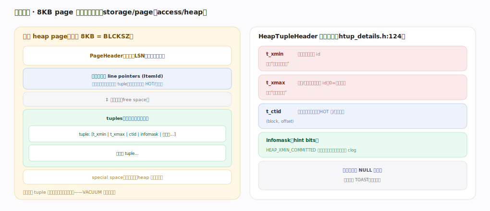
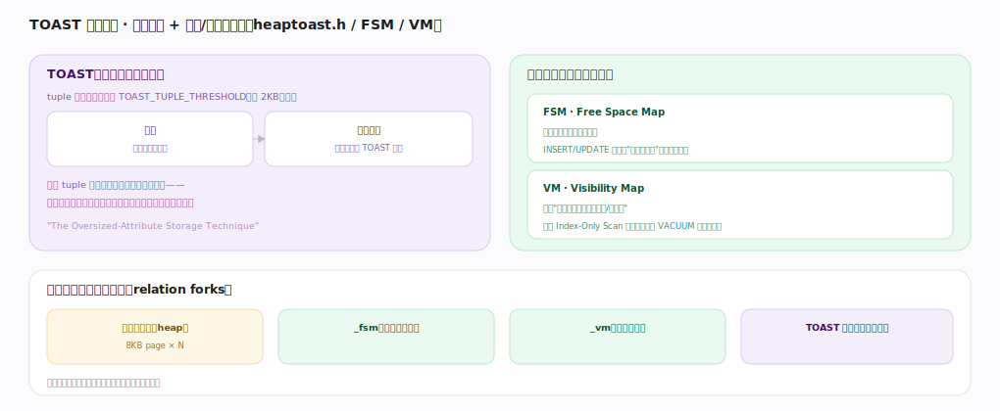

# PostgreSQL 核心原理 · 支撑能力域 · 存储引擎

> **定位**：底座能力域。自管**面向磁盘的行存**：8KB page 内多个 tuple（含 xmin/xmax），大值走 TOAST，配 FSM/VM 辅助图。被 **DML**（写）、**DQL**（读）依赖，与**事务与 MVCC**（tuple 版本）深度耦合。核实基准：官方源码 `postgres/src`。

## 一、页与元组：8KB page 的行存布局

一个 heap page（默认 8KB = BLCKSZ）自上而下：PageHeader（页头，含 LSN）→ **行指针数组**（line pointers/ItemId，从头向下增长，指向 tuple 的间接层，支撑 HOT 与页内整理）→ 空闲空间 → **tuples**（从页尾向上增长）→ special space（索引页用）。行指针与 tuple 相向增长、中间是空闲区，VACUUM 整理时压缩。`HeapTupleHeader`（`htup_details.h:124`）关键字段：**t_xmin**（插入事务 id，"从何时起可见"）、**t_xmax**（删除/更新事务 id，0=有效，"到何时失效"）、**t_ctid**（指向本行最新版本，HOT/更新链）、**infomask**（hint bits 缓存事务提交状态省查 clog）、列数据（含 NULL 位图）。

---

## 二、TOAST 与辅助图

**TOAST**：tuple 不能跨页，超过 `TOAST_TUPLE_THRESHOLD`（约 2KB）触发——先尝试行内压缩，再切块存到该表的 TOAST 附表，主表 tuple 只留指针、读时按需取回，让宽表主页紧凑（不碰大字段就不读它）。**两张辅助图**（每表附带）：**FSM**（Free Space Map，记每页剩余空闲，INSERT/UPDATE 快速找能放下的页免全扫）、**VM**（Visibility Map，标记整页对所有事务可见/全冻结，支撑 Index-Only Scan 免回表、加速 VACUUM 跳过干净页）。一张表的物理组成 = 主数据文件（heap）+ _fsm + _vm + TOAST 附表（如有）+ 各索引文件。

---

## 拓展 · 存储关键量与组件

| 项 | 值/说明 | 锚点 |
|---|---|---|
| BLCKSZ（page 大小） | 8KB（编译期可改） | `pg_config` |
| TOAST 阈值 | ~2KB（TOAST_TUPLE_THRESHOLD） | `access/heaptoast.h` |
| heap 写 | heap_insert/update/delete | `access/heap/heapam.c` |
| relation forks | main / fsm / vm / toast | `storage/smgr/` |
| 行版本可见性 | HeapTupleSatisfiesMVCC | `access/heap/heapam_visibility.c` |

---

## 调优要点（关键开关）

- `fillfactor`：留页内空闲提高 HOT 命中，写多的表调低于 100。
- 宽表大字段自动 TOAST；查询别 `SELECT *` 拖出不需要的大字段。
- 定期（auto）VACUUM 维护 FSM/VM，保持 Index-Only Scan 有效、控制膨胀。
- 监控表膨胀（dead tuples 占比），必要时 `VACUUM FULL`/重建（会锁表）。

---

## 常见误区与工程要点

- **以为行存适合大分析扫描**：行存要读整行的所有列；纯分析不如列存，但索引/并行/TOAST 分离缓解。
- **忽视 TOAST 读放大**：频繁读大字段会不断回取 TOAST，宽表按需选列。
- **以为 VACUUM 只是清理**：它还更新 FSM/VM、冻结老事务防 XID 回卷，是存储健康的关键。
- **page 大小随意改**：BLCKSZ 是编译期常量，生产用默认 8KB。

---

## 一句话总纲

**存储引擎是面向磁盘的行存：8KB page 内行指针数组（间接层，支撑 HOT/整理）与 tuple 相向增长，每个 tuple 头带 t_xmin/t_xmax/t_ctid/infomask 承载 MVCC 版本，超长字段经 TOAST 压缩切块存附表、主表只留指针；每表另有 FSM（找空闲页）与 VM（页级可见性，支撑 Index-Only Scan 与 VACUUM 跳页），死元组与页碎片由 VACUUM 回收整理。**
