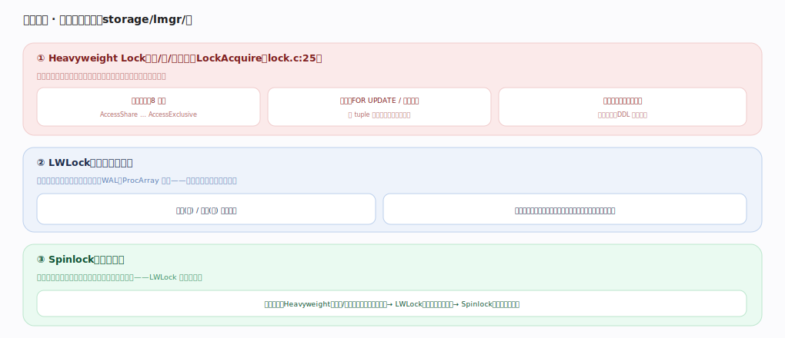
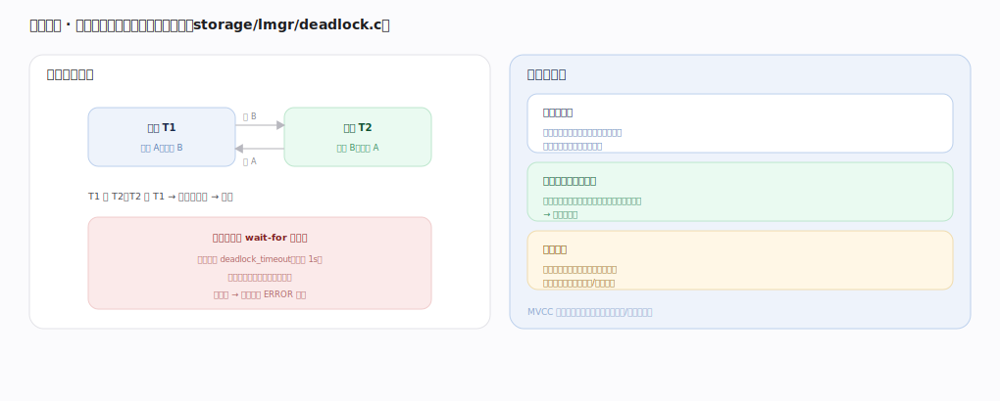

# PostgreSQL 核心原理 · 支撑能力域 · 并发控制与锁

> **定位**：保障能力域。MVCC 让读不加锁，但写写冲突、DDL、显式锁仍需锁——从重到轻三级（heavyweight/LWLock/spinlock），配死锁检测。被 **DML/DDL** 与**事务与 MVCC** 依赖。核实基准：官方源码 `postgres/src`（`storage/lmgr/`）。

## 一、锁的层次：从重到轻三级

**① Heavyweight Lock**（表/行/对象级，`LockAcquire`，`lock.c:25`）：保护逻辑对象、事务期持有、进锁表、支持多种模式与死锁检测——表锁 8 种模式（AccessShare … AccessExclusive，相容矩阵决定并发：读读兼容、DDL 与写互斥），行锁（FOR UPDATE/写冲突，存 tuple 头，冲突才升级等待）。**② LWLock**（轻量读写锁）：保护共享内存结构（缓冲池槽、WAL、ProcArray），共享/独占两模式、短临界区、不进死锁检测，高频低开销但争用会成扩展性瓶颈。**③ Spinlock**：保护极短原子操作、忙等不睡眠，LWLock 内部也用它。层次：Heavyweight（对象/事务级可等待可死锁）→ LWLock（共享内存结构）→ Spinlock（指令级原子）。

---

## 二、死锁检测

经典循环等待：T1 持 A 想要 B、T2 持 B 想要 A，互不放手。检测（`deadlock.c`）：锁等待超 `deadlock_timeout`（默认 1s）才触发（避免频繁开销），构建 wait-for 图找环，找到则选一个牺牲者 ERROR 回滚打破环、其余继续——应用需捕获死锁错误并重试。预防优于处理：**统一加锁顺序**（所有事务按同一顺序访问对象，如按主键序，则不可能成环）、**缩短事务**（持锁少、冲突窗口小、避免事务里穿插长耗时/交互等待）。MVCC 让读不加锁，死锁通常出在写写/显式锁之间。

---

## 拓展 · 锁相关组件

| 组件 | 职责 | 锚点 |
|---|---|---|
| LockAcquire/Release | heavyweight 锁 | `storage/lmgr/lock.c` |
| LWLock | 共享内存结构锁 | `storage/lmgr/lwlock.c` |
| DeadLockCheck | 死锁检测 | `storage/lmgr/deadlock.c` |
| fast-path lock | 弱表锁快路径 | `storage/lmgr/lock.c` |
| 谓词锁（SSI） | 可串行化冲突检测 | `storage/lmgr/predicate.c` |

---

## 调优要点（关键开关）

- 事务内按固定顺序访问对象/行，杜绝循环等待。
- 缩短事务、及时提交，减少持锁时间与冲突。
- 用 `pg_locks`/等待事件观测锁争用；LWLock 争用看扩展性瓶颈。
- DDL 选低锁方案（CREATE INDEX CONCURRENTLY 等），错峰执行。

---

## 常见误区与工程要点

- **以为 MVCC 就没锁**：读无锁，但写写、DDL、显式 FOR UPDATE 仍加锁。
- **死锁是 bug**：死锁是并发正常现象，应用要捕获重试，重点是统一加锁顺序降低概率。
- **忽视 LWLock 争用**：高并发下缓冲/WAL 的 LWLock 争用是隐形瓶颈。
- **长事务持锁**：长事务既阻塞别人又妨碍 VACUUM，双重危害。

---

## 一句话总纲

**并发控制在 MVCC（读不加锁）之上用三级锁处理写冲突：Heavyweight 锁（表/行/对象级、8 种模式相容矩阵、事务期持有、支持死锁检测）、LWLock（保护共享内存结构、短临界区）、Spinlock（指令级原子）；死锁靠 deadlock_timeout 后构建 wait-for 图找环、选牺牲者回滚，预防靠统一加锁顺序与缩短事务。**
