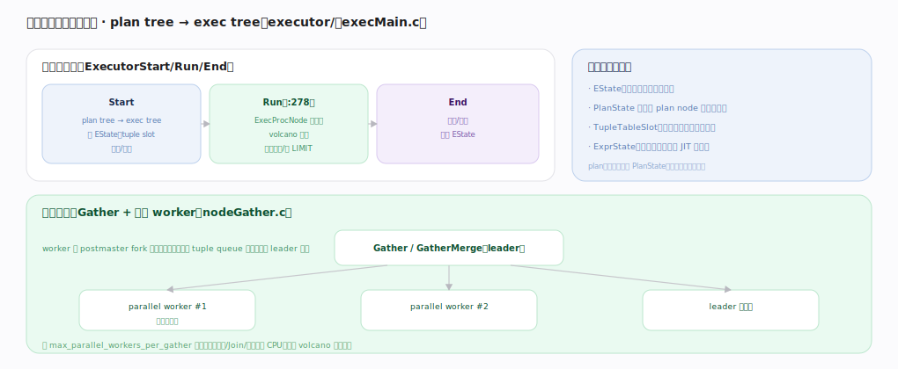

# PostgreSQL 核心原理 · 支撑能力域 · 执行引擎

> **定位**：计算能力域的执行侧。把优化器产的 plan tree 变成运行态 exec tree，用 volcano/pull 逐行拉取执行，并支持并行查询。是 **DQL/DML** 的执行底盘。与 DQL 主线分工：DQL 讲查询全链路，本篇讲执行器内部结构与并行。核实基准：官方源码 `postgres/src`。

## 一、执行器结构与并行查询

执行器三段：**Start**（plan tree→exec tree，建 EState、TupleTableSlot，开表/索引）→ **Run**（`ExecutorRun:278`，`ExecProcNode` 逐行拉取、volcano 驱动，直到取尽或够 LIMIT）→ **End**（关表/索引、释放 EState）。关键运行时结构：EState（本次执行全局状态）、PlanState 树（每 plan node 一个运行态，与不可变的 plan 分离）、TupleTableSlot（行在算子间传递的载体）、ExprState（表达式求值，可 JIT）。**并行查询**（`nodeGather.c`）：Gather/GatherMerge 是 leader，postmaster fork 若干 parallel worker 各扫一部分块、经共享内存 tuple queue 把结果传回 leader 汇聚，受 `max_parallel_workers_per_gather` 控制——并行扫描/Join/聚合分摊 CPU，缓解 volcano 逐行开销。

---

## 拓展 · 执行器组件

| 组件 | 职责 | 锚点 |
|---|---|---|
| ExecutorStart/Run/End | 执行三段 | `executor/execMain.c` |
| ExecProcNode | 逐行拉取分派 | `executor/execProcnode.c` |
| PlanState / EState | 运行态 | `executor/` |
| TupleTableSlot | 行载体 | `executor/execTuples.c` |
| nodeGather / 并行 | 并行汇聚 | `executor/nodeGather.c` |
| JIT | 表达式/元组 deform 编译 | `jit/` |

---

## 调优要点（关键开关）

- `max_parallel_workers_per_gather` / `max_parallel_workers`：开/限并行度。
- `jit`（默认按代价阈值开）：大查询表达式编译提速；OLTP 小查询可关。
- `work_mem`：影响 Sort/Hash 是否落盘（每执行节点各一份）。
- `EXPLAIN ANALYZE` 看各 node 实际行数/循环/耗时定位瓶颈。

---

## 常见误区与工程要点

- **把 volcano 当向量化**：逐行执行，纯分析大扫描不如列存；靠并行/JIT 缓解。
- **并行一定更快**：小查询并行的 worker 启动开销可能超收益；受代价阈值控。
- **plan 与 PlanState 混淆**：plan 不可变可缓存，PlanState 是每次执行的可变态。
- **JIT 到处开**：短 OLTP 查询 JIT 编译开销可能得不偿失。

---

## 一句话总纲

**执行引擎把优化器的 plan tree 经 ExecutorStart 建成 exec tree（EState + PlanState 树 + TupleTableSlot），Run 阶段用 volcano/pull 让 ExecProcNode 逐行拉取执行、End 阶段清理；并行查询用 Gather 汇聚 postmaster fork 的多个 worker（经共享内存 tuple queue 传结果），并以 JIT 编译表达式——共同缓解火山模型的逐行开销。**
