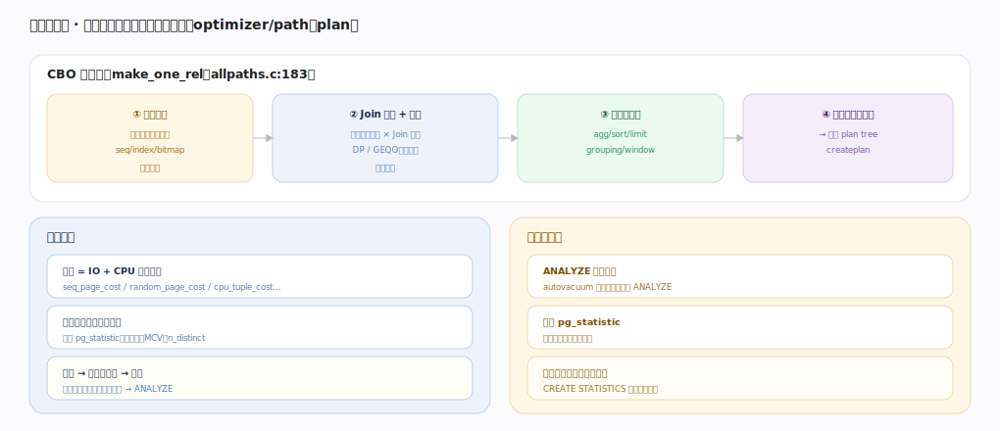
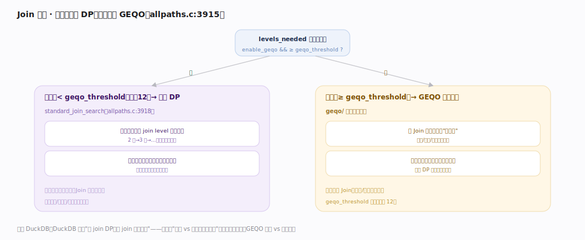

# PostgreSQL 核心原理 · 支撑能力域 · 查询优化器

> **定位**：计算能力域的规划侧。基于代价（CBO）为查询枚举候选路径、按代价选最优，再转成 plan tree 交执行器。为 **DQL** 定"怎么算最省"，依赖**索引方法**（候选扫描）、**存储引擎/统计**（基数）。核实基准：官方源码 `postgres/src`（commit 572c3b2）。

## 一、代价与路径生成

规划总入口 `planner`（`optimizer/plan/planner.c:328`）→ `standard_planner:346` → 递归的 `subquery_planner:770`，其核心 `make_one_rel`（`optimizer/path/allpaths.c:183`）四步：① **单表路径**（`set_base_rel_pathlists:384`/`set_rel_size:411` 为每表列候选 seq/index/bitmap 扫描各算代价）→ ② **Join + 算法**（`make_rel_from_joinlist:3847` 枚举连接顺序 × Join 算法）→ ③ 加顶层算子（agg/sort/limit/window）→ ④ 选最小代价路径经 `create_plan`（`optimizer/plan/createplan.c:345`）转成可执行 plan tree。

**代价模型**（`optimizer/path/costsize.c`）是 IO 与 CPU 的加权和：页读代价 `seq_page_cost`/`random_page_cost` + 每行/每算子 `cpu_tuple_cost`/`cpu_operator_cost`，如 `cost_seqscan:271`、`cost_index:546` 分别估顺序扫描与索引扫描代价。关键输入是**基数估计**——`clamp_row_est`（`costsize.c:215`）夹取行数，选择率来自 `pg_statistic`（直方图、MCV 最常见值、n_distinct）。估准选对、估错选坏，统计陈旧是坏计划头号原因；统计由 ANALYZE 采样收集（autovacuum 顺带或手动）写进 pg_statistic，多列相关性用 `CREATE STATISTICS` 扩展统计补齐。

---

## 二、Join 定序：DP vs GEQO

Join 顺序的搜索空间随表数**阶乘级**爆炸，PostgreSQL 两套策略（`make_rel_from_joinlist` 内分派）：

- **动态规划 DP**（`standard_join_search`，`allpaths.c:3952`）：自底向上按"参与表数"逐层构建——先所有单表最优路径，再所有两表 Join 最优，直到 N 表；每层用 DP 复用子结果，得**全局最优**但计算随表数增长很快。
- **遗传算法 GEQO**：当 `levels_needed >= geqo_threshold`（默认 12，判定在 `allpaths.c:3915`）时切到 GEQO——把 Join 顺序编码成"基因"，用选择/交叉/变异在解空间里启发式搜索，**牺牲最优性换可接受的规划时间**，避免超多表 Join 时优化器本身耗时爆炸。

配合 Join 算法选择（NestLoop/Merge/Hash，各算代价）与顶层算子，共同决定最终计划。规划本身是纯 CPU、无 IO，可被 prepared statement 缓存复用（复杂查询的规划开销不小）。

---

## 深化 · 失败路径与边界

- **基数估计崩塌**：多列强相关（如 city 与 zip）时优化器默认按列独立相乘估选择率、严重偏低，可能把该 Hash Join 选成 Nested Loop、慢几个数量级；用 `CREATE STATISTICS (dependencies, ndistinct)` 补多列统计，或 `pg_hint_plan` 强制。
- **统计陈旧**：大批量导入/删除后未 ANALYZE，直方图/MCV 反映旧分布 → 坏计划；autovacuum 的 ANALYZE 触发有滞后，导入后应手动 ANALYZE。
- **GEQO 非确定性**：超阈值切 GEQO 后同一查询可能得到不同计划（含随机性），对稳定性敏感的场景可调高 `geqo_threshold` 或 `geqo_seed`。
- **规划开销反噬**：表极多或 prepared statement 用 generic plan 时，规划本身可能比执行还慢；`plan_cache_mode` 可控 generic vs custom plan 选择。
- **参数不敏感（generic plan）**：预编译语句沿用泛化计划，遇到倾斜参数（某值命中极多）会选错扫描；PG 会在前几次执行后比较 custom/generic 代价再决定。
- **join_collapse_limit 截断搜索**：`FROM` 里超过 `join_collapse_limit`（默认 8）个表时优化器不再展平子查询、按书写顺序固定部分 Join，可能错过更优序；手写大 Join 或视图嵌套深时需留意。

---

## 拓展 · 优化器组件

| 组件 | 职责 | 锚点 |
|---|---|---|
| planner / standard_planner | 规划总入口 | `optimizer/plan/planner.c:328` |
| make_one_rel | 路径生成主流程 | `optimizer/path/allpaths.c:183` |
| standard_join_search | DP Join 定序 | `optimizer/path/allpaths.c:3952` |
| GEQO（阈值 geqo_threshold=12） | 超多表启发式定序 | `allpaths.c:3915` |
| costsize（cost_seqscan/cost_index） | 代价模型 | `optimizer/path/costsize.c:271/546` |
| clamp_row_est | 基数夹取 | `optimizer/path/costsize.c:215` |
| pg_statistic | 直方图/MCV/n_distinct | ANALYZE 收集 |
| create_plan | path→plan tree | `optimizer/plan/createplan.c:345` |

---

## 调优要点（关键开关）

- 保持统计新鲜（ANALYZE/autovacuum）；多列相关用 `CREATE STATISTICS`。
- `random_page_cost`：SSD 上调低使索引更受青睐；`effective_cache_size` 告知总缓存。
- `EXPLAIN (ANALYZE)` 看估计 vs 实际行数误差，定位坏计划根因。
- 表极多时用 `geqo_threshold`/`geqo` 控 GEQO 行为；`plan_cache_mode` 控泛化计划。
- `default_statistics_target` 调采样精度（倾斜列可对列单独调高）。

---

## 常见误区与工程要点

- **优化器总选最优**：它按估计代价选，估计错就选错；统计是命脉。
- **加 hint 就能治本**：PG 无原生 hint（需扩展），先修统计与 SQL 更根本。
- **忽视多列相关**：默认按列独立估选择率，相关列需扩展统计。
- **规划零成本**：复杂多表查询规划开销可观，可缓存 prepared statement。
- **GEQO 计划稳定**：超阈值 GEQO 有随机性，同查询可能得不同计划。

---

## 一句话总纲

**查询优化器是基于代价的规划器：`planner`→`make_one_rel` 四步（单表路径→Join 枚举→顶层算子→选最小代价 `create_plan` 转 plan tree），代价用 `cost_seqscan`/`cost_index` 等按 IO+CPU 加权、核心输入是来自 pg_statistic（直方图/MCV/n_distinct）的基数估计（`clamp_row_est`）；Join 定序用 DP（`standard_join_search` 求全局最优）、表数超 geqo_threshold=12 切 GEQO 启发式换规划时间——统计陈旧与多列相关导致的估计失真是坏计划头号原因，用 ANALYZE + CREATE STATISTICS 修正、EXPLAIN ANALYZE 定位。**
