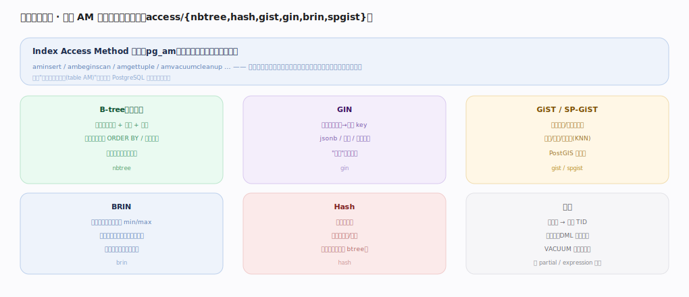

# PostgreSQL 核心原理 · 支撑能力域 · 索引方法

> **定位**：底座能力域。统一的 index access method（AM）抽象下提供六种索引，服务不同查询形态。被**查询优化器**（选扫描）、**DQL**（索引扫描）、**DML**（维护）依赖。核实基准：官方源码 `postgres/src`。

## 一、访问方法抽象与六种索引

所有索引实现同一组 **Index Access Method** 回调（`pg_am`：aminsert/ambeginscan/amgettuple/amvacuumcleanup…），执行器与优化器只对接口编程，索引类型可插拔（含扩展索引）——这与"表访问方法(table AM)"对称，是可扩展性的体现。六种：**B-tree**（默认，有序键支撑等值+范围+排序+唯一约束，`access/nbtree`）、**GIN**（倒排，一值→多 key，jsonb/数组/全文，"包含"查询利器）、**GiST/SP-GiST**（通用平衡/空间划分树，几何/范围/KNN，PostGIS 靠它）、**BRIN**（块范围索引，每段存 min/max，超大且物理有序的时序表，极小体积粗裁剪）、**Hash**（仅等值，场景窄多数用 btree）。共性：索引项→堆表 TID、需随 DML 维护（写放大）、VACUUM 清死索引项。

---

## 二、索引选型决策

按查询形态与数据特征选：**等值+范围+排序→B-tree**（默认首选，覆盖 90% 场景）；**包含/成员/全文→GIN**（jsonb `@>`、数组、tsvector）；**几何/范围/KNN→GiST/SP-GiST**；**超大+物理有序→BRIN**（时序/日志，索引极小）；**纯等值→Hash**（少用）。正交能力可叠加在任一类型上：partial（带 WHERE 只索引部分行）、expression（索引函数结果）、多列复合、唯一约束、covering（INCLUDE）。代价：每个索引随 DML 维护（写放大）+ 占空间 + VACUUM 清理——按真实查询建，勿滥建。

---

## 拓展 · 索引能力速览

| 索引 | 强项 | 目录/源码 |
|---|---|---|
| B-tree | 等值/范围/排序/唯一 | `access/nbtree` |
| GIN | 倒排：jsonb/数组/全文 | `access/gin` |
| GiST | 几何/范围/KNN 通用 | `access/gist` |
| SP-GiST | 空间划分（非平衡） | `access/spgist` |
| BRIN | 超大有序表粗裁剪 | `access/brin` |
| Hash | 纯等值 | `access/hash` |

---

## 调优要点（关键开关）

- 默认用 B-tree；仅在有明确查询形态时才用特种索引。
- jsonb/全文/数组的"包含"查询用 GIN；时序大表用 BRIN 省空间。
- partial/expression 索引把索引缩到"真正被查的子集/表达式"。
- 定期检查未使用索引（pg_stat_user_indexes）删掉，减写放大。

---

## 常见误区与工程要点

- **给所有列加 btree**：写放大 + 空间浪费；按查询建。
- **jsonb 用 btree**：应用 GIN 才支持包含查询。
- **BRIN 用在无序表**：BRIN 只对物理有序（如时间递增）有效，否则裁剪失效。
- **Hash 索引万能**：只等值、不支持范围/排序，通常 btree 更合适。

---

## 一句话总纲

**索引方法在统一 AM 抽象（pg_am 回调）下提供六种可插拔索引：B-tree（默认，等值/范围/排序/唯一）、GIN（倒排，jsonb/数组/全文包含）、GiST/SP-GiST（几何/范围/KNN）、BRIN（超大有序表粗裁剪）、Hash（纯等值）——按查询形态选型、可叠加 partial/expression/covering，索引项指向堆表 TID 且随 DML 维护、由 VACUUM 清理。**
