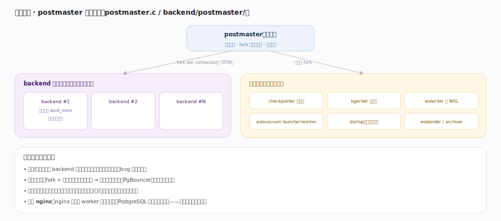

# PostgreSQL 核心原理 · 支撑能力域 · 进程与内存架构

> **定位**：底座、灵魂能力域之一。postmaster 每连接 fork 一个 backend + 一批辅助进程，进程间经共享内存协作——这是 PostgreSQL 并发的根基。被所有能力域依赖。核实基准：官方源码 `postgres/src`。

## 一、进程模型：postmaster 派生一切

`postmaster` 监听端口、fork 所有子进程、监控重启。两类子进程：**backend**（每客户端连接一个，`BackendStartup:3576`，私有内存 work_mem，跑查询流水线）与**辅助进程**（后台常驻：checkpointer、bgwriter、walwriter、autovacuum launcher/worker、startup、walsender、archiver）。进程级模型取舍：稳定/隔离（一个 backend 崩溃不污染其他连接）、连接开销大（fork + 私有内存初始化不便宜 → 高并发用连接池 PgBouncer）、协作靠共享内存（进程间不共享私有内存）。对照 nginx：nginx 是固定 worker 数事件循环，PostgreSQL 是每连接一进程——连接模型截然不同。

---

## 二、共享内存 vs 私有内存

**共享内存**（所有进程 attach，启动时分配）：`shared_buffers`（缓冲池，缓存 8KB 数据页、所有 backend 共享）、WAL buffers、锁表、ProcArray（活跃事务→算快照）、CLOG/缓存失效队列；访问用 LWLock 保护（轻量读写锁、短临界区），大小由参数在启动时定、改需重启。**每 backend 私有内存**：`work_mem`（排序/Hash 每节点各一份）、`maintenance_work_mem`（VACUUM/建索引）、relcache/syscache（该连接的目录缓存）。危险：`work_mem × 并发 × 节点数`可能远超物理内存导致 OOM——这是最常见的内存配置陷阱。

---

## 拓展 · 进程与内存组件

| 组件 | 职责 | 锚点 |
|---|---|---|
| postmaster | 监听、fork、监控 | `postmaster/postmaster.c` |
| backend | 每连接处理 SQL | `tcop/postgres.c` |
| checkpointer / bgwriter / walwriter | 刷盘辅助 | `postmaster/*.c` |
| autovacuum launcher/worker | 回收死元组 | `postmaster/autovacuum.c` |
| shared_buffers | 共享缓冲池 | `storage/buffer/bufmgr.c` |
| ProcArray | 活跃事务与快照 | `storage/ipc/procarray.c` |

---

## 调优要点（关键开关）

- `shared_buffers`：通常设物理内存的 25% 左右（其余留给 OS page cache）。
- `work_mem`：按并发与查询复杂度谨慎设；宁小勿爆（并发 × 节点数放大）。
- 高并发（数千连接）用连接池，别让 backend 数量失控。
- `max_connections` 与内存联动评估，别只调大连接数。

---

## 常见误区与工程要点

- **以为多线程**：多进程（每连接一 backend），高并发靠连接池。
- **work_mem 设太大**：并发下每个 Sort/Hash 节点各占一份，容易 OOM。
- **shared_buffers 设成全部内存**：留不下 OS cache 反而更慢；约 25% 起调。
- **连接不池化**：几千直连 = 几千进程，上下文切换与内存压垮机器。

---

## 一句话总纲

**进程与内存架构是 PostgreSQL 并发的根基：postmaster 监听并为每连接 fork 一个 backend（私有 work_mem 跑查询）+ 一批辅助进程（checkpointer/bgwriter/walwriter/autovacuum/startup/walsender），进程间经共享内存（shared_buffers 缓冲池 + 锁表 + ProcArray + CLOG）用 LWLock 协作；进程级模型稳定隔离但连接开销大，高并发靠连接池，work_mem×并发是头号内存陷阱。**
