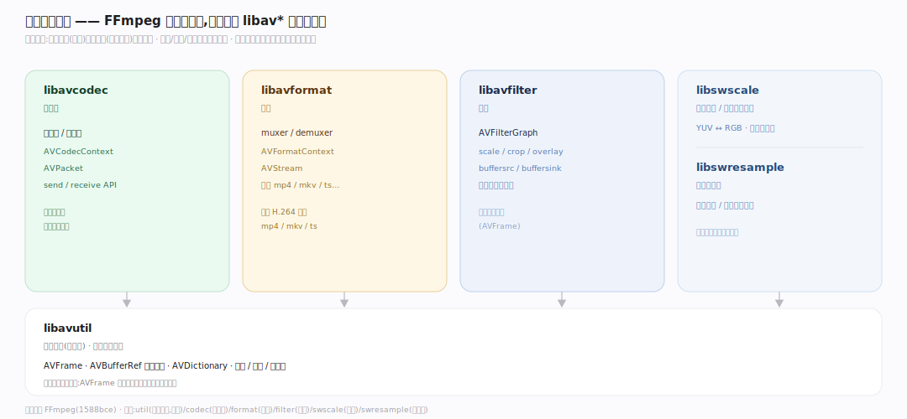
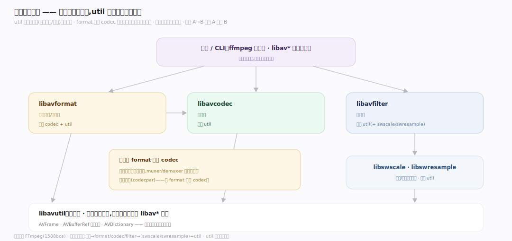
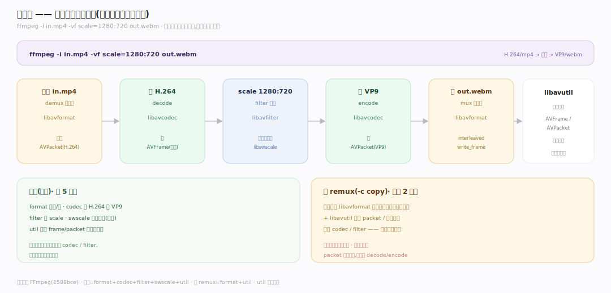

# FFmpeg 原理 · 支撑主线 · 库分层

> **定位**：属"架构能力域"——FFmpeg 的骨架分层。六个 libav* 库各司其职:libavformat(容器)、libavcodec(编解码)、libavfilter(滤镜)、libavutil(公共)、libswscale(缩放)、libswresample(重采样)。是所有主线依赖的分层地基。被【接触面】按需引入、【编解码管线】协作调用。源码基准 **FFmpeg(1588bce)**(`libav*/` 各目录)。

FFmpeg 不是一个大块,而是**六个分层库**协作。转码时:libavformat 拆/封容器、libavcodec 编解码、libavfilter 滤镜处理、libavutil 提供公共数据结构、libswscale 转像素格式/缩放、libswresample 转音频采样。理解每库的职责边界,就懂了 FFmpeg 怎么分工。

---

## 一、六库职责边界

- **libavutil**:公共基础——AVFrame(`libavutil/frame.h:472`)、AVBufferRef 引用计数(`libavutil/buffer.c:103` `av_buffer_ref`)、AVDictionary、数学/日志/错误码。所有库依赖它(最底层)。
- **libavcodec**:编解码——编码器/解码器,AVCodecContext(`libavcodec/avcodec.h:443`)、AVPacket(`libavcodec/packet.h:580`)、send/receive API(`libavcodec/decode.c:730` `avcodec_send_packet`)。
- **libavformat**:容器——muxer/demuxer,AVFormatContext、AVStream,读写各种容器(mp4/mkv/ts…)——读 `av_read_frame`(`libavformat/demux.c:1588`)、写 `av_interleaved_write_frame`(`libavformat/mux.c:1223`)。
- **libavfilter**:滤镜——AVFilterGraph(`libavfilter/avfiltergraph.c:85` `avfilter_graph_alloc`),scale/crop/overlay 等滤镜链接成图处理帧(`libavfilter/avfilter.c:1068` `ff_filter_frame`)。
- **libswscale**:图像缩放/像素格式转换(如 YUV↔RGB、分辨率缩放)——`sws_scale`(`libswscale/swscale.h`)。
- **libswresample**:音频重采样/采样格式/声道布局转换——`swr_convert`(`libswresample/swresample.c:725`)。

**为什么分这几层**:职责正交——容器格式(封装)与编解码(压缩算法)独立演进(同一 H.264 可封 mp4/mkv/ts);滤镜、缩放、重采样是可选处理。分库让用户按需链接、各库独立维护。

---

## 二、依赖方向:util 在底

依赖是**单向分层**(下层不依赖上层):

- **libavutil**(底):被所有库依赖,自己不依赖别的 libav* 库。
- **libavcodec** 依赖 avutil(用 AVFrame/AVPacket/AVBufferRef)。
- **libavformat** 依赖 avcodec + avutil(容器里存编码流,需 codec 参数)。
- **libavfilter** 依赖 avutil(+ swscale/swresample 做格式转换)。
- **应用/CLI** 顶层组合各库。

**为什么这依赖序**:util 是公共地基(数据结构/内存)必须最底;format 依赖 codec 因为容器要知道流的编码参数;单向依赖避免循环、可分层编译。

---

## 三、协作:一次转码用几个库

一次 `ffmpeg -i in.mp4 -vf scale=1280:720 out.webm` 转码,各库协作:

- **libavformat**:打开 in.mp4(demux)、写 out.webm(mux)。
- **libavcodec**:解 H.264、编 VP9。
- **libavfilter**:scale 滤镜(1280:720)。
- **libswscale**:滤镜内部/像素格式转换(若需)。
- **libavutil**:全程的 AVFrame/AVPacket/引用计数。

纯 remux(`-c copy`)只用 format(+util),不碰 codec/filter。

**为什么按需组合**:不是每次转码都用全部库——remux 只需 format;转码需 codec;加滤镜需 filter;格式转换需 swscale/swresample。按任务组合最小库集。

---

## 拓展 · 六库一览

| 库 | 职责 | 关键结构/API(file:line) |
|---|---|---|
| libavutil | 公共基础(最底层) | AVFrame(`frame.h:472`)、`av_buffer_ref`(`buffer.c:103`)、`av_frame_ref`(`frame.c:278`) |
| libavcodec | 编解码 | AVCodecContext(`avcodec.h:443`)、`avcodec_send_packet`(`decode.c:730`)、`avcodec_send_frame`(`encode.c:544`) |
| libavformat | 容器封装/解封装 | `av_read_frame`(`demux.c:1588`)、`av_interleaved_write_frame`(`mux.c:1223`) |
| libavfilter | 滤镜图 | `avfilter_graph_alloc`(`avfiltergraph.c:85`)、`ff_filter_frame`(`avfilter.c:1068`) |
| libswscale | 图像缩放/像素转换 | `sws_scale`(`swscale.h`)、SwsContext |
| libswresample | 音频重采样 | `swr_convert`(`swresample.c:725`)、SwrContext |

## 调优要点（理解要点）

- **按需链接**:只 remux 链 avformat+avutil;转码加 avcodec;滤镜加 avfilter——减小依赖体积。
- **format 与 codec 解耦**:容器与编码独立——同一编码流可封不同容器(remux),换容器不换编码。
- **swscale 开销**:像素格式转换/缩放有成本;能避免转换(源目标同格式)就避免。
- **util 是地基**:AVFrame/引用计数在 util——理解 util 的数据模型是理解全部的前提。

## 常见误区与工程要点

- **误区:FFmpeg 是单个库。** 是六个分层库(format/codec/filter/util/swscale/swresample);按需组合。
- **误区:容器=编码。** 容器(mp4)是封装、编码(H.264)是压缩算法;libavformat 管容器、libavcodec 管编码,正交。
- **误区:依赖随意。** 单向分层——util 最底、format 依赖 codec;无循环依赖。
- **误区:转码总用全部库。** remux 只用 format;按任务组合最小库集。
- **归属提醒**:各库承载的主线——format 在【容器格式】、codec 在【编解码管线】、filter 在【滤镜图】、util 的数据在【核心数据结构】/【引用计数内存】、swscale/swresample 在【像素采样格式】。

## 一句话总纲

**FFmpeg 是六个分层库:libavutil(公共基础/AVFrame/引用计数,最底层被所有库依赖)、libavcodec(编解码/AVCodecContext/send-receive)、libavformat(容器封装解封装/AVFormatContext/依赖 codec)、libavfilter(滤镜图)、libswscale(图像缩放像素转换)、libswresample(音频重采样);单向分层依赖(util 在底、format 依赖 codec)避免循环;职责正交(容器 vs 编码独立,同编码可封不同容器);按任务组合最小库集(remux 只用 format、转码加 codec、滤镜加 filter)。**
