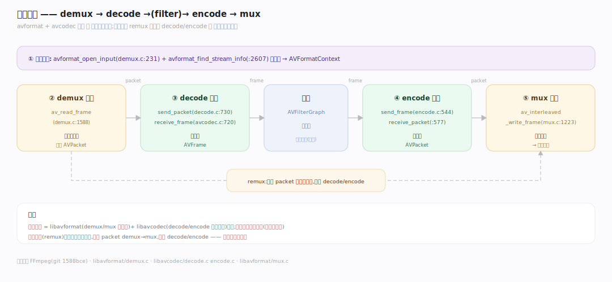
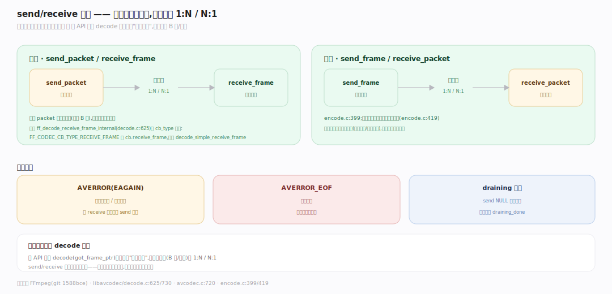
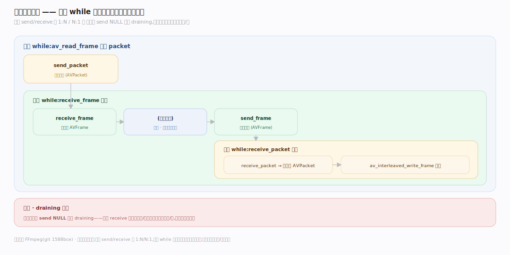
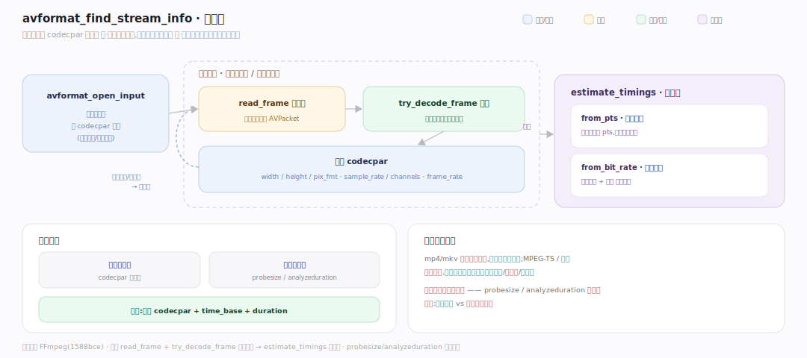

# FFmpeg 原理 · 支撑主线 · 编解码管线

> **定位**：属"处理能力域"——FFmpeg 的核心。管转码主流程:demux→decode→(filter)→encode→mux,send/receive API。是 packet/frame 流动的主干。用【核心数据结构】的 packet/frame、【库分层】各库协作。源码基准 **FFmpeg(1588bce)**(`libavformat/`、`libavcodec/`)。

FFmpeg 转码的核心是一条**管线**:从容器拆出压缩包(demux)→ 解码成原始帧(decode)→ 可选滤镜处理 → 编码成压缩包(encode)→ 封进容器(mux)。现代用 **send/receive API**(送 packet 收 frame、送 frame 收 packet)解耦——不是一次性回调。理解这条 5 段管线 + send/receive,就懂了 FFmpeg 怎么转码。

---

## 一、五段管线:demux→decode→encode→mux

一次转码(`libavformat`+`libavcodec` 协作):

1. **打开输入**:`avformat_open_input`(`libavformat/demux.c:231`)+ `avformat_find_stream_info`(`:2607`)探测流。
2. **demux 读包**:`av_read_frame`(`demux.c:1588`)从容器读出压缩 **AVPacket**。
3. **decode 解码**:`avcodec_send_packet`(`libavcodec/decode.c:730`)→ `avcodec_receive_frame`(`avcodec.c:720`)得原始 **AVFrame**。
4. **encode 编码**:`avcodec_send_frame`(`encode.c:544`)→ `avcodec_receive_packet`(`:577`)得压缩 AVPacket。
5. **mux 写包**:`av_interleaved_write_frame`(`mux.c:1223`)封进容器。

中间可插滤镜(见滤镜图篇);纯转封装(remux)可跳过 decode/encode(直接 packet 转封装)。

---

## 二、send/receive API:解耦数据流

现代编解码用 **send/receive**(替代旧一次性 decode/encode 回调):

- **解码**:`send_packet`(送压缩包)/ `receive_frame`(收原始帧)——一个 packet 可能产多帧(如含 B 帧)或需多包才出一帧;**1:N/N:1** 解耦。内部 `ff_decode_receive_frame_internal`(`decode.c:625`)按 `cb_type` 分派:`FF_CODEC_CB_TYPE_RECEIVE_FRAME` 调 `cb.receive_frame`,否则 `decode_simple_receive_frame`。
- **编码**:`send_frame`/`receive_packet`(`encode.c:399`);编码器必须返回引用计数缓冲(`:419`)。
- **流控**:返 `AVERROR(EAGAIN)`(需更多输入/输出满)/ `AVERROR_EOF`(结束);draining(冲刷)完置 `draining_done`。

**为什么 send/receive**:老 API 一次 decode 回调假设"一包一帧",但现代编码(B 帧/延迟)是 1:N/N:1;send/receive 把送入和取出分开——送满就取、取空就送,自然处理任意包帧比例。

---

## 三、转码循环

实际转码是个**循环**:

`while av_read_frame 读到 packet`:→ `send_packet` 送解码器 → `while receive_frame 收帧`:→ (滤镜处理)→ `send_frame` 送编码器 → `while receive_packet 收包`:→ `av_interleaved_write_frame` 写出。结束时冲刷(send NULL 触发 draining)取尽残留帧/包。

**为什么嵌套循环**:每层 send/receive 是 1:N/N:1——读一个 packet 可能解出多帧、一帧滤镜可能产多帧、编码可能攒多帧才出包;内层 while 取尽当前层输出再进下一层。冲刷保证延迟的帧/包(编码器缓冲的)也输出。

---

## 四、avformat_find_stream_info 流探测

`avformat_open_input` 后流列表已知,但 codecpar 常不全(裸流无全局头)。`avformat_find_stream_info`(`libavformat/demux.c:2607`)**循环读包试解**:read_frame 取包 → try_decode_frame 解出帧读真实参数 → 累积 width/height/pix_fmt/sample_rate,再 `estimate_timings`(`libavformat/demux.c:2027`)估时长(有 pts 用首尾差、无则文件大小÷码率)。每流参数齐或读满探测量(probesize/analyzeduration)即停——探测越久越准但开播延迟越大。

---

## 拓展 · 编解码管线关键结构一览

| 结构 | 定义 | 职责 |
|---|---|---|
| avformat_open_input | `libavformat/demux.c:231` | 打开容器探测流 |
| av_read_frame | `libavformat/demux.c:1588` | demux 读压缩 AVPacket |
| avcodec_send_packet/receive_frame | `libavcodec/decode.c:730` | 解码(1:N/N:1) |
| avcodec_send_frame/receive_packet | `libavcodec/encode.c:544/577` | 编码 |
| av_interleaved_write_frame | `libavformat/mux.c:1223` | mux 写包 |

## 调优要点（理解要点）

- **remux 免解码**:纯转封装(改容器不改编码)直接 packet demux→mux,跳过 decode/encode——快且无质量损失。
- **冲刷**:结束时 send NULL 触发 draining,取尽编码器缓冲的延迟帧/包——否则丢尾部。
- **流控 EAGAIN**:收到 EAGAIN 说明需先取输出(receive)再送(send);正确处理避免死锁。
- **零拷贝**:packet/frame 引用计数(见内存篇),管线各段传引用不复制。

## 常见误区与工程要点

- **误区:一个 packet 解一帧。** 现代编码 1:N/N:1(B 帧/延迟);send/receive 内层 while 取尽——别假设一对一。
- **误区:转码必须解码再编码。** 纯转封装(remux)直接 packet 转容器,跳过 decode/encode,无损且快。
- **误区:结束直接停。** 要冲刷(send NULL/draining)取尽编码器缓冲的延迟帧/包,否则丢尾部数据。
- **误区:send/receive 是旧 API。** send/receive 是现代解耦 API;旧的是一次性 decode/encode 回调(got_frame_ptr)。
- **归属提醒**:流经的 packet/frame 结构在【核心数据结构】;demux/mux 的容器在【容器格式】;滤镜处理在【滤镜图】;引用计数在【引用计数内存】;GPU 解码在【硬件加速】。

## 一句话总纲

**FFmpeg 转码是五段管线:avformat_open_input 打开容器→av_read_frame demux 出压缩 AVPacket→avcodec_send_packet/receive_frame 解码成原始 AVFrame→(滤镜)→avcodec_send_frame/receive_packet 编码成 AVPacket→av_interleaved_write_frame mux 封容器;现代 send/receive API 解耦数据流(1:N/N:1 处理 B 帧/延迟,内层 while 取尽,EAGAIN/EOF 流控,结束冲刷 draining 取尽延迟帧);纯转封装 remux 可跳过 decode/encode 无损快转。**
