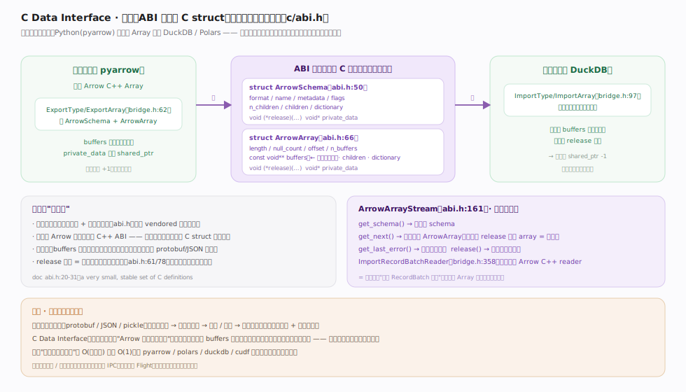
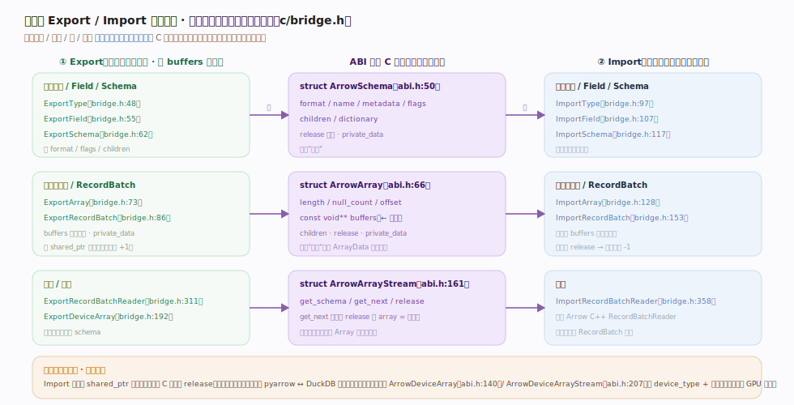

# Apache Arrow 核心原理 · 零拷贝交换 · C Data Interface（超能力）

> **定位**：Arrow 的**超能力**——一套极小、ABI 稳定的 C 结构体定义（`cpp/src/arrow/c/abi.h`），让不同语言 / 不同库在**同一进程内零拷贝、免序列化**地交换列式数据。两个核心结构体 `ArrowSchema`（abi.h:50，类型）+ `ArrowArray`（abi.h:66，数据）与 `ArrayData` 一一对应；`ArrowArrayStream`（abi.h:161）是批次流版本。核实基准：`c/abi.h`、`c/bridge.h`。

## 一、两个结构体的零拷贝交换

图示同进程内 pyarrow → DuckDB 递一列数据：`ArrowSchema`（abi.h:50）述类型（format/flags/children），`ArrowArray`（abi.h:66）述数据（`const void** buffers` 是**指针**、字段与 `ArrayData` 一一对应）。生产者 Export 填结构体、把 `shared_ptr` 藏进 `private_data` 保活；消费者 Import 按结构体建视图、直读指针字节，用完调 `release` 回调减引用计数。**不变量**：结构体可 vendored、不依赖 Arrow 运行库，数据本体一字节不动、不经任何序列化编解码。

## 二、对称的 Export / Import 四层次面

图示 `c/bridge.h` 为逻辑类型 / 数据 / 批 / 批流四层次提供的成对函数：一端 Export 填结构体、另一端 Import 建视图，语义完全对称。**不变量**：Import 返回的 `shared_ptr` 析构时自动回调 C 结构体 `release`，所有权在 C++ 侧被接管、无需手动 release；方向对调即"pyarrow 递给 DuckDB"与"DuckDB 递回 pyarrow"走同一套无拷贝路径。`ArrowArrayStream`（abi.h:161）是批流版本、`ArrowDeviceArray`（abi.h:140）把零拷贝延伸到 GPU 显存。

## 深化 · Export / Import 四层次对称面

| 层次 | Export（生产者填） | Import（消费者读） |
|---|---|---|
| 逻辑类型 | `ExportType` bridge.h:48 | `ImportType` bridge.h:97 |
| Field | `ExportField` bridge.h:55 | `ImportField` bridge.h:107 |
| Schema | `ExportSchema` bridge.h:62 | `ImportSchema` bridge.h:117 |
| Array（一批列数据） | `ExportArray` bridge.h:73 | `ImportArray` bridge.h:128 |
| RecordBatch | `ExportRecordBatch` bridge.h:86 | `ImportRecordBatch` bridge.h:153 |
| 批流 | `ExportRecordBatchReader` bridge.h:311 | `ImportRecordBatchReader` bridge.h:358 |
| 批流结构 | `ArrowArrayStream`（abi.h:161） | get_schema/get_next/release |
| 设备（GPU 等） | `ExportDeviceArray` bridge.h:192 | `ArrowDeviceArray` abi.h:140 |

## 深化 · 为什么免序列化能成立

| 环节 | 传统（protobuf/JSON/pickle） | C Data Interface |
|---|---|---|
| 生产端 | 遍历对象 → 编码成字节流 | 只填结构体、递 buffers 指针 |
| 传输 | 拷贝 / 写入通道 | 同地址空间，无拷贝 |
| 消费端 | 解码字节 → 重建对象 | 按同一布局直接解读指针 |
| 复杂度 | O(数据量)，两份内存 | O(1)，共享一份内存 |
| 前提 | 双方约定 schema/proto | 双方都认 Arrow 列式内存布局 |

正因两端**都认同 Arrow 的列式内存布局**，才无需"编码—解码"这层翻译。这是 pyarrow / Polars / DuckDB / cuDF 等能互相直接交换列的根基。

## 常见误区

- **"跨语言必然要序列化"**：同机同地址空间下，C Data Interface 只递指针；序列化只在跨进程（IPC）/ 跨网络（Flight）才需要，且那时也仍是同一列式布局。
- **"release 可以不调"**：`release` 回调是所有权移交协议（abi.h:61/78），消费者用完必须调，否则生产者的引用计数不减、内存泄漏。
- **"C Data Interface 能跨进程共享"**：它传的是本进程指针，仅同地址空间有效；跨进程要用 IPC，跨机要用 Flight。
- **"要链接 Arrow 才能用"**：结构体可 vendored，最小集成完全不依赖 Arrow 运行库。

## 一句话总纲

**C Data Interface 是 Arrow 的超能力：用两个 ABI 稳定的 C 结构体（ArrowSchema 述类型、ArrowArray 述数据，buffers 是指针、release 回调管所有权）表达"一份列式内存"，因交换双方都认同 Arrow 布局，跨语言 / 跨库传数据只需填结构体、递指针，数据本体一字节不动——把跨语言数据交换从 O(数据量) 的序列化拷贝降到 O(1) 的指针传递，这正是 Arrow 生态互通的立身之本。**
</content>
