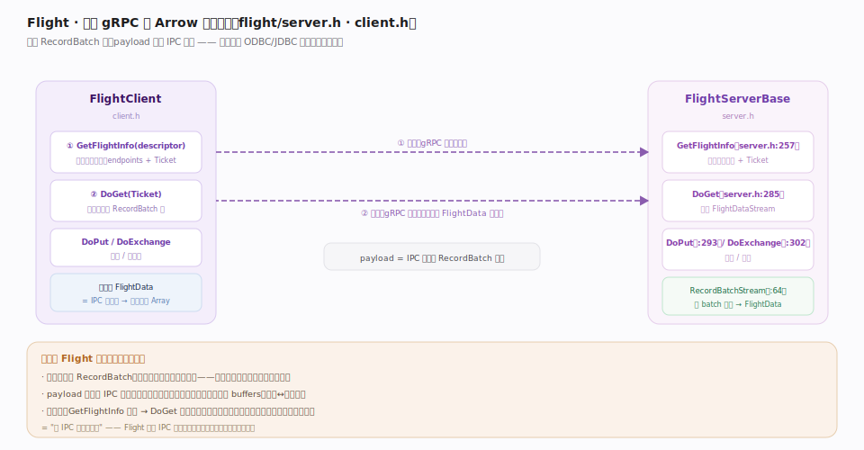
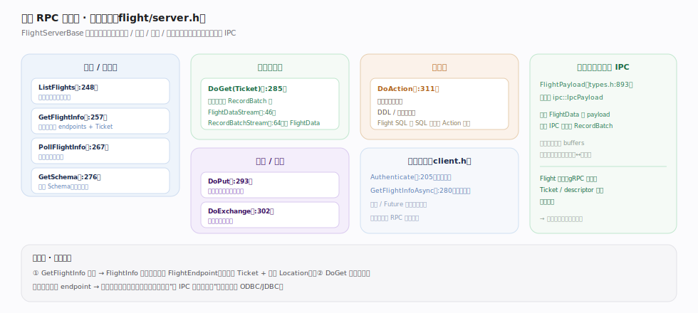

# Apache Arrow 核心原理 · 零拷贝交换 · Flight RPC

> **定位**：Arrow 的**跨网络数据服务**——基于 gRPC 直传 RecordBatch 流，payload 复用 IPC 编码。`FlightServerBase`（`cpp/src/arrow/flight/server.h`）暴露 `GetFlightInfo`/`DoGet`/`DoPut`/`DoExchange`；`FlightClient`（`cpp/src/arrow/flight/client.h`）对应调用。定位是取代"逐行 ODBC/JDBC"的高吞吐数据端点。核实基准：`flight/server.h`、`flight/client.h`。

## 一、两段式数据服务：问路 + 取数

图示 Flight 用 gRPC 承载的典型两段：**① GetFlightInfo(descriptor)**（server.h:257）——客户端凭 `FlightDescriptor`（路径/命令）问路，服务端返回 `FlightInfo`（types.h:619），内含若干 `FlightEndpoint`（每个带一张 `Ticket` 与可选 `Location`）；**② DoGet(Ticket)**（server.h:285）——凭票拉一条 RecordBatch 流。**不变量**：每个 `FlightData` 的 payload 就是 IPC 封装的 RecordBatch 字节，收端还原即得 buffers、无行↔列转换；两段式让数据可分布多 endpoint、客户端并行拉取、水平扩展。

## 二、完整 RPC 方法面：不止取数

图示 `FlightServerBase`（server.h:185）上一整套动作，按发现/取数/写入/扩展分组：`ListFlights`/`GetFlightInfo`/`PollFlightInfo`/`GetSchema`（发现与元信息）、`DoGet`（取数）、`DoPut`/`DoExchange`（写入与双向流）、`DoAction`（扩展点，Flight SQL 把 SQL 编码成 Action 走这）。**不变量**：`FlightPayload`（types.h:893）字段里直接嵌 `ipc::IpcPayload`——数据编码这层完全托管给 IPC，Flight 只管 gRPC 流式帧、Ticket/descriptor 路由与认证，零拷贝底色被完整继承。客户端侧另有 `Authenticate`（client.h:205）与异步变体 `GetFlightInfoAsync`（client.h:280）。

## 深化 · Flight RPC 方法全表

| RPC | 源码锚点 | 作用 |
|---|---|---|
| `ListFlights` | server.h:248 | 列出服务端可提供的数据集（发现） |
| `GetFlightInfo` | server.h:257 | 按 descriptor 问路，返回 endpoints + Ticket |
| `PollFlightInfo` | server.h:267 | 轮询长任务的执行进度（结果逐步 ready） |
| `GetSchema` | server.h:276 | 只取某数据集的 Schema，不拉数据 |
| `DoGet` | server.h:285 | 凭 Ticket 拉一条 RecordBatch 流 |
| `DoPut` | server.h:293 | 客户端向服务端推一条批流 |
| `DoExchange` | server.h:302 | 全双工双向批流（可边推边收） |
| `DoAction` | server.h:311 | 执行自定义动作（DDL / 控制命令等扩展点） |

`PollFlightInfo`（server.h:267）给"结果逐步就绪"的长查询用；`DoAction`（server.h:311）是通用扩展口，Flight SQL 等上层协议把"执行 SQL / 预处理语句"编码成 Action 走这里。

## 深化 · payload 即 IPC 载荷：源码为证

"Flight 复用 IPC"不是口号，而是**结构体层面的直接嵌入**。`FlightPayload`（types.h:893）——即将写上线缆的暂存结构——其字段里赫然是一个 `ipc::IpcPayload ipc_message`（同结构体内），头文件注释也写明"FlightData in Flight.proto maps to FlightPayload here"。也就是说，服务端把一个 RecordBatch 编码成 IPC payload 后，直接塞进 `FlightPayload` 送出；收端反过来把 `FlightData` 的 body 当作 IPC 消息解码即还原出 buffers。Flight 本身只负责 gRPC 的流式帧管理、Ticket / descriptor 路由与认证，**数据编码这一层完全托管给 IPC**，因而零拷贝 / 免转换的底色被完整继承。

## 深化 · 为什么 Flight 比逐行协议快

| 对比项 | ODBC/JDBC 逐行 | Arrow Flight |
|---|---|---|
| 传输单元 | 一行（甚至一字段） | RecordBatch（一批多行多列） |
| 编解码 | 逐字段序列化 / 反序列化 | payload 是 IPC 字节，收端直接还原 buffers |
| 往返 | 行级往返多 | 批级流，一次拉多批 |
| 布局 | 行式，客户端常要转列 | 全程列式，收到即可向量化计算 |
| 扩展 | 单连接单流 | 多 endpoint 可并行拉取 |

Flight 本质是**"把 IPC 批送上网络"**——它不重新定义数据编码，而是复用 IPC，是零拷贝交换哲学在跨网络维度的延伸。

## 深化 · 交换三件套的分工

| 维度 | 机制 | 复用关系 |
|---|---|---|
| 同进程跨语言 | C Data Interface（递指针） | 定义内存 ABI |
| 跨进程 / 文件 | IPC（同构字节） | 定义落字节格式 |
| 跨网络 | Flight（gRPC 传批） | payload = IPC 编码 |

三者不各造轮子：**C-Data 管内存布局、IPC 管字节序列化、Flight 管网络传输**，全都立在同一份列式 buffer 布局之上。这就是为什么 Arrow 的"交换"能在任意边界都保持零拷贝 / 免转换的底色。

## 常见误区

- **"Flight 自定义了一套数据编码"**：Flight 的 payload 直接是 IPC 编码的 RecordBatch，不另造格式。
- **"一次 DoGet 就够，不用 GetFlightInfo"**：两段式让数据可分布多端点、支持并行；GetFlightInfo 负责定位与鉴权入口。
- **"Flight 只能拉数据"**：DoPut 推流、DoExchange 双向流同样支持。
- **"Flight = REST/JSON API"**：Flight 基于 gRPC 流式传列式批，面向高吞吐分析数据搬运，非逐条 JSON。

## 一句话总纲

**Flight 是 Arrow 的跨网络数据服务：基于 gRPC 两段式（GetFlightInfo 问路拿 Ticket → DoGet 凭票拉 RecordBatch 流，另有 DoPut/DoExchange），每个 FlightData 的 payload 直接是 IPC 编码的批，收端还原即得列式 buffers——传输单元是批而非行、全程列式免转换、多端点可并行，本质是"把 IPC 批送上网络"，让零拷贝交换延伸到跨机维度，取代逐行 ODBC/JDBC。**
</content>
