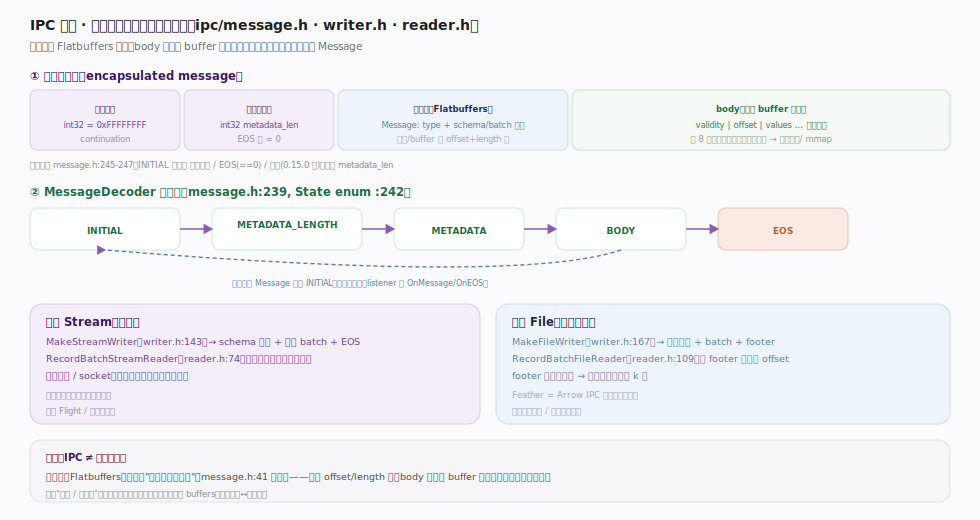
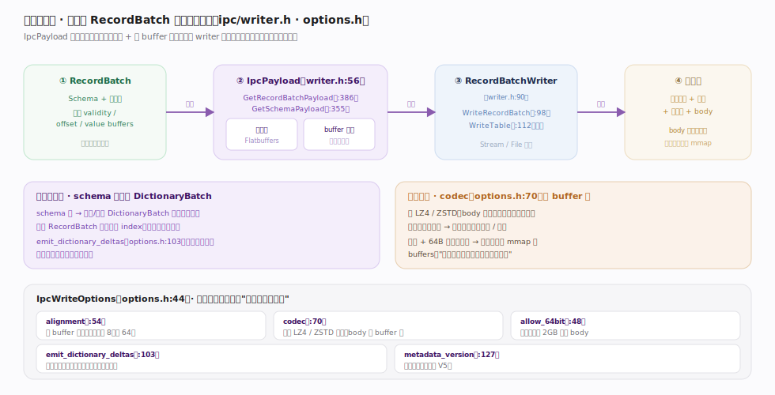

# Apache Arrow 核心原理 · 零拷贝交换 · IPC 格式

> **定位**：把列式内存**原样落成字节流**的进程间 / 文件格式——元数据用 Flatbuffers 描述、body 是原始 buffer 字节。`Message`（`cpp/src/arrow/ipc/message.h:47`）封装一帧；`MessageDecoder`（message.h:239）是逐帧解码状态机。两种形态：流式（顺序）与文件（带 footer、可随机读）。核实基准：`ipc/message.h`、`ipc/writer.h`、`ipc/reader.h`。

## 一、封装帧结构 + 解码状态机

图示读侧一帧 = `[续传令牌 int32][元数据长度 int32][Flatbuffers 元数据][body 原始字节]`，由 `MessageDecoder`（message.h:239）状态机 `INITIAL→METADATA_LENGTH→METADATA→BODY→EOS` 逐帧拆解。**不变量**：元数据"do not fully deserialize"（message.h:41）——只记 `type` 与各节点/buffer 的 offset+length 表；body 是 validity/offset/values 原样拼接、与内存布局同构，读端可零拷贝映射。读完一帧回 `INITIAL`，事件经 `MessageDecoderListener`（`OnMessage`/`OnEOS`）回调上层。

## 二、写侧：RecordBatch → IpcPayload → 字节流

图示写侧把一个 RecordBatch"摊成一帧字节"：中转结构 `IpcPayload`（writer.h:56）先把元数据（Flatbuffers）与各 buffer 收成"待写清单"（`GetRecordBatchPayload` :386 / `GetSchemaPayload` :355），再由 `RecordBatchWriter`（writer.h:90）落到输出流。**两处取舍**：字典编码列先发 `DictionaryBatch` 定义字典、后续批只存 index（`emit_dictionary_deltas` 可只追加增量）；`codec`（options.h:70）逐 buffer 压缩后 body 不再与内存同构、读端须先解压——这是"内存原样落字节"哲学的一处让步。反之不压 + 64B 对齐写文件，读端可直接 `mmap` 成 buffers。

## 深化 · 写选项 IpcWriteOptions 决定字节流形态

| 选项 | 锚点 | 作用 |
|---|---|---|
| `alignment` | options.h:54 | 每个 buffer 的对齐边界（默认 8 字节，也可 64） |
| `codec` | options.h:70 | 可选 LZ4 / ZSTD 压缩，body 按 buffer 压 |
| `allow_64bit` | options.h:48 | 是否允许超 2GB 的大 body |
| `emit_dictionary_deltas` | options.h:103 | 字典增量：只发新增字典项而非整表重发 |
| `metadata_version` | options.h:127 | 元数据版本（默认 V5） |

## 深化 · 流式 Stream vs 文件 File

| 维度 | 流式 Stream | 文件 File |
|---|---|---|
| Writer | `MakeStreamWriter`（writer.h:143） | `MakeFileWriter`（writer.h:167） |
| Reader | `RecordBatchStreamReader`（reader.h:74） | `RecordBatchFileReader`（reader.h:109） |
| 结构 | schema 消息 + 若干 batch + EOS | 魔数 + batch + footer（批索引） |
| 访问 | 顺序消费，来一批处理一批 | footer 记 offset → 随机读第 k 批 |
| 场景 | 管道 / socket / Flight，可无限流 | 本地列存 / 中间结果落盘（Feather） |

两者共享同一帧编码，区别只在文件多了 footer 使其可随机定位；`Feather` 就是 Arrow IPC 文件格式的落地（`ipc/feather.h`）。

## 深化 · IPC 为什么不是"序列化开销"

传统序列化要遍历对象树编码、读端再解码重建。IPC 的元数据是极小的 Flatbuffers（只含 offset/length 表，且不完全反序列化），**body 就是内存里那份 buffer 字节**——写 = 把 buffers 顺序写出，读 = 把字节映射回 buffers。所以"落盘 / 跨进程"往返仍是同一份列式布局，没有行↔列转换、没有逐字段编解码。这与 C Data Interface 是同一哲学的两种投影：C-Data 在同地址空间递指针，IPC 在跨进程 / 磁盘间搬同构字节。

## 常见误区

- **"IPC 会把数据序列化成另一种格式"**：body 就是原始 buffer 字节，与内存同构；只有元数据是 Flatbuffers 且很小。
- **"流式格式也能随机读某批"**：流式必须顺序消费；随机读需文件格式（footer 提供批索引）。
- **"Feather 是与 Arrow 无关的格式"**：Feather(v2) 就是 Arrow IPC 文件格式。
- **"IPC 就是 Parquet"**：Parquet 是磁盘列式（有编码 / 压缩、面向长期存储与谓词下推）；Arrow IPC 面向"内存布局原样搬运"，读回即可直接计算。

## 一句话总纲

**IPC 是 Arrow 列式内存的"字节流投影"：一帧 = 续传令牌 + 元数据长度 + Flatbuffers 元数据（只记 offset/length、不完全反序列化）+ 原始 buffer 字节 body，由 MessageDecoder 状态机逐帧读出；流式面向顺序管道、文件靠 footer 支持随机读——因 body 与内存布局同构，跨进程 / 落盘往返都免行↔列转换，读回直接就是 buffers。**
</content>
