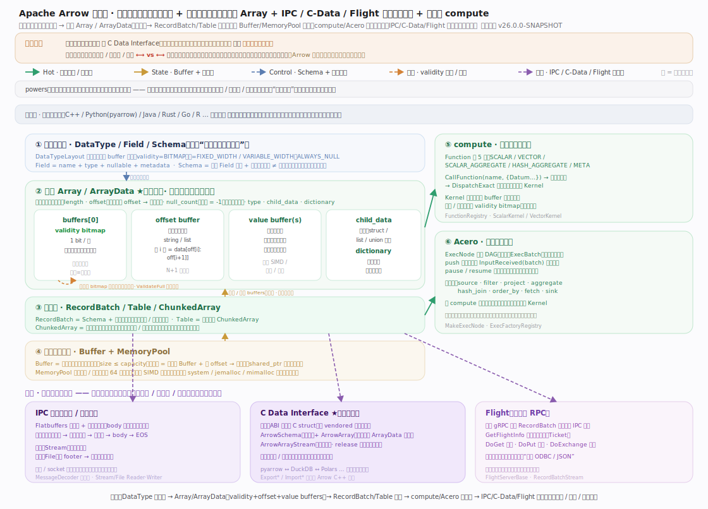
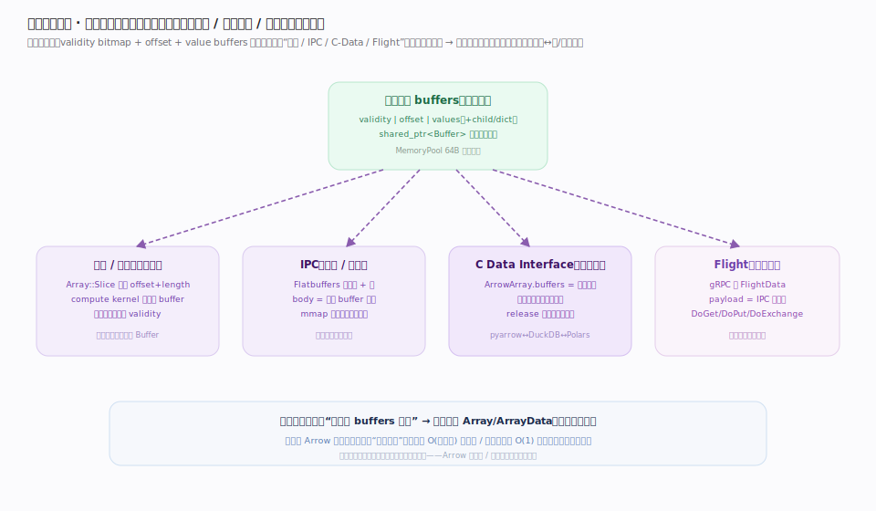
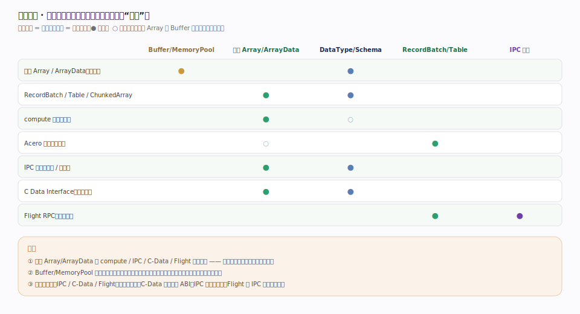

# Apache Arrow 核心原理 · 全景主线框架

> **定位**：全库总纲——用"格式核心 × 零拷贝交换 × 计算引擎"三维把 Apache Arrow 拆成可导航的主线，并点出灵魂：**语言无关的列式内存布局（Array = validity bitmap + offset + value buffers）让同一份内存免序列化跨进程 / 跨语言 / 跨网络零拷贝流转**。核实基准（pin：Apache Arrow `v26.0.0-SNAPSHOT`，本地克隆后按 `grep -n` 逐处核实行号）：`array/data.h:85`（ArrayData）、`buffer.h:52`（Buffer）、`memory_pool.h:109`（MemoryPool）、`c/abi.h:66`（ArrowArray）、`ipc/message.h:47`（Message）、`compute/function.h:142`（Function）。

## 一、总架构：格式栈 + 计算 + 交换

图示 Arrow 是**为分析型数据定义的语言无关列式内存标准**（非数据库/查询引擎）。分层：逻辑类型层（`DataType`/`Field`/`Schema`，只描述物理布局）→ 列式核心（`Array`/`ArrayData`，灵魂，三类缓冲承载一列、元数据与数据分离）→ 组合层（`RecordBatch`/`Table`/`ChunkedArray`），皆立于物理基石 `Buffer`+`MemoryPool`（64B 对齐、引用计数）之上；右侧 compute/Acero 就地运算，底部 IPC/C-Data/Flight 横切全局。**关键约束**：所有主线共享同一份 buffers 布局——交换不做行↔列/结构转换，只递指针或原样搬字节。

## 二、贯穿主线：零拷贝交换（立身之本）

图示**一份 buffers、四态同构**：validity+offset+value 的字节布局，在"本进程切片/计算""IPC 落盘或进程间""C-Data 跨语言""Flight 跨网络"四种去向里完全一致。**不变量**：切片与 compute 复用同一 `Buffer`（甚至复用输入 validity）；IPC body 就是原样字节、文件可 mmap；C-Data 只递 `ArrowArray` 指针数组；Flight 用 gRPC 送 IPC 编码的批。这就是立身之本——把交换成本从 O(数据量) 复制降到 O(1) 指针传递；代价是列式对随机行访问/逐行更新不友好，Arrow 定位分析/交换层而非事务存储。

## 三、依赖矩阵：谁立于谁之上

图示 **列式 Array/ArrayData**（data.h:85）被 compute/IPC/C-Data/Flight 全线依赖——它塌则全盘皆停，故定为灵魂；**Buffer/MemoryPool** 是最底基石。**不变量**：交换三件套不各造轮子——C-Data 定义内存 ABI（c/abi.h:66）、IPC 定义落字节格式（ipc/message.h:47）、Flight 把 IPC 批送上网络，三者共栈复用同一列式布局；compute/Acero 也只读写这份 buffers、不另立数据表示。"列式 Array + Buffer"是被依赖度最高的两格，正是本库把列式内存格式定为灵魂的原因。

## 深化 · 三维覆盖自检

| 维度 | Arrow 落点 | 代表主线 |
|---|---|---|
| 格式核心·数据 | 列式 Array/ArrayData（validity+offset+value buffers） | 核心_列式内存格式 |
| 格式核心·类型 | DataType/Field/Schema + DataTypeLayout | 核心_类型系统与Schema |
| 格式核心·内存 | Buffer + MemoryPool（64B 对齐 / 引用计数） | 核心_Buffer与内存池 |
| 格式核心·组合 | RecordBatch / Table / ChunkedArray | 核心_RecordBatch与Table |
| 交换·进程/文件 | IPC（Flatbuffers 元数据 + 消息帧） | 交换_IPC格式 |
| 交换·跨语言 | C Data Interface（ABI 稳定 C struct） | 交换_CData接口 |
| 交换·跨网络 | Flight（gRPC 传 RecordBatch 流） | 交换_Flight |
| 计算·向量化 | compute Function/Kernel（CallFunction） | 计算_compute内核 |
| 计算·流式 | Acero ExecNode DAG（push + 背压） | 引擎_Acero流式执行 |

## 拓展 · 与其它系统的对照

| 对照点 | Arrow | 相似系统 | 关键差异 |
|---|---|---|---|
| 列式布局 | 内存中的列式标准 | Parquet / ORC 磁盘列式 | Arrow 是**内存**格式，无编码 / 压缩解码开销，可直接计算 |
| 跨语言交换 | C Data Interface 递指针 | Protobuf / FlatBuffers 序列化 | Arrow 免序列化，同机零拷贝直接共享 |
| 计算 | compute kernel / Acero | 各引擎自研算子 | Arrow 提供可复用的向量化算子与流式框架 |
| 数据服务 | Flight RPC | ODBC / JDBC 逐行 | Flight 列式批直达线缆，省行式往返 |

## 调优要点

- 内存池选型：`jemalloc` / `mimalloc` 后端通常优于系统 `malloc`（碎片、`ReleaseUnused`），可按负载切换并用 `bytes_allocated()` 监控。
- 优先切片而非复制：`Array::Slice` / `Buffer` 切片零拷贝，避免不必要的 `CopySlice`。
- 批大小权衡：RecordBatch / ExecBatch 过小则调度开销大、过大则背压与内存峰值高。
- 跨语言首选 C Data Interface：同机免序列化；跨网络才用 Flight（复用 IPC 编码）。

## 常见误区

- **"Arrow 是文件格式"**：Arrow 是**内存**列式格式；磁盘列式是 Parquet/ORC，Arrow 的 IPC/Feather 只是把内存布局原样落字节。
- **"列式 = 无空值开销"**：空值由独立 validity bitmap（1 bit/值）表达，值槽仍占位（非哨兵值、非行式紧凑省略）。
- **"C Data Interface 会拷贝数据"**：它只递结构体与指针，靠 `release` 回调转移所有权，不拷贝缓冲字节。
- **"Arrow 能替代事务数据库"**：列式布局对随机行访问、逐行更新不友好，Arrow 是分析 / 交换层，非 OLTP 存储。

## 一句话总纲

**Apache Arrow 是一套"语言无关的列式内存标准"：把一列数据拆成 validity bitmap + offset + value buffers 三类对齐缓冲（元数据与数据分离、切片只移 offset），于是同一份内存能被 compute/Acero 就地向量化、被 IPC 原样落字节、被 C Data Interface 递指针跨语言、被 Flight 送上网络——全程免序列化、免行↔列转换，把数据交换成本从"复制一份"降到"传个指针"，这条零拷贝贯穿线就是全库的灵魂。**
</content>
