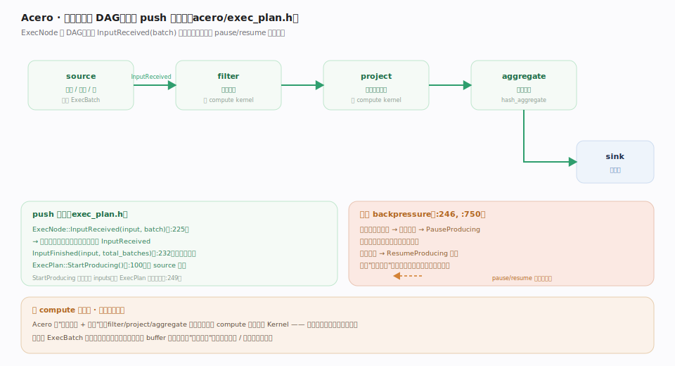
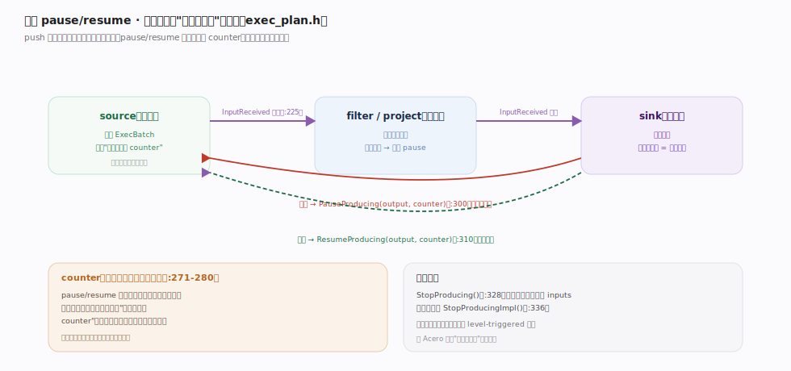

# Apache Arrow 核心原理 · 计算引擎 · Acero 流式执行

> **定位**：Arrow 的**流式执行引擎**——把关系算子连成 DAG，列式批次（`ExecBatch`）在节点间 push 着流过。`ExecNode`（`cpp/src/arrow/acero/exec_plan.h:125`）是算子基类，`InputReceived`（exec_plan.h:225）是 push 入口；`ExecPlan`（exec_plan.h:54）编排整图。面向"大于内存"的数据：分批 + 背压，而非一次性全量物化。核实基准：`acero/exec_plan.h`、`acero/*_node.*`。

## 一、算子 DAG 与 push 驱动

图示查询被表达为 `ExecNode`（exec_plan.h:125）组成的 DAG：`source→filter→project→aggregate→sink`，流动的批是轻量 `ExecBatch`（compute/exec.h:174，一组列 `Datum`+长度）。**push 驱动不变量**：`InputReceived(input, batch)`（exec_plan.h:225）是核心——上游算完一批就调下游的 `InputReceived` 把批推下去，`InputFinished`（:232）告知总批数收尾；`ExecPlan`（:54）统一编排整图（节点自身 `StartProducing` 不递归进 inputs），节点经 `MakeExecNode`+`ExecFactoryRegistry` 按名构造。

## 二、背压：pause/resume 处理超内存数据

图示 push 模型下下游积压会撑爆内存，Acero 用 pause/resume 反压解决：下游积压时调上游 `PauseProducing(output, counter)`（exec_plan.h:300）停产、缓解后 `ResumeProducing`（:310）恢复。**不变量**：`counter` 单调递增——pause/resume 可能乱序到达（:271-280），源节点只认"见过的最高计数"决定最终状态，故并发下正确收敛。终止走幂等且转发 inputs 的 `StopProducing()`（:328）。这让引擎始终只保留在途少量批次、吞下"远大于内存"的数据集，是数据流的流量控制。

## 深化 · 声明式装配：一张 Options 表定义整图

用户不必手工连线，而是给每个节点一份 `*NodeOptions`（`acero/options.h`），由工厂按名实例化并接线：

| 节点 | Options 锚点 | 语义 |
|---|---|---|
| source | options.h:90（SourceNodeOptions） | 批的产出源（表 / 生成器 / 异步流） |
| filter | options.h:250（FilterNodeOptions） | 一个布尔 Expression 谓词 |
| project | options.h:281（ProjectNodeOptions） | 一组输出列表达式 |
| aggregate | options.h:335（AggregateNodeOptions） | 聚合函数 + 分组键 |
| order_by | options.h:539（OrderByNodeOptions） | 排序键与升降序 |
| hash_join | options.h:564（HashJoinNodeOptions） | join 类型 + 左右键 |
| sink | options.h:403（SinkNodeOptions） | 结果出口（回调 / 生成器） |

`filter` / `project` 里的 Expression 最终下沉成 compute 的 `CallFunction`，`aggregate` / `hash_join` 内部用 compute 的哈希聚合与哈希表 kernel——**Acero 只做编排与调度，运算全部借道 compute**。

## 深化 · Acero 与 compute、与格式的关系

| 层 | 职责 | 复用 |
|---|---|---|
| Acero | 算子编排 + 流控（DAG / push / 背压） | 不自造标量运算 |
| compute | 向量化 Kernel（add/filter 表达式…） | filter/project 节点内部直接调 |
| 格式 | ExecBatch 承载列式 buffer 视图 | 节点间传视图，保持零拷贝 |

`filter`/`project`/`aggregate` 节点内部就调用 compute 的向量化 Kernel——**Acero 与 compute 共栈、不重复造轮子**。流动的 `ExecBatch` 承载列式数据，节点间传的是列 buffer 视图，因此"流式执行"仍保持零拷贝 / 向量化的底色。

## 常见误区

- **"Acero 是 pull（迭代器）模型"**：Acero 是 **push** 模型——上游主动 `InputReceived` 推给下游，非下游拉。
- **"Acero 自己实现所有算子运算"**：标量 / 向量运算复用 compute Kernel；Acero 负责编排与流控。
- **"流式引擎不需要流控"**：无背压则下游慢时内存爆；pause/resume 是处理超内存数据的关键。
- **"Acero = Arrow 的全部计算"**：单次表达式用 compute 的 CallFunction 即可；Acero 面向多算子流水线 / 大数据集。

## 一句话总纲

**Acero 是 Arrow 的流式执行引擎：把 source/filter/project/aggregate/join/sink 连成 ExecNode DAG，用 push 模型（上游 InputReceived 推批给下游、InputFinished 收尾）驱动列式 ExecBatch 流过，并以 pause/resume 背压处理大于内存的数据；算子内部复用 compute 向量化 Kernel、传的是列 buffer 视图——编排与流控归 Acero，向量化归 compute，零拷贝底色贯穿始终。**
</content>
