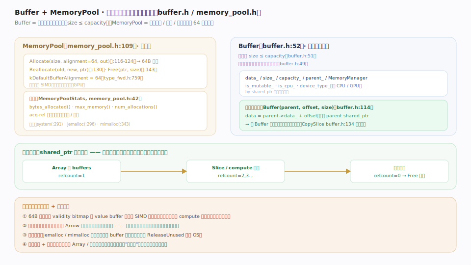
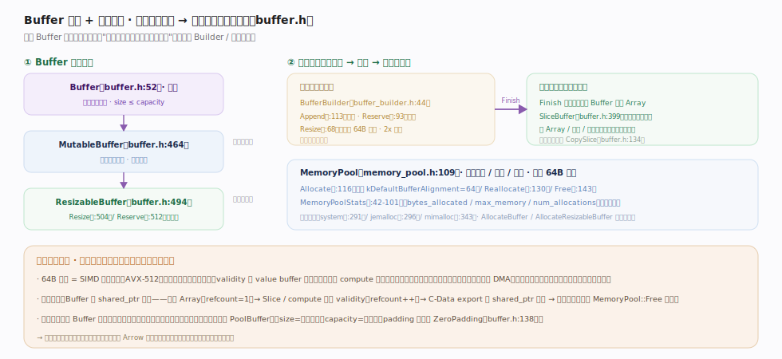

# Apache Arrow 核心原理 · 格式核心 · Buffer 与内存池

> **定位**：列式数据的**物理基石**——`Buffer`（`cpp/src/arrow/buffer.h:52`）是一段连续内存的引用视图（`size ≤ capacity`），`MemoryPool`（`cpp/src/arrow/memory_pool.h:109`）统一分配 / 回收 / 统计并强制 64 字节对齐。Array 的每个 buffer 都是一个 `shared_ptr<Buffer>`；切片共享父 buffer 即零拷贝。核实基准：`buffer.h`、`memory_pool.h`、`type_fwd.h`。

## 一、内存栈：MemoryPool 分配、Buffer 引用、引用计数回收

图示三层：`MemoryPool`（memory_pool.h:109）是分配器抽象（`Allocate`/`Reallocate`/`Free`，默认 64B 对齐，内建 `bytes_allocated`/`max_memory` 原子统计，后端可插 jemalloc/mimalloc）；`Buffer`（buffer.h:52）是连续内存的引用视图，持 `data_`/`size_`/`capacity_`/`parent_`。**不变量**：`size ≤ capacity`；零拷贝切片 `Buffer(parent, offset, size)` 令 `data = parent->data_ + offset` 并保留 `parent` 的 shared_ptr（真复制才用 `CopySlice`）；buffer 由引用计数持有，Array/Slice/compute 复用都使计数增加，全部析构归零才 `Free` 回池。

## 二、Buffer 家族与内存节律

图示基类 `Buffer` 默认不可变，派生出 `MutableBuffer`（可改字节、定容）与 `ResizableBuffer`（可增长）；写入走 `BufferBuilder`（buffer_builder.h:44，2x 倍增、按 64B 倍数取整摊薄再分配），`Finish` 冻结成不可变 Buffer 交给 Array。**不变量**：一次可写构建 → 之后只读零拷贝共享（`SliceBuffer` 只递引用），是 Arrow 内存管理的基本节律。两条服务关系：64B 对齐服务 SIMD 向量化（整批加载、免未对齐边界），引用计数服务安全的零拷贝共享。

## 深化 · Buffer 家族角色

| 角色 | 类 / 函数（锚点） | 可写 | 可变容量 |
|---|---|---|---|
| 只读视图 | `Buffer`（buffer.h:52） | 否 | 否 |
| 定容可写 | `MutableBuffer`（buffer.h:464） | 是 | 否 |
| 可增长 | `ResizableBuffer`（buffer.h:494，`Resize` :504 / `Reserve` :512） | 是 | 是 |
| 零拷贝切片 | `SliceBuffer`（buffer.h:399）/ `SliceMutableBuffer`（buffer.h:433） | 视父 | 否 |
| 增量构建 | `BufferBuilder`（buffer_builder.h:44） | 是 | 是（倍增） |

分配入口 `AllocateBuffer`（buffer.h:539，定容）与 `AllocateResizableBuffer`（buffer.h:550，可增长）都从 MemoryPool 取内存、按 64B 对齐。

## 深化 · 为什么强制 64 字节对齐

64 字节 = 常见 SIMD 寄存器宽度（AVX-512）与缓存行的公倍数考量。validity bitmap 与 value buffer 都对齐到 64B 后，向量化 `compute` 内核可整批加载、无需处理未对齐首尾边界，也利于跨设备（GPU）DMA。这就是 Arrow "为向量化而生" 在内存层的体现：对齐不是可选优化，而是格式约定的一部分（`MemoryPool::Allocate` 默认即 64B）。

## 深化 · 引用计数：零拷贝的所有权基础

| 场景 | Buffer 引用计数行为 |
|---|---|
| 构造 Array | Array 持 buffers，refcount=1 |
| Array::Slice | 新 ArrayData 共享同批 Buffer，refcount++ |
| compute 复用输入 validity | 输出 Array 持有同一 bitmap Buffer，refcount++ |
| C-Data Export | private_data 藏 shared_ptr 保活，release 时 refcount-- |
| 全部析构 | refcount=0 → 调 MemoryPool::Free 归还 |

正因所有权由 shared_ptr 引用计数管理，多个 Array / 视图 / 跨语言消费者才能**安全共享同段字节**——这是"零拷贝"在所有权层面能成立的前提。

## 常见误区

- **"Buffer 拥有内存"**：基类 `Buffer` 只是引用视图、不拥有；拥有内存的是分配它的子类（如 `PoolBuffer`）。
- **"切片会复制"**：`Buffer(parent, offset, size)` / `Array::Slice` 零拷贝共享；只有 `CopySlice`（buffer.h:134）才真复制。
- **"用系统 malloc 就行"**：Arrow 需要 64B 对齐 + 用量统计 + 可选 jemalloc/mimalloc 抗碎片，故用 MemoryPool 而非裸 malloc。
- **"size==capacity"**：`size` 是有效数据字节、`capacity` 是已分配字节，`size ≤ capacity`；padding 部分可 `ZeroPadding`（buffer.h:138）。

## 一句话总纲

**Buffer + MemoryPool 是列式数据的物理地基：MemoryPool 以 64 字节对齐统一分配、回收并统计内存（可插 jemalloc/mimalloc 后端），Buffer 是连续内存的引用视图（size≤capacity）、由 shared_ptr 引用计数持有、切片共享父 buffer 即零拷贝——对齐服务于 SIMD 向量化，引用计数服务于安全的零拷贝共享，二者共同支撑起 Arrow 全部上层的列式数据。**
</content>
