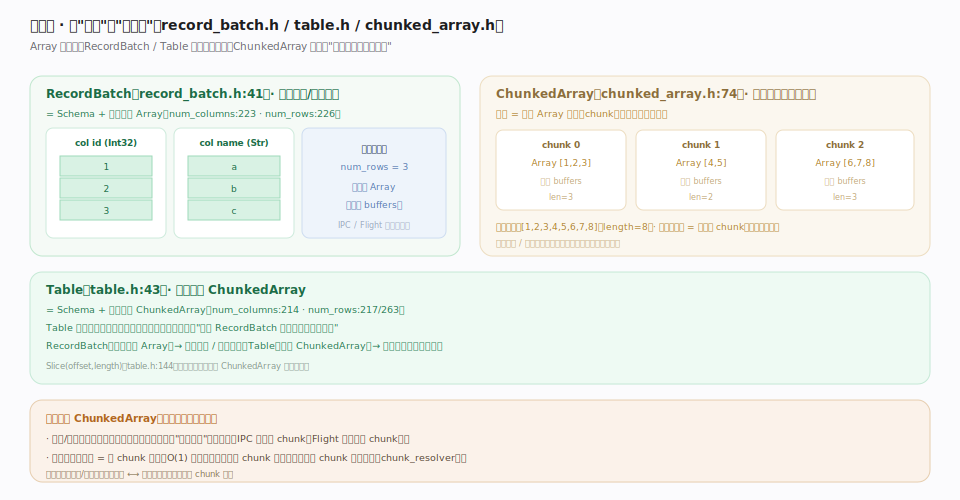
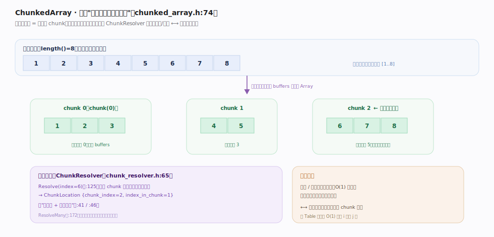

# Apache Arrow 核心原理 · 格式核心 · RecordBatch 与 Table

> **定位**：把"一列 Array"组合成"一张表"的组合层——`RecordBatch`（`cpp/src/arrow/record_batch.h:41`）= Schema + 一组等长 Array（面向传输 / 单批计算）；`Table`（`cpp/src/arrow/table.h:43`）= Schema + 每列一个 `ChunkedArray`；`ChunkedArray`（`cpp/src/arrow/chunked_array.h:74`）让一列"逻辑连续、物理分块"。核实基准：`record_batch.h`、`table.h`、`chunked_array.h`。

## 一、从一列到一张表

图示三层组合：**RecordBatch**（record_batch.h:41）= Schema + 一组**等长** Array（每列独立 buffers），是 IPC/Flight 的传输单元、compute 的单批输入；**Table**（table.h:43）= Schema + **每列一个 ChunkedArray**，等价于"若干 RecordBatch 纵向拼接的逻辑视图"（`FromRecordBatches` table.h:86）。**不变量**：`RecordBatch` 各列行数必须相同；`Table::Slice`（table.h:141）零拷贝、只收窄各 ChunkedArray 视图范围。

## 二、ChunkedArray：逻辑连续、物理分块

图示 `ChunkedArray`（chunked_array.h:74）把一列表示为若干 Array 分块、逻辑首尾相接：`[1,2,3]+[4,5]+[6,7,8]` 逻辑视图是 `[1..8]`（`length()`=8），物理是三个各自 buffers 的独立 Array。**不变量**：追加新数据 = 加一个 chunk、**不重排旧内存**；拼接两数据集 = 拼 chunk 列表、O(1) 不复制。代价是跨 chunk 随机定位需 `ChunkResolver`（chunk_resolver.h:65）在起始偏移数组上二分，`Resolve(index)` 返回 `{chunk_index, index_in_chunk}`——吞吐/追加友好 ⟷ 单值访问多一跳。

## 深化 · 组表层 API：变换皆零拷贝或浅拷贝

| 操作 | 源码锚点 | 是否复制 buffer |
|---|---|---|
| `RecordBatch::Slice` | record_batch.h:256 | 否，各列 Array 切片共享父 buffer |
| `RecordBatch::SelectColumns` | record_batch.h:269 | 否，挑选列引用重组 |
| `RecordBatch::AddColumn` / `RemoveColumn` | record_batch.h:187 / :214 | 否，列指针增删 |
| `RecordBatch::ToStructArray` | record_batch.h:91 | 否，视作一个 struct Array 视图 |
| `Table::Slice` | table.h:141 | 否，收窄各 ChunkedArray 视图 |
| `Table::SelectColumns` | table.h:175 | 否，挑列 |
| `Table::CombineChunks` | table.h:247 | **是**，多 chunk 合并成单 chunk（显式物化） |
| `ChunkedArray::View` | chunked_array.h:161 | 否，逐 chunk 重解释类型 |

只有 `CombineChunks`（table.h:247）/ `CombineChunksToBatch`（table.h:256）是显式"物化"——把碎片化多 chunk 合并成连续单块，代价一次真实拷贝，通常在需要连续内存的下游 kernel 前才做。一致性校验走 `ValidateFull()`（record_batch.h:286 / table.h:211 / chunked_array.h:205）。

## 深化 · RecordBatch vs Table：何时用哪个

| 维度 | RecordBatch | Table |
|---|---|---|
| 每列结构 | 单个 Array | ChunkedArray（多 chunk） |
| 典型用途 | 传输 / 单批向量化计算 | 承载全量大数据集 |
| 行数来源 | 显式 num_rows，列等长 | 各列 chunk 总和一致 |
| IPC/Flight | 是传输的最小批单元 | 拆成多个 RecordBatch 传 |
| 拼接 | 纵向拼多个 batch | 拼 ChunkedArray 的 chunk 列表 |

一句话：**RecordBatch 是"一批"，Table 是"整个数据集的逻辑视图"**。

## 深化 · 为什么要 ChunkedArray

强求一列物理连续有两难：变长/超大列一次性连续分配昂贵；流式场景无法"边读边攒"。分块解决之，代价是随机定位需 `ChunkResolver`（chunk_resolver.h:65）在起始偏移数组上二分（`Resolve` :125 返回 `{chunk_index, index_in_chunk}`，`ResolveMany` :172 批量摊薄）——**吞吐/追加友好 ⟷ 单值随机访问多一跳**（详见 SVG②）。

## 常见误区

- **"RecordBatch 的列可以不等长"**：RecordBatch 要求所有列等长（= num_rows）；不等长应上升为不同批。
- **"Table 的列必然只有一个 chunk"**：Table 每列是 ChunkedArray，通常多 chunk；单 chunk 只是特例。
- **"Table 就是二维数组，可 O(1) 取第 i 行第 j 列"**：列式 + 分块下，取单值要先定位 chunk 再取列内偏移，非行式 O(1)。
- **"拼接两个 Table 要复制数据"**：拼的是 chunk 列表引用，数据 buffer 零拷贝共享。

## 一句话总纲

**RecordBatch / Table / ChunkedArray 是 Arrow 的组合层：RecordBatch = Schema + 等长 Array（传输 / 单批计算的单元），Table = Schema + 每列一个 ChunkedArray（承载全量数据集），ChunkedArray 让一列"逻辑连续、物理分块"从而支持边读边攒与 O(1) 拼接——这套分块组合服务于流式吞吐与零拷贝拼接，代价是跨 chunk 随机定位需多一层 resolver 映射。**
</content>
