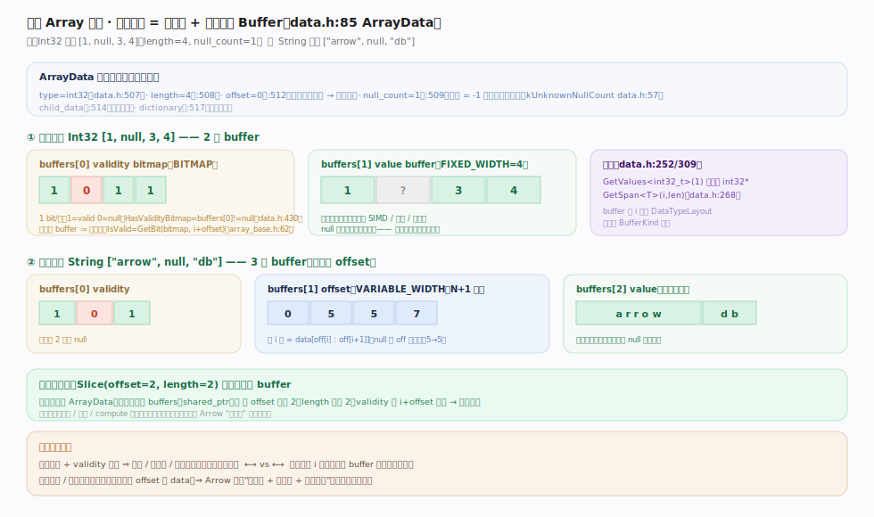
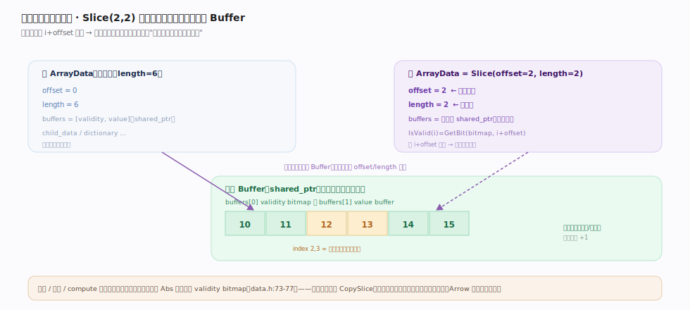
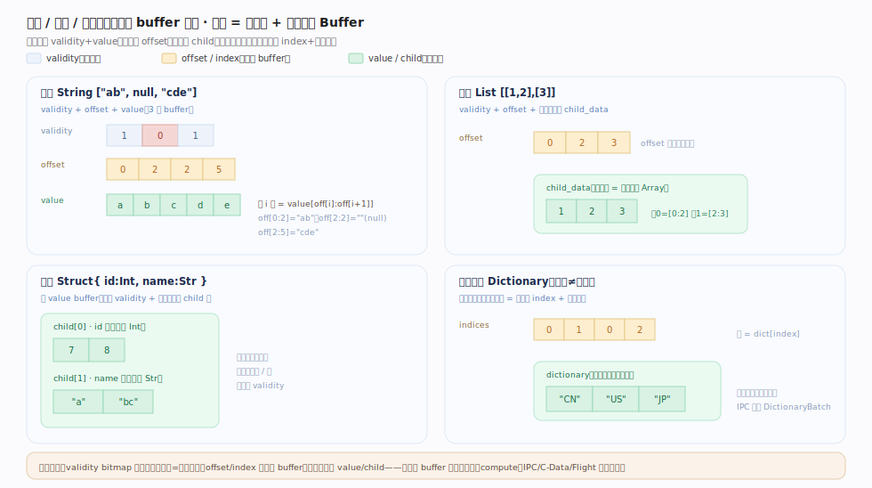

# Apache Arrow 核心原理 · 格式核心 · 列式内存格式（灵魂）

> **定位**：Arrow 的**定义性**存在——把一列数据表示为"元数据 + 若干对齐 Buffer"的自包含容器 `ArrayData`（`cpp/src/arrow/array/data.h:85`），由强类型只读访问器 `Array`（`cpp/src/arrow/array/array_base.h:53`）封装。三类缓冲：`buffers[0]` validity bitmap（空值，1 bit/值）、offset buffer（变长类型）、value buffer(s)（实际值）；元数据 `length`/`offset`/`null_count` 与数据分离，切片只移 `offset` 即零拷贝。核实基准：`data.h`、`array_base.h`。

## 一、列式 Array 剖面：元数据 + 对齐 Buffer

图示一列 `ArrayData`（data.h:85）= 元数据（`length`/`offset`/`null_count`/`type`）与数据分离，加三类对齐 Buffer。定长 Int32 只需 2 个（validity + values，null 槽仍占位）；变长 String 需 3 个（validity + offset + values，第 i 值 = `data[off[i]:off[i+1]]`）。**不变量**：`buffers[0]==nullptr` 即无 validity bitmap = 全非空（`HasValidityBitmap` data.h:430）；`null_count` 惰性计算（`kUnknownNullCount=-1`，首访才算）；取值用 `GetValues<T>(i)`，访问器 `IsValid(i)=GetBit(bitmap, i+offset)`（array_base.h:62）——正是 `i+offset` 让切片天然正确。

## 二、零拷贝切片的微观机制

图示 `Slice(offset, length)` **不复制任何 buffer**：构造新 `ArrayData` 共享同一批 `shared_ptr<Buffer>`，只把 `offset` 改成新起点、`length` 改成新长度。**不变量**：因所有取值（含 validity bitmap）都用 `i+offset` 定位，切片视图天然正确。这是 Arrow 单机内"零拷贝"的微观来源——切片、拼接、compute 输出都能廉价复用底层内存（如 Abs 复用输入 validity）；行式结构取子集常需复制一段连续行，Arrow 只改两个整数。

## 三、变长 / 嵌套 / 编码类型的物理布局

图示定长之外的四类布局：**变长 String** = validity + offset + value（第 i 值 = `value[off[i]:off[i+1]]`）；**列表 List** = validity + offset + 一个子数组 `child_data`（offset 划分每行区间）；**嵌套 Struct** 无 value buffer、只有 validity + 每字段一个 child 列；**字典编码 Dictionary** = 小整数 indices + 去重 dictionary（逻辑一列字符串、物理省内存，IPC 专发 DictionaryBatch）。**不变量**：validity 可缺省（=全非空），offset/index 是结构 buffer、真实数据在 value/child——同一份 buffer 布局被切片 / compute / IPC / C-Data / Flight 原样复用。逐类锚点见下表。

## 深化 · 逻辑空值 vs 物理 validity bitmap

多数类型用 `buffers[0]` 的 validity bitmap 表达空值。但 union、run-end-encoded、dictionary 等类型**没有顶层 validity bitmap**，空值是"逻辑的"：`MayHaveLogicalNulls()`（data.h:470）对这些类型分派到 `internal::UnionMayHaveLogicalNulls` / `RunEndEncodedMayHaveLogicalNulls` / `DictionaryMayHaveLogicalNulls`（data.h:43-49 声明）判断；`ComputeLogicalNullCount()`（data.h:495）按需重算。所以正确写法是先 `HasValidityBitmap()` 再决定是否直接读 bitmap，否则会漏掉这些类型的逻辑空值。

## 深化 · 定长 / 变长 / 嵌套的 buffer 数

| 类型族 | buffer 序列 | 说明 |
|---|---|---|
| 定长（Int/Float/…） | validity + values | value 定宽紧排，null 槽占位 |
| 变长（String/Binary） | validity + offset + values | 第 i 值 = data[off[i]:off[i+1]] |
| StringView/BinaryView | validity + views + 多个 data | view=16B（kInlineSize=12 内联短串），长串指向 data buffer |
| List | validity + offset + child_data | 子元素在 child，offset 划分每行 |
| Struct | validity + child_data（每字段一列） | 无 value buffer，字段各自成列 |
| Union | type_ids(+offset) + child_data | 无顶层 validity，逻辑空值 |
| Dictionary | indices 的 buffers + dictionary | 低基数值复用，dictionary 存去重值 |

## 常见误区

- **"null 值不占空间"**：定长类型的 null 槽仍在 value buffer 中占位（值任意），空值信息在独立 validity bitmap；这换来定长随机寻址 O(1)。
- **"直接对 validity/boolean buffer 用 GetValues 加 offset"**：位打包 buffer 必须用 `GetValues(i, 0)` 再手动施加 bit offset（data.h:299-307 注释），否则结果错误。
- **"有 buffer 就有空值"**：`buffers[0]==nullptr` 表示无 validity bitmap = 全非空；不能假设总有 bitmap。
- **"Array 可变"**：`Array` 是不可变只读视图（array_base.h:42-43），可变访问只应在初始填充 `ArrayData` 时进行（data.h:79-84）。

## 一句话总纲

**列式 Array/ArrayData 是 Arrow 的灵魂：一列 = 元数据（length/offset/null_count/type）+ 三类对齐 Buffer（validity bitmap 记空值、offset 划分变长、value 存实际字节），元数据与数据分离让切片只改 offset 即零拷贝、让 compute 复用 validity bitmap、让同一份内存能被 IPC/C-Data/Flight 原样搬运——这套紧排布局是"扫描 / 向量化 / 零拷贝交换"极快、却对随机行访问与逐行更新不友好的根因。**
</content>
