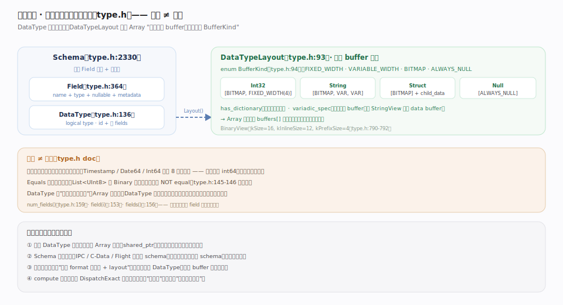
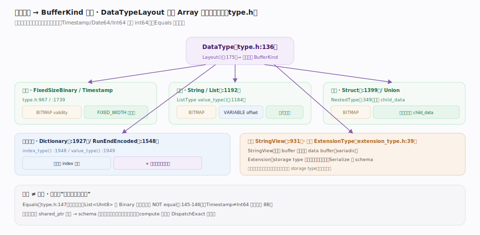
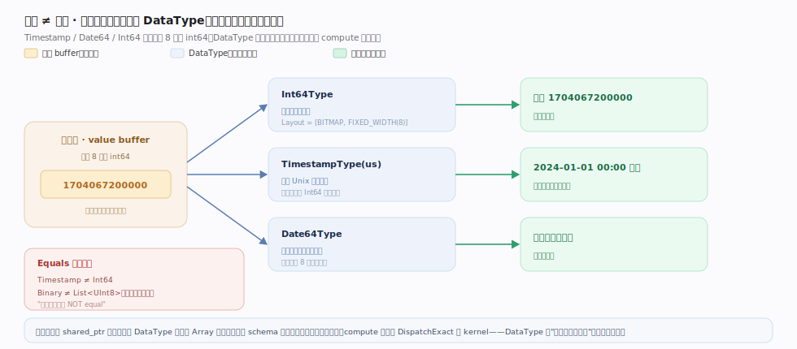

# Apache Arrow 核心原理 · 格式核心 · 类型系统与 Schema

> **定位**：Arrow 的"类型层"——`DataType`（`cpp/src/arrow/type.h:136`）是**逻辑**类型，`Field`（type.h:364）= name+type+nullable+metadata，`Schema`（type.h:2330）= 有序 Field 列表 + 元数据。关键：`DataTypeLayout`（type.h:93）把逻辑类型翻译成"该有几个 buffer、各是什么 `BufferKind`"，让 `Array` 知道如何解读字节。逻辑 ≠ 物理。核实基准：`type.h`。

## 一、逻辑类型如何描述物理布局

图示 `DataType`（type.h:136）是**逻辑**类型，其 `Layout()`（type.h:175）返回 `DataTypeLayout`（type.h:93）——`buffers` 向量逐格声明期望的 `BufferKind`（`FIXED_WIDTH/VARIABLE_WIDTH/BITMAP/ALWAYS_NULL`）。**不变量**：Array 正是据此知道 `buffers[i]` 每格放什么、如何解读字节。于是 Int32 = [BITMAP, FIXED_WIDTH(4)]、String = [BITMAP, VARIABLE, VARIABLE]、Struct = [BITMAP] + child_data、Null = [ALWAYS_NULL]；`Field`（type.h:364）+ `Schema`（type.h:2330）在其上组织成有序列描述。

## 二、类型家族：primitive → nested → 编码类型

图示 `DataType` 派生出的类型树、layout 各异：定长（[validity, 定宽值]）、变长/列表（+ offset + 子数组）、嵌套（Struct 每字段一个 child_data）、编码类型（Dictionary = index 数组 + 独立去重字典）、视图/扩展。**不变量**：`DictionaryType`（type.h:1927）尤其体现"逻辑 ≠ 物理"——逻辑一列字符串、物理是小整数 index + 一份去重字典，低基数列大幅省内存（也是 IPC 要专发 DictionaryBatch 的原因）；`ExtensionType`（extension_type.h:39）在 storage type 上贴自定义语义，收端认不得就退化成 storage type、向后兼容。

## 三、逻辑 ≠ 物理：一种布局多种语义

图示同一份 8 字节 int64 字节，被不同 `DataType`「透镜」解读成不同逻辑值：`Int64` 是整数、`Timestamp(us)` 是 Unix 微秒时刻、`Date64` 是毫秒日期——物理布局完全相同。**不变量**：`Equals`（type.h:147）只认逻辑相等，`Timestamp≠Int64`、`Binary≠List<UInt8>`（type.h:145-146 注释"logically convertible … are NOT equal"）；`DataType` 既是"解读字节的透镜"（`Array` 存字节、`DataType` 决定当作整数/时间戳/偏移），也是 compute `DispatchExact` 选实现的派发键。

## 深化 · 类型家族与 layout 对照

| 类别 | 代表类型（锚点） | buffer 布局要点 |
|---|---|---|
| 定长 | `FixedSizeBinaryType`（type.h:967）、`TimestampType`（type.h:1739） | [validity, 定宽值] |
| 嵌套基类 | `NestedType`（type.h:349） | 有子 Field，值在 child_data |
| 列表 | `ListType`（type.h:1192，`value_type()` type.h:1184） | [validity, offset] + 一个子数组 |
| 映射 | `MapType`（type.h:1323，`key_field` type.h:1344 / `item_field` type.h:1347） | List<Struct<key,value>> 的特化 |
| 结构 | `StructType`（type.h:1399，`GetFieldByName` type.h:1417 / `GetFieldIndex` type.h:1424） | [validity] + 每字段一个子数组 |
| 联合 | `SparseUnionType`（type.h:1503）、`DenseUnionType`（type.h:1532） | type_ids（+ dense 的 offset） |
| 字典编码 | `DictionaryType`（type.h:1927，`index_type()` type.h:1948 / `value_type()` type.h:1949 / `ordered()` type.h:1951） | index 数组 + 独立字典 |
| 游程编码 | `RunEndEncodedType`（type.h:1548，`value_type()` type.h:1564） | run_ends + values 两子数组 |
| 视图型 | `StringViewType`（type.h:931） | 变长 buffer 之外多个 data buffer（variadic） |

`Schema` 侧 `GetFieldByName`（type.h:2370）/ `GetFieldIndex`（type.h:2376）提供按名定位列的入口。

## 深化 · 为什么类型与数据分离

| 收益 | 机制 |
|---|---|
| 内存省 | 一个 DataType（shared_ptr）被无数 Array 共享 |
| 独立传输 | IPC/C-Data/Flight 先传 schema、再传多批数据 |
| 跨语言 | 约定 format 字符串 + layout，各语言自建 DataType，buffer 原样共享 |
| 派发 | compute 按类型 DispatchExact 选 kernel，数据是被运算的字节 |

## 常见误区

- **"类型里存着数据"**：`DataType` 只描述布局与语义，数据在 `Array` 的 buffers；两者 shared_ptr 解耦。
- **"物理布局相同就类型相同"**：`Equals` 认逻辑；Timestamp≠Int64、Binary≠List<UInt8>，即便字节布局一致。
- **"nullable 是数据属性"**：`nullable` 是 `Field`（schema 层）的属性；实际是否有空值看 `ArrayData` 的 validity bitmap。
- **"Schema 顺序无所谓"**：Schema 是**有序** Field 列表，列序参与 IPC/C-Data 对齐，不能随意重排。

## 一句话总纲

**类型系统是 Arrow 的"透镜层"：DataType 是逻辑类型（Timestamp/Int64 可同物理布局），通过 DataTypeLayout 声明"几个 buffer、各是 BITMAP/FIXED/VARIABLE/ALWAYS_NULL"来指挥 Array 如何解读字节；Field/Schema 把类型组织成有序列描述——类型与数据 shared_ptr 分离，使 schema 能独立传输、跨语言各自重建、compute 按类型派发，这是"逻辑 ≠ 物理"带来的灵活与省。**
</content>
