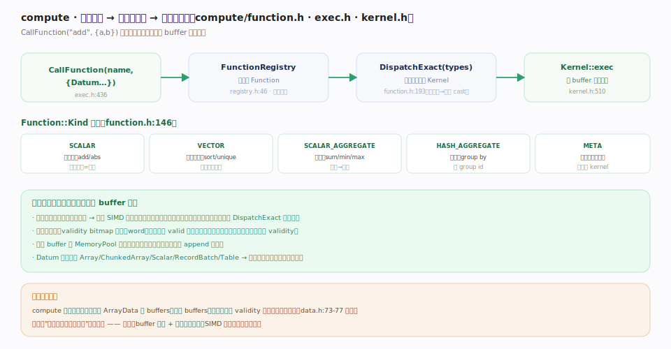
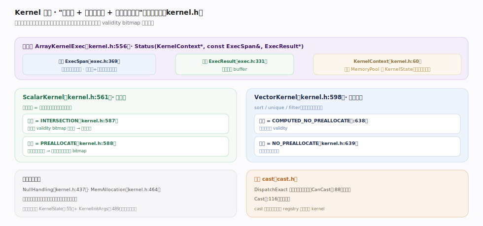

# Apache Arrow 核心原理 · 计算引擎 · compute 向量化内核

> **定位**：Arrow 的**就地向量化计算层**——`CallFunction`（`cpp/src/arrow/compute/exec.h:436`）按名从 `FunctionRegistry`（`cpp/src/arrow/compute/registry.h:46`）取 `Function`（`cpp/src/arrow/compute/function.h:142`），`DispatchExact`（function.h:193）按参数类型选 `Kernel`（`cpp/src/arrow/compute/kernel.h:510`），Kernel 直接在列式 buffer 上批量运算。核实基准：`compute/function.h`、`exec.h`、`kernel.h`、`registry.h`。

## 一、按名调用 → 按类型派发 → 就地向量化

图示调用链：`CallFunction("add", {a,b})`（exec.h:436）→ `FunctionRegistry`（registry.h:46）按名查出 `Function` → `DispatchExact(types)`（function.h:193）按精确参数类型选 `Kernel`（不匹配则隐式 cast）→ `Kernel`（kernel.h:510）在 buffer 上批量算。**不变量**：`Function::Kind` 五类（function.h:146）——`SCALAR`（逐元素）、`VECTOR`（整列相关）、`SCALAR_AGGREGATE`（数组→标量）、`HASH_AGGREGATE`（分组）、`META`（派发到其它函数）；输入输出统一用 `Datum`（裹 Array/ChunkedArray/Scalar/RecordBatch/Table），同一函数适配多种输入形态。

## 二、Kernel 解剖：执行签名、空值约定、内存预分配

图示一个 `Kernel`（kernel.h:510）是"如何跑 + 如何管空值 + 如何分配输出"的三元约定：执行体 `ArrayKernelExec`（kernel.h:556）签名 `Status(KernelContext*, const ExecSpan&, ExecResult*)`。**不变量**：两个枚举定死框架代劳多少——`ScalarKernel` 默认 `INTERSECTION`+`PREALLOCATE`（逐元素输出长度=输入，框架按位与算好 validity、预分配输出，内核只填值、连 bitmap 都不碰）；`VectorKernel` 默认 `COMPUTED_NO_PREALLOCATE`+`NO_PREALLOCATE`（输出长度事前未知，内核自分配）。隐式 cast 走 `cast.h`，本身也是注册的一族 kernel。

## 深化 · 空值与内存策略的默认约定

| 约定 | 枚举（锚点） | ScalarKernel 默认 | VectorKernel 默认 |
|---|---|---|---|
| 空值处理 | `NullHandling`（kernel.h:437） | `INTERSECTION`（kernel.h:587，交集输入 bitmap） | `COMPUTED_NO_PREALLOCATE`（kernel.h:638） |
| 输出内存 | `MemAllocation`（kernel.h:464） | `PREALLOCATE`（kernel.h:588，框架预分配） | `NO_PREALLOCATE`（kernel.h:639） |

输入 `ExecSpan`（exec.h:369）是一批列的只读视图（纯指针+长度、不持所有权），输出 `ExecResult`（exec.h:331）承接结果 buffer，`KernelContext`（kernel.h:60）提供 MemoryPool；有状态内核（如带累加器的聚合）用 `KernelState`（kernel.h:55）+ `KernelInitArgs`（kernel.h:489）开跑前初始化。

## 深化 · 为什么向量化快

| 加速点 | 机制 |
|---|---|
| SIMD 批处理 | 同列同类型定长值连续紧排，一条指令算多个值 |
| 无虚调用 / 无分支 | 类型已在 DispatchExact 定死，循环内无逐行类型判断 |
| 空值快路径 | validity bitmap 按 word 扫描，全 valid 块走无分支路径 |
| validity 复用 | 输出常直接复用输入 bitmap（data.h:73-77 的 Abs 例），空值不重算 |
| 一次分配输出 | 输出长度已知，从 MemoryPool 一次分配，无逐元素扩容 |

这正是"列式布局利于向量化"的兑现处——**格式（buffer 紧排 + 64B 对齐）与计算（SIMD 批处理）互为因果**。

## 深化 · compute 与格式零耦合复制

compute 内核**不复制数据**：直接读 `ArrayData` 的 buffers、写新 buffers。能复用输入 validity 时连空值都不重算（data.h:73-77 明确以 Abs 为例："an Abs function can reuse the validity bitmap of its input as the validity bitmap of its output"）。这让"读一列 → 算一列"的内存开销降到只分配输出 value buffer，validity 甚至零成本传递。

## 常见误区

- **"compute 会把列转成行再逐行算"**：恰相反，它就地在列式 buffer 上批量算，行式反而慢。
- **"函数名不同 kernel 就不同"**：一个 Function 名下按参数类型注册**多个** Kernel，DispatchExact 选最匹配的。
- **"聚合和逐元素是一类"**：SCALAR（逐元素）与 SCALAR_AGGREGATE（汇总）、HASH_AGGREGATE（分组）是不同 Kind，语义与输出形态不同。
- **"必须先转成 Array 才能算"**：`Datum` 统一裹 Array/ChunkedArray/Scalar/RecordBatch/Table，函数按形态处理。

## 一句话总纲

**compute 是 Arrow 的就地向量化层：CallFunction 按名查 FunctionRegistry、DispatchExact 按参数类型选 Kernel，Kernel 直接在列式 buffer 上跑 SIMD 批循环（类型已定死、空值按 bitmap 快路径、输出常复用输入 validity、一次分配）——Function 分 SCALAR/VECTOR/两种 AGGREGATE/META 五类，用统一 Datum 适配多种输入；格式的紧排对齐与计算的向量化在此互为因果。**
</content>
