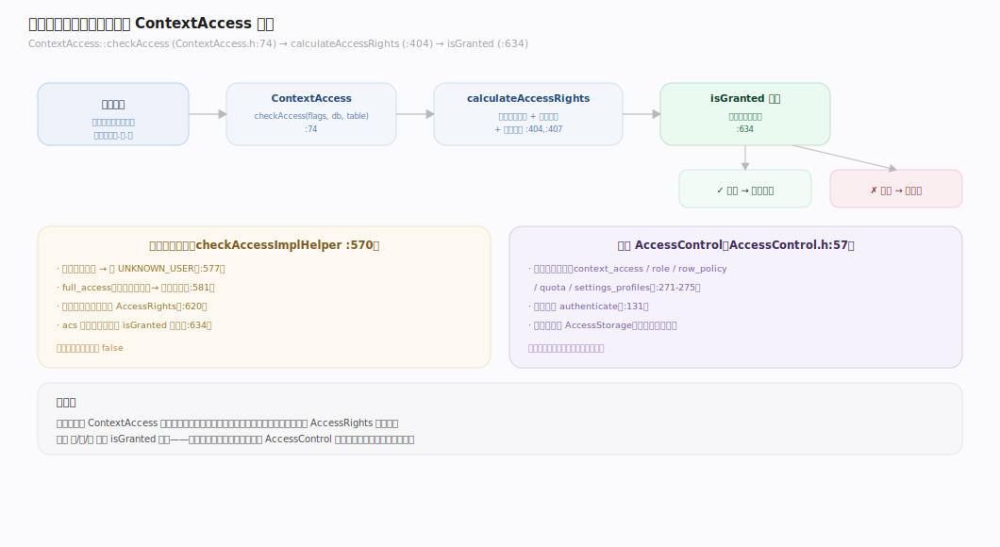
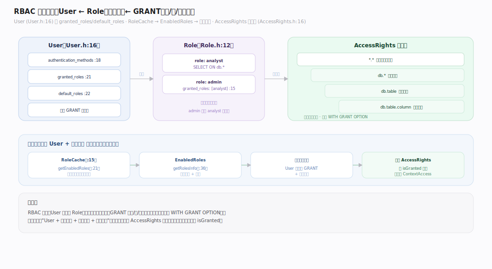
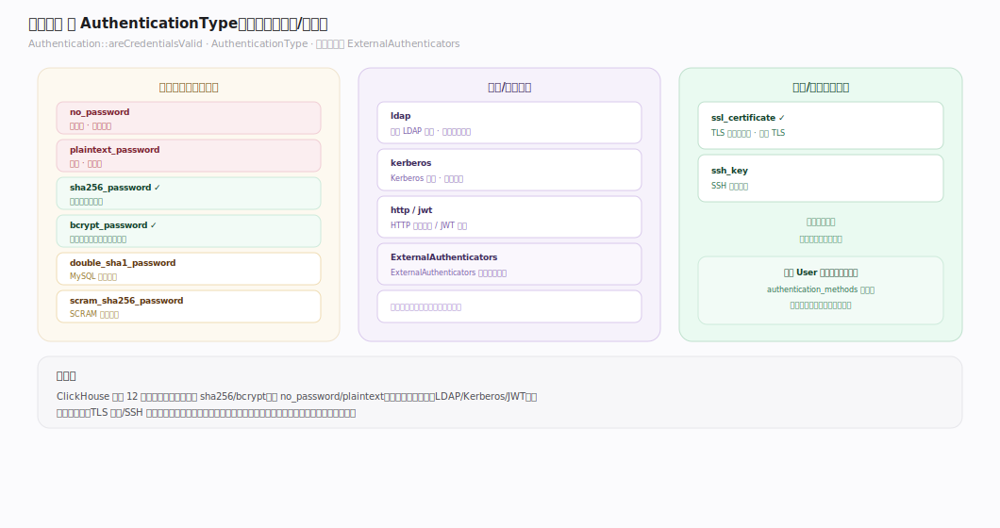
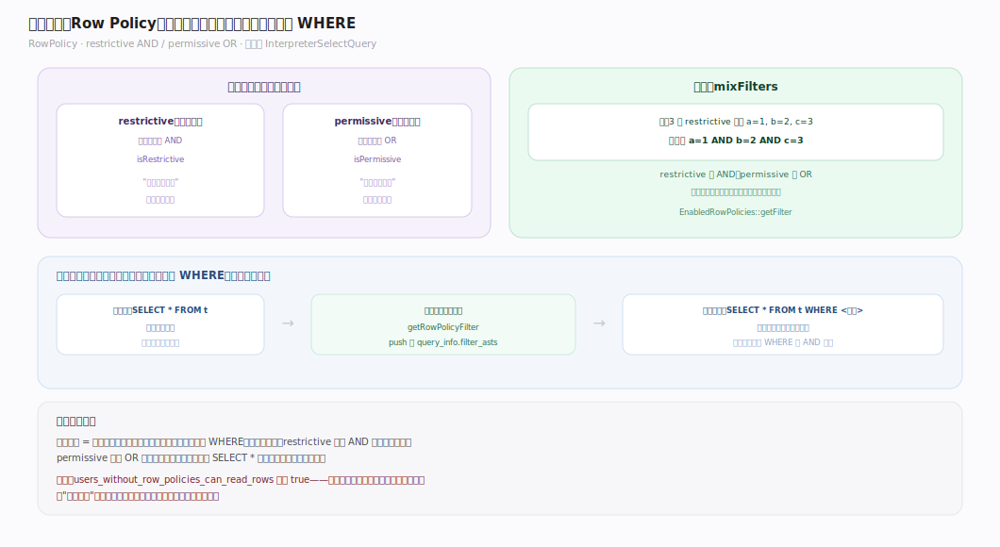
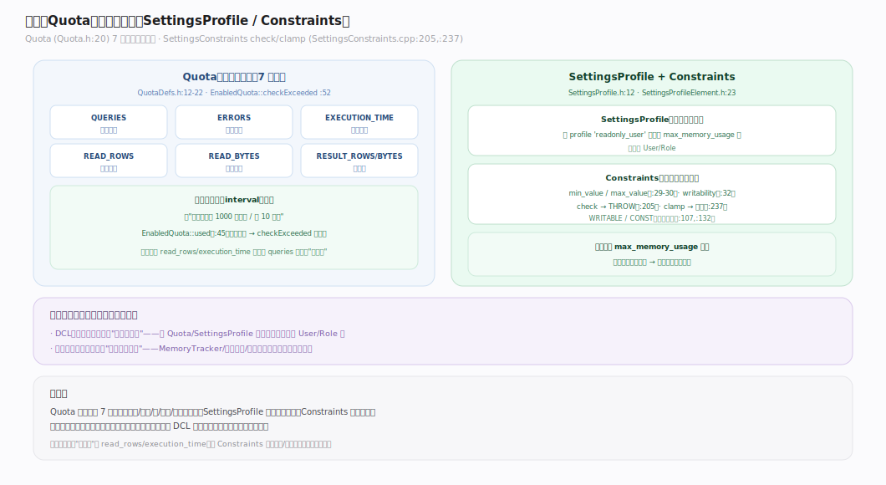
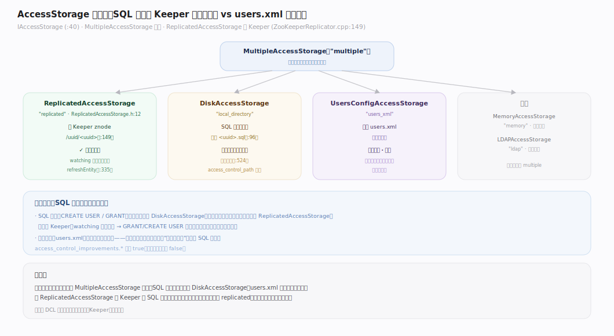

# ClickHouse 核心原理 · DCL 数据控制

> **定位**：DCL 是"管权限/配额"的接口主线，骨架 = `AccessControl 管理器 → 实体（User/Role/RowPolicy/Quota/SettingsProfile）→ 多后端 AccessStorage`；依赖 **元数据与协调**（ReplicatedAccessStorage 经 Keeper 全集群一致），与 **资源与负载管理**（Quota/SettingsProfile）共用配额与约束机制。核实基准：社区 v25.8，源码 `src/Access/`。

## 一、DCL 生命周期与权限判定

图注：每条查询的鉴权在 `ContextAccess`——`checkAccess → calculateAccessRights` 算出含隐式权限的 `AccessRights`，`checkAccessImplHelper` 判定：用户被删则抛 `UNKNOWN_USER`，`full_access`（内部查询）短路放行，否则 `isGranted` 在权限树上按 **库/表/列** 粒度匹配。中枢是 `AccessControl`，持有各类实体缓存与认证入口。

---

## 二、RBAC 模型：User / Role / GRANT

图注：`IAccessEntity` 是所有实体基类。`User` 持有认证方式、被授予/默认角色与直接权限；`Role` 可再持有角色（**角色可嵌套**）。角色解析经 `RoleCache → EnabledRoles`，聚合出"当前生效的所有角色 + 权限"。`AccessRights` 是**权限树**，支持 库/表/列 粒度、通配符、`WITH GRANT OPTION`。

---

## 三、认证方式（Authentication）

`Authentication::areCredentialsValid` 校验凭据，`AuthenticationType` 支持多种：

| 方式 | 说明 | 适用 |
|---|---|---|
| `no_password` | 无密码 | 内网测试（默认允许开关控制） |
| `plaintext_password` | 明文 | 简单场景 |
| `sha256_password` | SHA-256 哈希 | 推荐的密码方式 |
| `double_sha1_password` | 双 SHA-1 | MySQL 协议兼容 |
| `bcrypt_password` | bcrypt | 更强的密码哈希 |
| `ldap` / `kerberos` | 外部目录/票据 | 企业统一认证 |
| `ssl_certificate` | TLS 客户端证书 | 双向 TLS |
| `ssh_key` / `http` / `jwt` | SSH 密钥 / HTTP / JWT | 免密/令牌 |

外部认证器（LDAP/Kerberos 服务器）在 `ExternalAuthenticators`。

---

## 四、行级安全（Row Policy）

图注：`RowPolicy` 给表附加过滤表达式，分 **restrictive（限制型，AND）** 与 **permissive（许可型，OR）**；`RowPolicyCache::mixFilters` 把它们组合（restrictive 用 AND、permissive 用 OR）。应用点在**查询规划期**：取 `getRowPolicyFilter` 并把策略表达式 push 进 `query_info.filter_asts`——**每个用户看到的行由其行策略自动过滤**，对用户透明。

---

## 五、配额与约束（Quota / SettingsProfile / Constraints）

- **Quota** 按周期限流，维度含 `QUERIES/ERRORS/RESULT_ROWS/RESULT_BYTES/READ_ROWS/READ_BYTES/EXECUTION_TIME`，`EnabledQuota::checkExceeded` 在消费时判超限。
- **SettingsProfile** 成组应用设置，`SettingsProfileElement` 带 `min/max_value` 与可写性；`SettingsConstraints` 在设置被改时 `check`（THROW）或 `clamp`（夹取），支持 `WRITABLE`/`CONST`（只读锁定）。

这套配额/约束机制与 **资源与负载管理** 主线共用——DCL 定义"谁受什么限"，资源主线执行"运行时怎么限"。

---

## 深化 · AccessStorage 多后端与复制

`IAccessStorage` 是实体存储抽象，多后端由 `MultipleAccessStorage`（`"multiple"`）聚合：

| 后端 | 类型名 | 存储位置 | 复制 |
|---|---|---|---|
| `DiskAccessStorage` | `local_directory` | 本地 `<uuid>.sql` 文件 | 否（SQL 创建的实体，本节点） |
| `UsersConfigAccessStorage` | `users_xml` | `users.xml` | 否（节点本地、只读） |
| `ReplicatedAccessStorage` | `replicated` | Keeper znode | **是**（全集群） |
| `MemoryAccessStorage` | `memory` | 内存 | 否 |
| `LDAPAccessStorage` | `ldap` | 外部 LDAP | — |

**SQL 驱动的访问控制默认开启**（配置 `access_control_path` 时加可写 DiskAccessStorage）。`ReplicatedAccessStorage` 把实体存在 Keeper（znode `<zk>/uuid/<uuid>`），watching 线程监听变更并 `refreshEntity`——所以 `GRANT`/`CREATE USER` 能**全集群自动生效**，而 `users.xml` 是节点本地、只读的。

---

## 拓展 · 权限对象全景

| 类别 | 项 | 说明 |
|---|---|---|
| 主体 | User / Role | 谁 |
| 权限 | GRANT/REVOKE（库/表/列/通配） | 能做什么 |
| 行安全 | Row Policy（restrictive/permissive） | 能看哪些行 |
| 限流 | Quota（7 维度 × 周期） | 用多少 |
| 设置 | Settings Profile + Constraints | 用什么设置、能否改 |
| 认证 | 12 种 AuthenticationType | 怎么证明身份 |

---

## 调优要点（关键开关）

- **认证方式**：生产用 `sha256_password`/`bcrypt`/`ldap`/证书，避免 `plaintext`/`no_password`。
- `access_control_improvements.*`：一组收紧默认安全的开关，**多数默认 true**（如 `on_cluster_queries_require_cluster_grant`、`select_from_system_db_requires_grant`、`users_without_row_policies_can_read_rows`），但少数为兼容旧配置**默认 false**（如 `table_engines_require_grant`、`enable_read_write_grants`）。
- **ReplicatedAccessStorage**：多节点集群应启用，让 DCL 全集群一致，避免各节点 users.xml 漂移。
- **Quota 维度**：按 `read_rows`/`execution_time` 限"重查询"比只限 `queries` 更有效。
- **SettingsConstraints**：用 `readonly`/`min/max` 锁定关键设置，防止用户改坏（如关掉内存限制）。

---

## 常见误区与工程要点

- **只用 users.xml 管多节点权限**：users.xml 是节点本地的，改一台不影响其他；多节点要用 `ReplicatedAccessStorage`（经 Keeper）让 SQL 权限全集群一致。
- **依赖 `no_password`**：内网也应设密码；`allow_implicit_no_password` 虽默认 true，但生产应显式设强认证。
- **行策略以为默认拦截**：`users_without_row_policies_can_read_rows` 默认 true——没给某用户设策略时，它能看全部行；要"默认拒绝"需显式配置。
- **Quota 只限查询数**：一个重查询能拖垮系统，应同时限 `read_rows`/`memory`/`execution_time`。

---

## 一句话总纲

**DCL 以 `AccessControl` 为中枢：RBAC（User/Role/GRANT，权限树按库/表/列匹配）+ 12 种认证 + 行级安全（restrictive AND / permissive OR，规划期注入 WHERE）+ 配额与设置约束；实体存于多后端 AccessStorage，其中 ReplicatedAccessStorage 经 Keeper 让 SQL 权限全集群一致——这与节点本地的 users.xml 形成互补。**
