# ClickHouse 核心原理 · DQL 数据查询（SELECT）

> **定位**：DQL 是"读数据"的接口主线，骨架 = `executeQuery → Parser → Analyzer(QueryTree) → Planner(QueryPlan) → 优化 pass → QueryPipeline → Processors`；依赖 **优化技术**（裁剪/下推/主键裁剪）、**执行引擎**（向量化 Pipeline）、**存储引擎**（读取路径），跨节点时依赖 **集群与自愈**（Distributed / parallel replicas）。核实基准：社区 v25.8。

## 执行全景（一图看全链路）

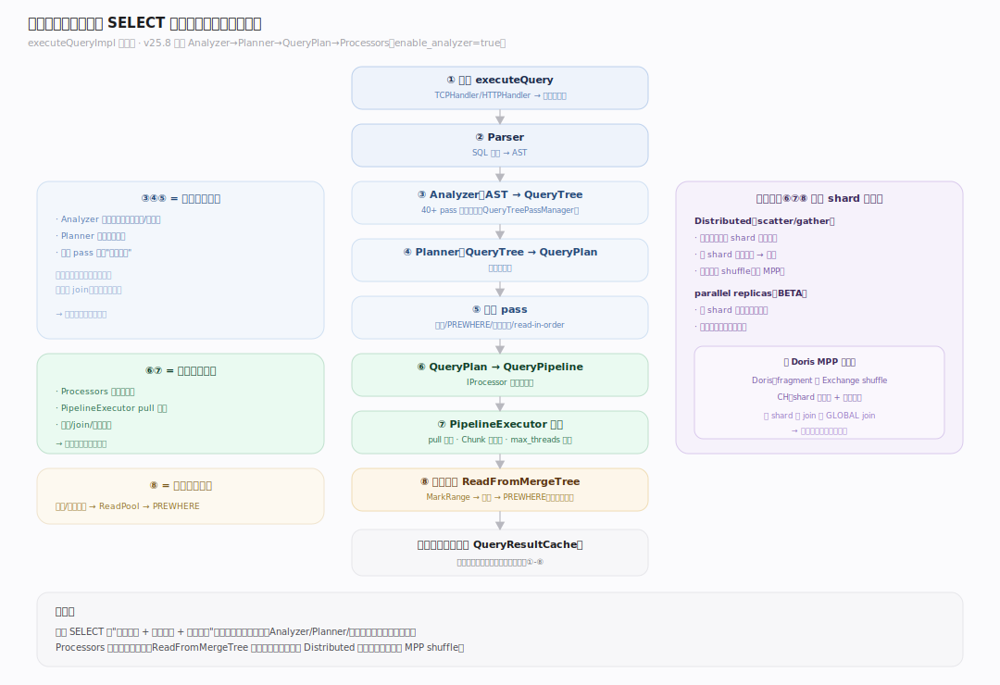

## 生命周期总览

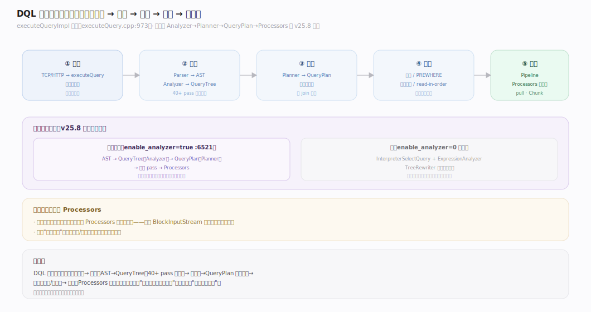

图注：`executeQueryImpl` 是总漏斗——`parseQuery → InterpreterFactory::get → plan.buildQueryPipeline → CompletedPipelineExecutor` 执行。v25.8 默认走 **Analyzer→Planner→QueryPlan→Processors** 新路径（`enable_analyzer=true`），旧 `InterpreterSelectQuery` 仅在关闭时兜底。

---

## 阶段一 · 接入与结果缓存（Receive · QueryResultCache）

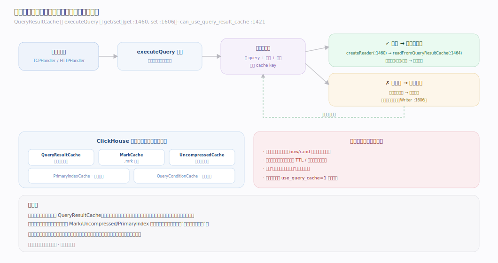

图注：查询经 TCP/HTTPHandler 进入 `executeQuery`。命中 **QueryResultCache**（`use_query_cache` 且确定性）则直接读缓存、跳过全部计算；未命中正常执行并在允许时回填。此为"完全相同查询"的最快路径。

---

## 阶段二 · 分析：AST → QueryTree（Analyzer）

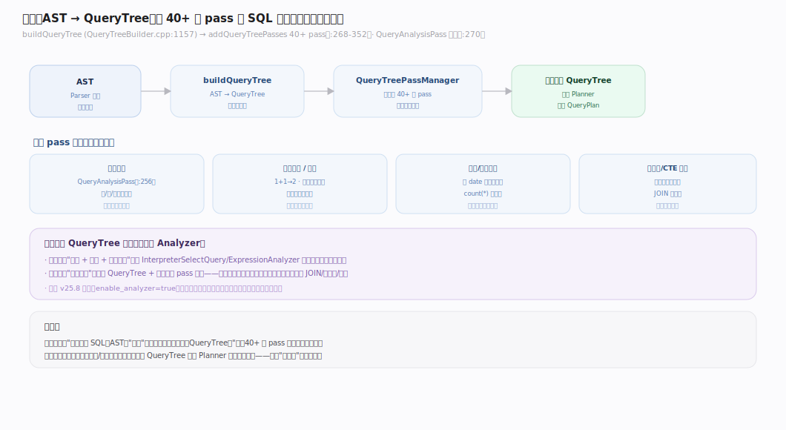

图注：`buildQueryTree` 把 AST 转成 **QueryTree**（语义树：QueryNode/JoinNode/FunctionNode…），随后 `QueryTreePassManager` 跑 **40+ pass**——名称解析、常量折叠、谓词化简、函数重写——把"用户写的 SQL"规整成"引擎好优化的语义形态"。

---

## 阶段三 · 规划：QueryTree → QueryPlan（Planner）

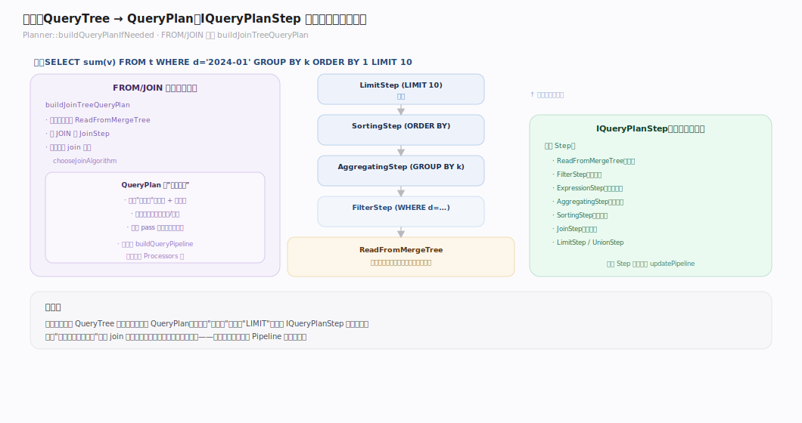

图注：`Planner` 把 QueryTree 变成 **QueryPlan**——一棵由 `IQueryPlanStep` 组成的逻辑算子树（ReadFromMergeTree / Aggregating / Sorting / Join / …）。FROM/JOIN 子树由 `buildJoinTreeQueryPlan` 构建，Join 算法在此期由 `chooseJoinAlgorithm` 选定。

---

## 阶段四 · 优化 pass 与主键裁剪

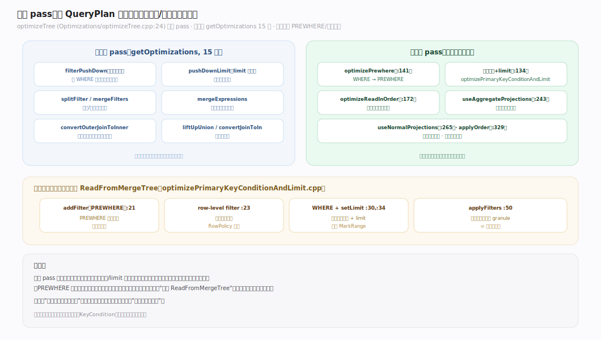

图注：`optimizeTree` 对 QueryPlan 跑两轮 pass。第一轮（15 条）含谓词下推、limit 下推、表达式合并；第二轮含 **PREWHERE 移动**、**主键裁剪 + limit**、**按序读**、**投影使用**。这些优化最终把过滤/裁剪条件推给 `ReadFromMergeTree` 读取步——详见「优化技术」主线。

---

## 阶段五 · QueryPlan → QueryPipeline → Processors 执行

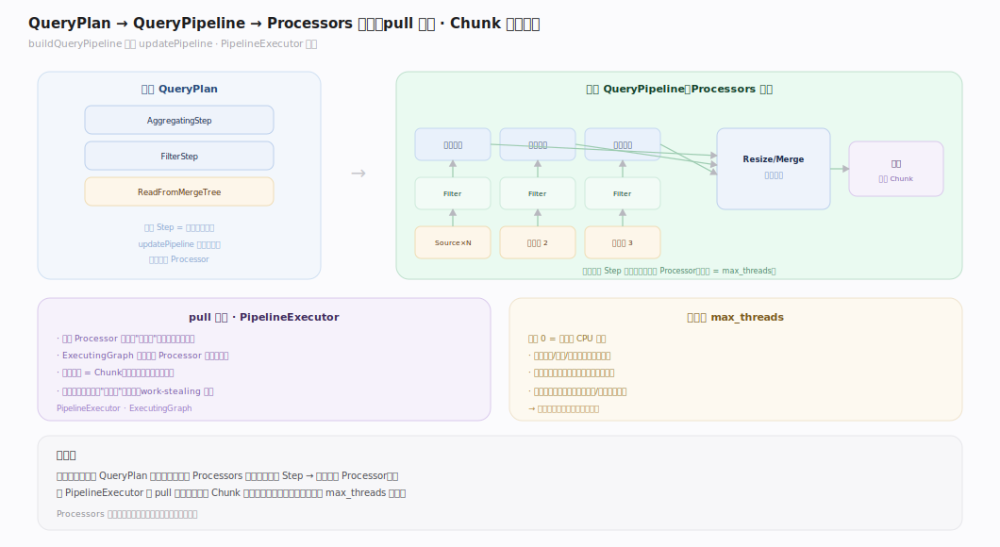

图注：`buildQueryPipeline` 逐步把逻辑算子树转成 **QueryPipeline**——由 `IProcessor` 组成的物理执行图；`PipelineExecutor` 以 **pull 模型**驱动 `ExecutingGraph` 并行执行，数据单位是 **Chunk**（列式批），并行度由 `max_threads`（默认 0=自动取核数）控制。执行细节见「执行引擎」主线。

---

## 阶段六 · 分布式：Distributed 散射汇聚 与 parallel replicas

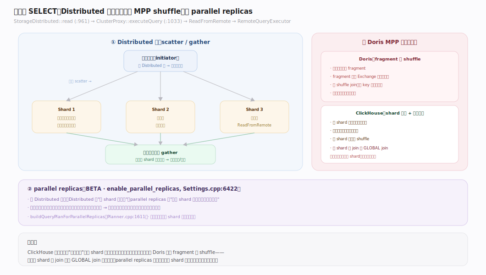

跨节点查询有两条路径：
- **Distributed 表**：`StorageDistributed::read → ClusterProxy` 遍历各 shard，发 `ReadFromRemote` 步，`RemoteQueryExecutor` 把子查询发到各 shard 的一个副本再汇聚。**经典 Distributed 是 scatter/gather（散射/汇聚）**——每 shard 独立算完再由发起节点汇总，不像 Doris 那样按 key 在 fragment 间 shuffle 重分布（parallel replicas 路径会用到 exchange/repartition）。
- **parallel replicas**（`enable_parallel_replicas`，BETA）：把**同一 shard** 的扫描工作动态分给多个副本并行，提升单分片大扫描吞吐。

---

## 深化 · 两级聚合（two-level aggregation）

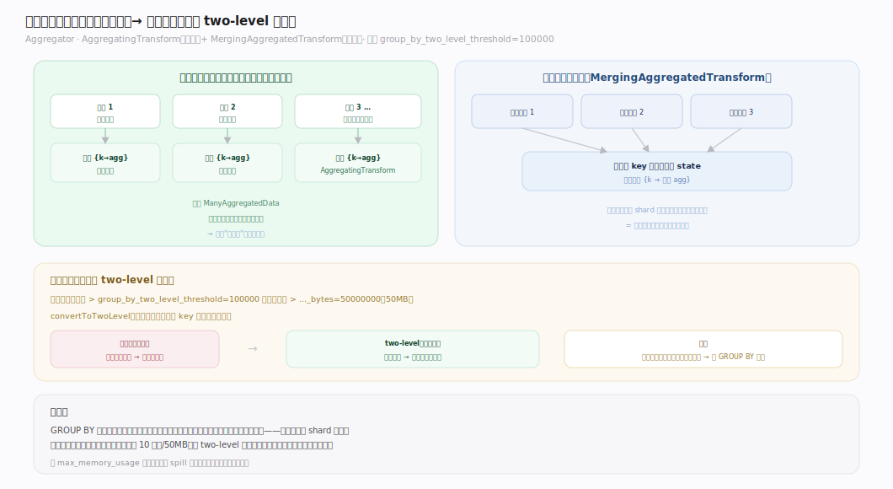

图注：`GROUP BY` 走 `Aggregator`——先每线程/每来源做**部分聚合**（`AggregatingTransform`，共享 `ManyAggregatedData`），再**合并**（`MergingAggregatedTransform`）。基数超阈值（`group_by_two_level_threshold=100000` 行或 `..._bytes=50MB`）时切 **two-level** 哈希表：按 key 高位桶拆分，使合并阶段可并行、避免单大哈希表成瓶颈。

---

## 深化 · Join 算法族（Hash / Grace / Merge / Direct）

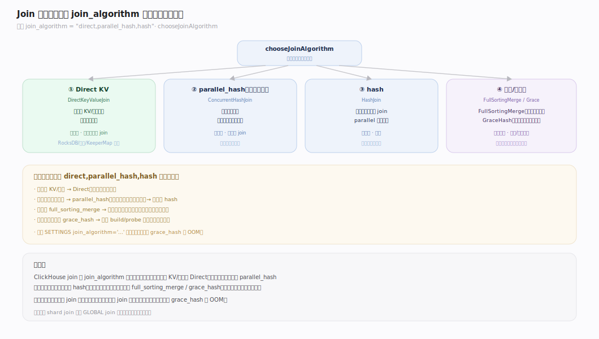

`join_algorithm` 默认 `direct,parallel_hash,hash`（按序偏好）；`chooseJoinAlgorithm` 按序尝试：

| 算法 | 内存 | 触发 | 适用 |
|---|---|---|---|
| **DirectKeyValueJoin** | 低 | 右表是 KV/字典引擎 | 维表点查式 join |
| **ConcurrentHashJoin**（parallel_hash） | 高 | 默认首选（右表可放内存） | 大多数 join |
| **HashJoin** | 高 | parallel 不适用时 | 经典 hash join |
| **FullSortingMergeJoin** | 中 | 两侧可排序 | 大表 join、内存受限 |
| **GraceHashJoin** | 可控 | 右表超内存 | 超大右表、分批落盘 |

---

## 深化 · 点查旁路（Direct KV / 主键裁剪短路）

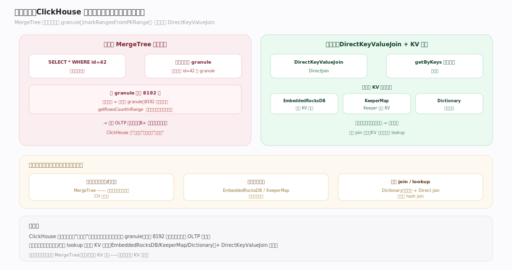

图注：ClickHouse **不擅长单行点查**——MergeTree 主键裁剪只能定位到 granule，点查一行也要读整个 granule（默认 8192 行）。真正的低延迟 KV 点查靠专门引擎：`DirectKeyValueJoin` over `StorageEmbeddedRocksDB`/`StorageKeeperMap`/字典，按键直取值。

---

## 调优要点（关键开关）

- `enable_analyzer`：新分析器（默认 true，`Settings.cpp:6521`）——除非兼容旧行为，勿关。
- `max_threads`：单查询并行度（默认 0=CPU 核数，`Settings.cpp:206`）。
- `optimize_move_to_prewhere`：自动 WHERE→PREWHERE（默认 true）。
- `group_by_two_level_threshold` / `..._bytes`：两级聚合切换阈值（100000 / 50MB）。
- `join_algorithm`：join 算法偏好（默认 `direct,parallel_hash,hash`）。
- `enable_parallel_replicas`：单分片多副本并行扫描（BETA）。
- `use_query_cache`：开启结果缓存（对确定性、重复查询有效）。

---

## 常见误区与工程要点

- **拿 ClickHouse 当 KV 点查库用**：MergeTree 点查一行也读整 granule，延迟不低；高频点查用 RocksDB/KeeperMap 引擎或字典。
- **以为 Distributed 是 MPP 交换**：它是 scatter/gather——每 shard 独立算完汇总，没有节点间 shuffle；重分布类查询（如跨 shard 大 join）需谨慎设计或用 GLOBAL join。
- **关掉 analyzer 期待更快**：新 Analyzer 是默认且更强，关掉只为兼容极旧行为。
- **忽略 PREWHERE**：宽表大扫描不利用 PREWHERE 会白读大量列；默认自动开启，写查询时留意选择性高的过滤条件。
- **大基数 GROUP BY 不给内存**：两级聚合虽能并行，仍受 `max_memory_usage` 约束，超限会 spill 或报错。

---

## 一句话总纲

**DQL 是"读数据"的全栈合力：`executeQuery` 漏斗 → Analyzer 把 AST 规整成 QueryTree（40+ pass）→ Planner 生成 QueryPlan → 优化 pass 把过滤/裁剪推给 ReadFromMergeTree → Pipeline 用 Processors 向量化 pull 执行；跨节点是 Distributed 的 scatter/gather（非 MPP shuffle）或 parallel replicas 分担；聚合两级、join 按 `direct,parallel_hash,hash` 择优，点查靠专门 KV 引擎旁路。**
