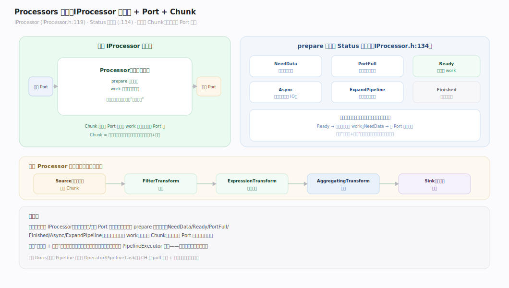
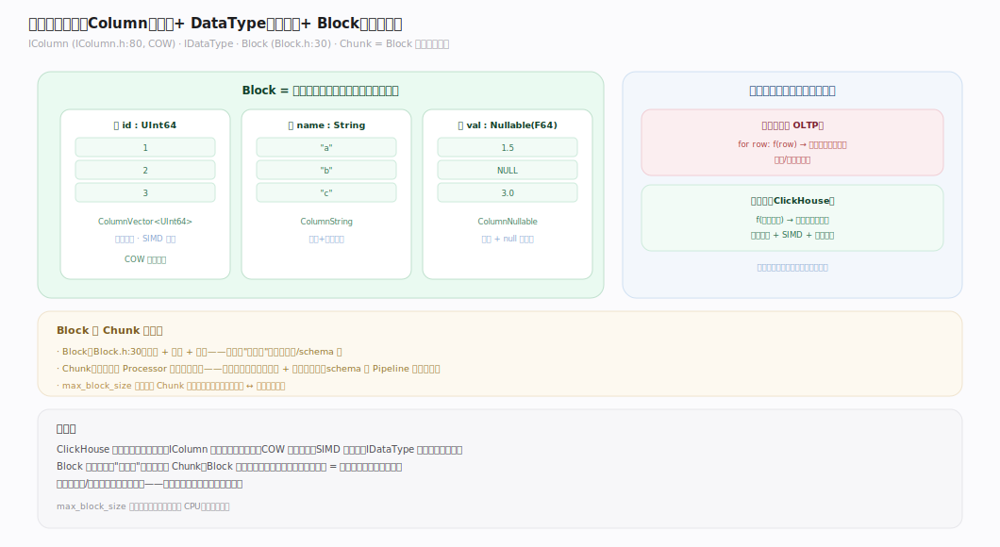
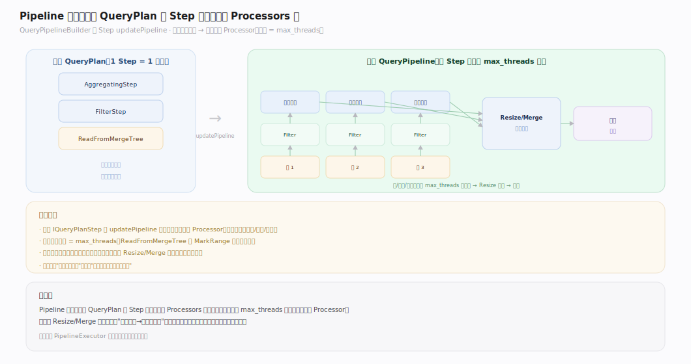
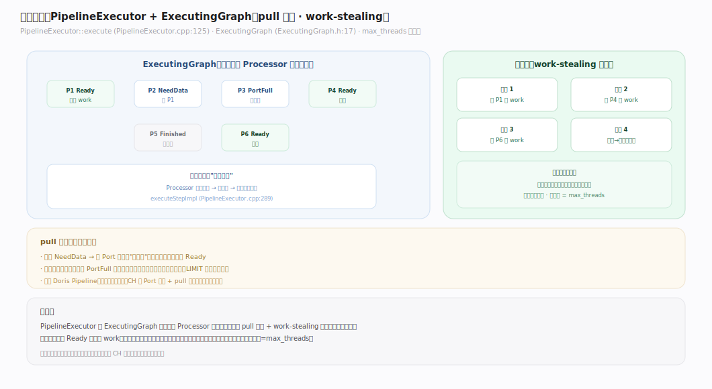
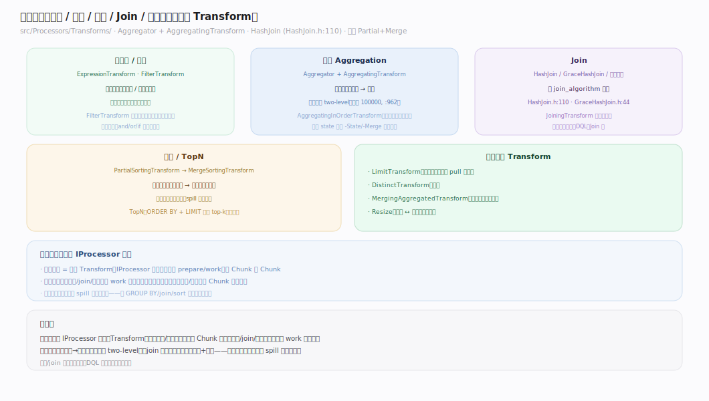
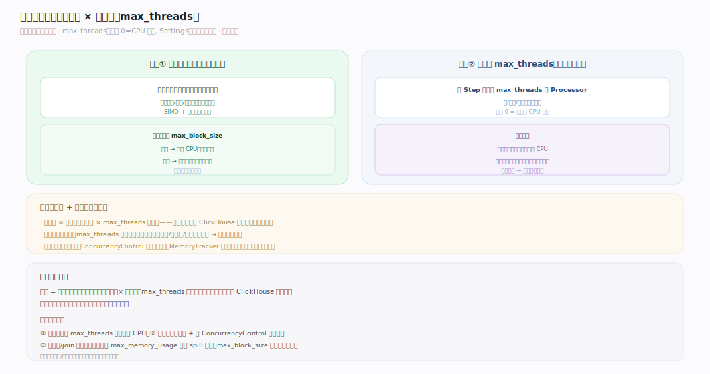

# ClickHouse 核心原理 · 支撑主线 · 执行引擎（Processors 向量化）

> **定位**：执行引擎是计算能力域，执行期把 QueryPlan 并行跑出来；骨架 = `QueryPlan → QueryPipeline → Processors 图 → PipelineExecutor`。上承 **优化技术** 产出的计划，下依 **存储引擎** 的读取；跨节点执行与 **集群与自愈** 协作。核实基准：社区 v25.8，源码 `src/Processors/`、`src/QueryPipeline/`、`src/Columns/`。

## 一、Processors 框架：IProcessor / Port / Chunk

图注：执行的原子是 **IProcessor**——一个有输入/输出 Port 的算子节点，不主动跑，而由调度器问它"现在能做什么"。`prepare` 返回一个 **Status**：`NeedData`（等上游）、`PortFull`（下游满）、`Ready`（可 `work`）、`Finished`、`Async`、`ExpandPipeline`（动态扩图）。数据以 **Chunk**（一批列，向量化单位）经 Port 流动。这套"状态机 + 端口"设计让执行图能被通用调度器驱动。

---

## 二、列式内存模型：Column / DataType / Block

- **IColumn**（COW 写时复制）：一列数据的内存表示（`ColumnVector`/`ColumnString`/`ColumnArray`/`ColumnNullable`…），连续存储、SIMD 友好。
- **IDataType**：列的类型与（反）序列化逻辑。
- **Block**：一组同长度的列 + 列名/类型——是"内存中的一段表"。Chunk 是 Block 的执行期载体（去掉列名，只留数据 + 行数）。

图注：向量化的本质——算子一次处理**一整列的一批值**（而非逐行），把函数调用/分支开销摊薄到成千上万行上，充分利用 CPU 缓存与 SIMD。

---

## 三、Pipeline 构建：QueryPlan → QueryPipeline

图注：`QueryPipelineBuilder` 把逻辑 QueryPlan 逐 Step `updatePipeline` 展开成物理 **QueryPipeline**——一张 IProcessor 组成的有向图。一个逻辑算子（如 AggregatingStep）会展开成**多路并行** Processor（宽度 = `max_threads`），中间用 Resize/Merge 节点收束。这一步把"做什么"（逻辑）变成"用多少并行、怎么连线"（物理）。

---

## 四、调度执行：PipelineExecutor 与 ExecutingGraph

图注：`PipelineExecutor::execute` 驱动整张图——构建 **ExecutingGraph** 追踪每个 Processor 的就绪状态，以 **pull 模型**运行：空闲线程从图里找 `Ready` 的 Processor 执行 `work`，数据不足就顺 Port 向上游要（`NeedData`）。这是 work-stealing 式并行——无中央协调线程，线程各自从图中取可执行节点，天然负载均衡。`max_threads`（默认 0=CPU 核数）决定线程池大小。

---

## 五、算子族：聚合 / Join / 排序 / 表达式

| 算子 | Transform / 类 | 关键机制 |
|---|---|---|
| 表达式 | `ExpressionTransform` | 按列批量算表达式 |
| 过滤 | `FilterTransform` | 按掩码筛行 |
| 聚合 | `AggregatingTransform` + `Aggregator` | 每线程部分聚合 → 合并；大基数切 two-level（阈值 100000 行） |
| 有序聚合 | `AggregatingInOrderTransform` | 利用输入有序省哈希表 |
| Join | `HashJoin` / `GraceHashJoin` / 排序归并 | 按 `join_algorithm` 择优 |
| 排序 | `PartialSorting` + `MergeSorting` | 分块排序 → 归并 |

（聚合/join 的选择逻辑见「DQL 数据查询」深化篇。）

---

## 深化 · 向量化与并行度（max_threads）

图注：两个性能杠杆叠加——**向量化**（一次算一列批，摊薄开销）× **并行度**（`max_threads` 路 Processor 同时跑）。大分析查询把 `max_threads` 设大吃满 CPU；高并发点查/小查询设小以保隔离、避免线程争抢。并行度与「资源与负载」的并发控制、内存追踪协同——线程越多，峰值内存越高。

---

## 拓展 · 执行边界清单

| 类别 | 项 | 说明 |
|---|---|---|
| 溢写 | spill to disk | 聚合/排序/join 超内存时落盘（GraceHash、外部排序） |
| 短路 | short-circuit function eval | `and`/`or`/`if` 惰性求值 |
| 动态 | ExpandPipeline | 运行期按数据动态扩图（如自适应 join） |
| 早停 | LIMIT / TopN 提前终止 | 够数即停，不扫全量 |

---

## 调优要点（关键开关）

- `max_threads`：单查询并行度（默认 0=CPU 核数）。
- `max_block_size`：Chunk 行数上限（影响向量化批大小与内存）。
- `max_memory_usage`：单查询内存上限，超限 spill 或报错。
- `join_algorithm`：join 算法偏好（见 DQL 篇）。
- `aggregation_in_order_max_block_bytes`：有序聚合的批控制。

---

## 常见误区与工程要点

- **以为 ClickHouse 是逐行执行**：它是列式向量化——一次处理一整列的一批，逐行思维会误判性能。
- **max_threads 越大越好**：单查询设太大在高并发下会线程争抢、内存爆；按"分析查询大、并发查询小"分场景设。
- **忽视内存上限做大聚合/join**：向量化虽快，聚合状态/哈希表仍占内存；大基数 GROUP BY、大右表 join 要么给足内存要么用 spill 变体。
- **旧 BlockInputStream 心智**：老的流式引擎已彻底移除，一切走 Processors——别参照过时资料。

---

## 一句话总纲

**执行引擎是 Processors 向量化图：逻辑 QueryPlan 展开成多路并行的 IProcessor 图（宽度=max_threads），PipelineExecutor 以 pull 模型 + work-stealing 驱动，数据以 Chunk（列批）流动；两大性能杠杆是"向量化（一次算一列批）× 并行度"，代价是并行越高内存峰值越大。**
