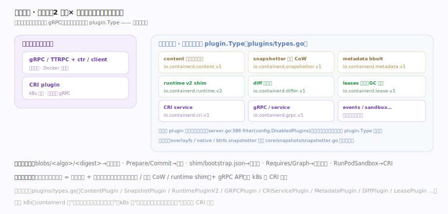
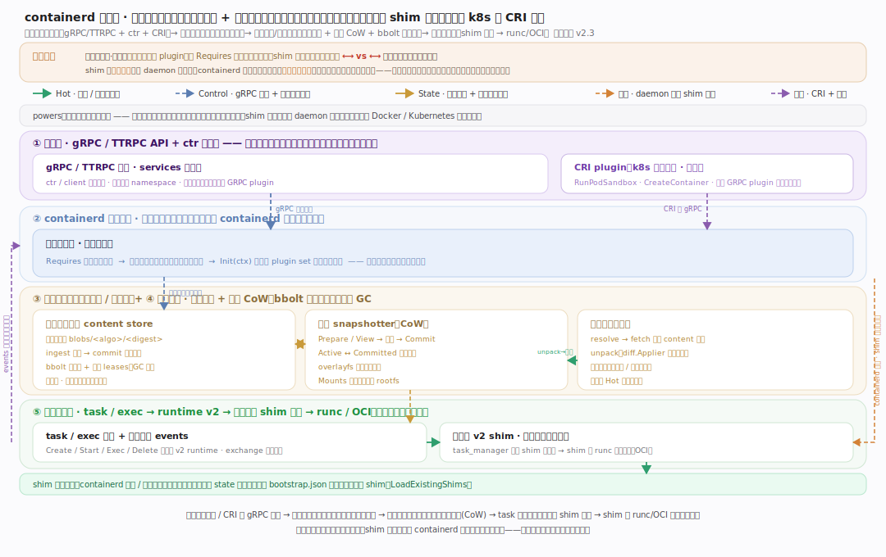
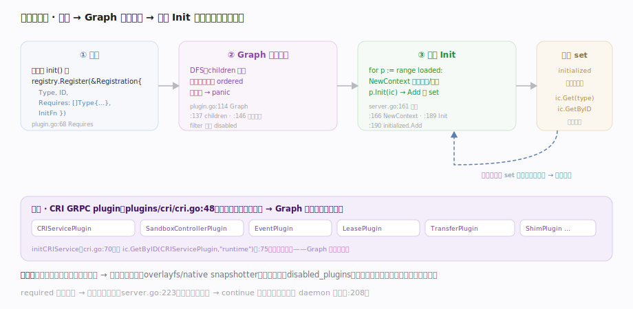

# containerd 核心原理 · 全景主线框架

> **定位**：工业级容器运行时范例（守护进程 + 插件化子系统）。全库总纲——用"接触面 × 插件子系统"把 containerd 拆成可导航的主线，并点出灵魂：**一切皆插件（经依赖图拓扑装配）+ shim 进程隔离让容器不随 containerd 重启而死**。核实基准（pin：containerd v2.3，`version/version.go:26`）：`cmd/containerd/server/server.go`、`vendor/github.com/containerd/plugin/plugin.go`、`plugins/types.go`、`core/runtime/v2/`、`plugins/content/local/store.go`、`core/snapshots/snapshotter.go`。

## 一、判型模型：接触面 × 插件子系统

图示判型的两个正交轴：**接触面**（都收敛到 gRPC）——gRPC/TTRPC API（ctr/client/Docker）与 CRI plugin（k8s，内部转 gRPC），所有请求带 namespace 隔离、只读写对象/元数据；**插件子系统**——这是 containerd 的**定义性特质**：每个子系统都是一个插件（content/snapshotter/diff/metadata/leases/runtime v2/service/CRI/events），类型全表见 `plugins/types.go`。**正交性检验**：任取核心概念都唯一归位——`blobs/<algo>/<digest>` 归内容存储、`Prepare/Commit` 归快照、`shim`/`bootstrap.json` 归运行时、`Requires`/`Graph` 归插件架构、`RunPodSandbox` 归 CRI。

## 二、总架构：守护进程 + 插件依赖图

图示守护进程装配这一核心机制：`server.go:124 New` 先 `LoadPlugins`（`registry.Graph` 按依赖**拓扑排序**），再逐个 `NewContext`→`Init`→`Add` 到共享 plugin set，后装插件经 `ic.Get`/`GetByID` **取到先装好的依赖**——依赖注入。三条支柱：**存储真源**（content store 内容寻址存 blob、snapshotter CoW 存层、bbolt 元数据统管引用与 GC）、**运行时下沉**（task 派发到 runtime v2，为每容器起独立 shim 调 runc）、**关键约束**（容器进程挂在 shim 而非 containerd 名下，daemon 可平滑重启升级而容器不死）。

## 三、贯穿主线：一切皆插件（灵魂）

图示 containerd 的灵魂——不是某条数据流，而是它的组织方式：`plugin.go:68 Requires []Type` 让每个插件只声明依赖**类型**、不硬编码实现；`:114 Graph` 用 DFS 产出初始化顺序（被依赖者先装、环依赖 panic）；server 按序 Init、插件从共享 set 取依赖。**三个后果**：① 能力可插拔（禁用某插件即裁剪能力，`server.go:386 filter`）；② 可扩展（第三方 snapshotter/differ 注册 plugin.Type 即融入）；③ 解耦（overlayfs/btrfs/native 同接口可互换）。这条"依赖图装配"横切所有子系统，是工业级可扩展性的本质。

## 四、五路径覆盖：架构图的语义分型

图示总架构用五色标注五类正交语义路径：**Hot（绿）**运行流——fetch 落内容存储→unpack 成快照→task 起 shim→runc 拉起；**Control（蓝）**gRPC 派发 + 依赖注入；**State（琥珀）**内容寻址 + 快照 + bbolt 元数据；**失败（橙）**daemon 重启 shim 存活——`shim_load.go:38 LoadExistingShims` 按落盘 `bootstrap.json` 重连接管；**横切（紫）**CRI + 事件——`sandbox_run.go:54 RunPodSandbox` 是 k8s 接触面、`exchange.go:80 Publish` 全局扇出。

## 深化 · 两维覆盖自检

| 维度 | containerd 落点 | 代表主线 |
|---|---|---|
| 接触面·通用 | gRPC / TTRPC API + ctr（namespace 隔离） | 接口_gRPC服务与客户端 |
| 接触面·k8s | CRI plugin（RunPodSandbox / CreateContainer） | 支撑_CRI插件 |
| 组织机制·灵魂 | 一切皆插件 + 依赖图拓扑装配 | 支撑_插件化架构 |
| 子系统·存储 | content store 内容寻址（blobs/<algo>/<digest>） | 支撑_内容寻址存储 |
| 子系统·文件系统 | snapshotter 写时复制层 | 支撑_快照与CoW层 |
| 子系统·镜像 | pull → unpack（diff.Applier 解包成快照） | 支撑_镜像拉取与解包 |
| 子系统·运行时 | runtime v2 每容器一 shim 进程 → runc | 支撑_运行时shim |
| 子系统·执行/事件 | task/exec 派发 + events 事件总线 | 支撑_task与事件总线 |

## 拓展 · 与 Kubernetes 的分工对照

| 对照维度 | containerd | Kubernetes | 关键差异 |
|---|---|---|---|
| 定位 | 单机容器运行时 | 集群编排 | k8s 经 CRI 把每节点的容器交给 containerd |
| 组织灵魂 | 一切皆插件 + 依赖图装配 | reconcile 控制循环 | 前者是"如何拼装能力"，后者是"如何持续收敛" |
| 状态真源 | 内容寻址 blob + bbolt 元数据 | etcd 声明态 | containerd 存镜像/容器实体，k8s 存期望态 |
| 进程隔离 | shim 独立进程（容器不随 daemon 死） | kubelet + Pod | shim 让运行时可平滑升级 |

## 调优要点

- 插件按需启用：`config.toml` 的 `disabled_plugins` 裁剪不用的子系统（`server.go:386` filter），减小攻击面与内存。
- snapshotter 选型（overlayfs / native / 远程 snapshotter）直接决定拉起延迟与磁盘占用；内容存储是拉取瓶颈，可配并发 fetch。
- shim 与 daemon 解耦：升级 containerd 无需杀容器，但需保证 `bootstrap.json`/state 目录持久（`core/runtime/v2/binary.go:142`）。
- 事件总线 events 是可观测入口，但订阅过多会放大扇出开销（`core/events/exchange/exchange.go:80`）。

## 常见误区

- **containerd 自己跑容器**：它经 shim 调 runc（OCI）拉起容器，自身不含容器引擎；每容器一个 shim 进程。
- **重启 containerd 会杀掉所有容器**：容器进程挂在独立 shim 上，daemon 重启后 `LoadExistingShims` 重连接管，容器不死。
- **插件之间硬编码调用**：插件只声明 `Requires` 依赖类型，具体实现经依赖图注入，可互换、可裁剪。
- **content store 会覆盖旧层**：内容寻址、摘要即路径、不可变，同一层跨镜像天然共享，删除靠租约 + GC。

## 一句话总纲

**containerd 是一台"插件装配的容器运行时机器"：所有能力（内容寻址存储、快照 CoW、差分、运行时、CRI…）都是插件，守护进程按 Requires 依赖图拓扑排序后依次 Init 并互相注入依赖；镜像以内容寻址不可变地落 blob、解包成写时复制快照，task 为每个容器启动一个独立 shim 进程去调 runc 拉起容器——shim 进程隔离让 containerd 与容器生命周期解耦、可平滑升级，一切皆插件让能力可插拔组合，这就是贯穿全库的灵魂。**
