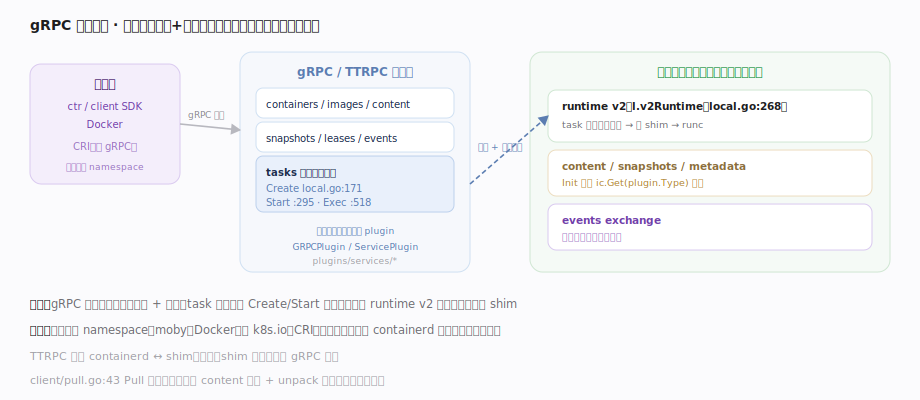
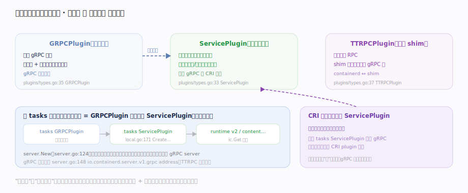

# containerd 核心原理 · 接触面主线 · gRPC 服务与客户端

> **定位**：containerd 唯一的外部接触面——**gRPC / TTRPC API**。`ctr`、`client` SDK、Docker 都经此提交请求；Kubernetes 经 CRI plugin（内部再转 gRPC）。所有请求带 **namespace** 做租户隔离，只读写对象/元数据，不直接操作容器进程。核实基准：`plugins/services/tasks/local.go`、`cmd/containerd/server/server.go`、`client/pull.go`。

## 一、请求派发：客户端 → gRPC 服务 → 子系统插件

图示请求派发链：containerd 对外是一组 **gRPC 服务**（containers/images/content/snapshots/tasks/events…），每个服务本身也是一个插件。以 task 为例：gRPC 层收到 `CreateTaskRequest` → tasks 服务的 `Create`，内部拿到 runtime v2 实例（`local.go:268` 的 `l.v2Runtime`），把请求下派到 `core/runtime/v2` 去起 shim。**服务只做协议适配 + 派发，真正干活的是被依赖注入的子系统插件**——task 服务在 Init 时经 `ic.Get(RuntimePluginV2)` 拿到运行时。方法族 Create/Start/Delete/Exec 的落点见图与下表。

## 二、三类插件撑起一个接触面：协议壳与业务实现分离

图示 containerd 把"对外服务"拆成三层插件：**GRPCPlugin**（`types.go:35`）是协议壳、暴露 gRPC 方法做编解码与派发；**ServicePlugin**（`types.go:33`）是业务实现、真正干活并依赖更底层插件；**TTRPCPlugin**（`types.go:37`）是面向 shim 的轻量 RPC。一个对外能力（如 tasks）通常是 GRPCPlugin 注入一个 ServicePlugin，ServicePlugin 再依赖运行时/存储——`server.New` 启动时按拓扑序逐一初始化并注册。**协议壳与业务实现彻底分离**：同一个 tasks ServicePlugin 既能被 gRPC 前端调用，也能被 CRI plugin 进程内直接复用（省一次序列化）。这就是接触面"薄"的原因——gRPC 层几乎全是转发。

## 拓展 · 三类插件与职责

| 插件类型 | 常量落点 | 职责 |
|---|---|---|
| GRPCPlugin | `plugins/types.go:35` | 暴露 gRPC 方法、协议编解码与派发 |
| ServicePlugin | `plugins/types.go:33` | 内部服务实现（可被 GRPC 与 CRI 共用） |
| TTRPCPlugin | `plugins/types.go:37` | 面向 shim 的轻量 RPC |

## 深化 · namespace 隔离与 client 门面

| 机制 | 落点 | 要点 |
|---|---|---|
| namespace 贯穿请求 | context 取出 | `moby`/`k8s.io` 互不可见，一台 containerd 无串味服务多上层 |
| client SDK 门面 | `client/pull.go:43` Pull · `:134` NewUnpacker · `:192` fetch | 把"拉一个镜像"编排成一次调用，底层多服务协作 |
| TTRPC 面向 shim | `server.go:148` 邻近 ttrpc address | shim 不依赖完整 gRPC 栈 |

## 拓展 · 一次 ctr run 的接触面视角

| 步骤 | 客户端动作 | 落到的 gRPC 服务 |
|---|---|---|
| 1 | `ctr image pull` | content / images 服务 + transfer |
| 2 | 解包 | snapshots + diff 服务 |
| 3 | 创建容器对象 | containers 服务（写元数据） |
| 4 | 创建 task | tasks 服务（local.go:171 Create） |
| 5 | 启动 task | tasks 服务（local.go:295 Start）→ shim |
| 6 | 订阅事件 | events 服务（exchange 扇出） |

## 调优要点

- gRPC 地址与 socket 权限由 server 配置注入（`server.go:148` 读 `io.containerd.server.v1.grpc` address）；生产环境注意 socket ACL。
- namespace 是天然隔离边界：多租户/多编排系统共用一个 containerd 时按 namespace 分区。
- 大批量操作优先用 client SDK 的批处理/流式接口，减少 gRPC 往返。

## 常见误区

- **gRPC 服务里有业务逻辑**：服务层主要做协议适配 + 派发，实际能力在被注入的子系统插件里。
- **所有命名空间共享镜像**：镜像/容器/快照都按 namespace 隔离，`k8s.io` 与 `moby` 各存各的。
- **containerd 只能被 Docker 用**：任何 gRPC 客户端都能驱动它；k8s 经 CRI plugin 直接用。

## 一句话总纲

**containerd 的接触面是一组 gRPC/TTRPC 服务，每个服务也是一个插件、只做协议适配与派发，真正干活的是它经依赖注入拿到的子系统插件；所有请求带 namespace 做租户隔离，让一台 containerd 同时无串味地服务 Docker 与 Kubernetes。**
